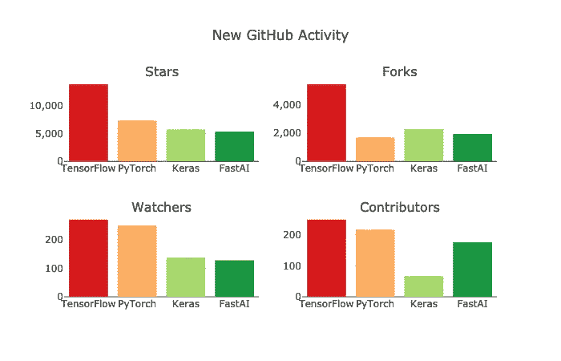

# 什么是张量流？为初学者解释的张量流(2021)

> 原文：<https://medium.com/analytics-vidhya/what-is-tensorflow-tensorflow-explained-for-beginners-2021-6ae3c288eea4?source=collection_archive---------6----------------------->

## 对 TensorFlow 以及如何在 TensorFlow 中创建您的第一个“Hello world”程序的高级解释

约书亚·雷德科普在 [Unsplash](https://unsplash.com?utm_source=medium&utm_medium=referral) 上的照片

当我们相互比较不同的深度学习框架时，我们很快就会看到一个似乎是学术界、企业和开发人员的最爱: **TensorFlow。**

不同 ML 框架的 GitHub 活动([来源](https://www.kdnuggets.com/2019/05/which-deep-learning-framework-growing-fastest.html))

# 什么是张量流？

到现在，你可能已经听说过[“tensor flow 是 Google 开发的用于数值计算和大规模机器学习的开源库”](https://www.infoworld.com/article/3278008/what-is-tensorflow-the-machine-learning-library-explained.html)。由于这个定义并没有真正告诉我们张量流到底是什么，让我们从一个不同的角度来看它:

什么是张量流？为初学者讲解的 Tensorflow(动画)

# 什么是张量？

张量是表示数据类型的 n 维向量或矩阵。张量中的值保存具有已知形状的相同数据类型。这个形状是矩阵的维度。

机器学习处理大量非常复杂格式的数据。张量为以简单的方式处理这些不同的数据提供了一个很好的解决方案。这就是 TensorFlow 中所有计算都使用张量的原因，也是 TensorFlow 被称为 TensorFlow 的原因。

现在，张量流的流动部分是什么？

照片由[替代代码](https://unsplash.com/@altumcode?utm_source=medium&utm_medium=referral)在 [Unsplash](https://unsplash.com?utm_source=medium&utm_medium=referral) 上拍摄

# 什么是流量？

正如我们已经看到的，TensorFlow 接受一个 n 维数组/矩阵形式的输入，称为 tensors。这个输入**流经由几个操作组成的系统**，并作为输出输出。例如，我们接收许多数字作为输入，代表一张照片的位，并接收类似“这是一只猫”的输出。

所以这个流描述了 TensorFlow 为什么叫 TensorFlow 的第二部分。

奥斯卡·伊尔迪兹在 [Unsplash](https://unsplash.com?utm_source=medium&utm_medium=referral) 上拍摄的照片

# TensorFlow 是如何工作的？

由于 Python 是机器学习的语言，难怪 TensorFlow 使用 Python 来提供一个方便的前端 API，用框架来构建应用。然而，TensorFlow 在执行这些应用程序时实际上使用 C++，因为这种语言允许显著更好的性能。

由[克里斯多佛·高尔](https://unsplash.com/@cgower?utm_source=medium&utm_medium=referral)在 [Unsplash](https://unsplash.com?utm_source=medium&utm_medium=referral) 拍摄的照片

# 使用 TensorFlow 的好处

*   **抽象:【TensorFlow 为机器学习开发提供的最大好处就是*抽象。开发人员可以专注于应用程序的整体逻辑，而不是处理实现算法的本质细节，或者找出将一个函数的输出与另一个函数的输入挂钩的适当方法。TensorFlow 负责幕后的细节。***
*   **Google:**tensor flow 是由谷歌巨头开发的，它汇集了许多其他令人惊叹的工具和优秀的文档。例如，您可以通过 TensorFlow 提供的大量教程来学习机器学习，并通过使用 TensorBoard 等工具来优化您自己的机器学习模型，tensor board 可以让您检查和可视化模型的许多细节。
*   **用例:** TensorFlow 可以训练深度神经网络，用于手写数字分类、图像识别、单词嵌入、递归神经网络、机器翻译的序列到序列模型、自然语言处理等等。
*   **CPU 和 GPU 支持:**深度学习应用非常复杂，训练过程需要大量计算。由于数据量很大，这需要很长时间，并且涉及到多次迭代过程、数学计算、矩阵乘法等等。这些活动在普通 CPU 上需要很长时间。这就是 TensorFlow 支持 GPU 的原因，它显著加快了训练过程。
*   **集成:** TensorFlow 可以与 Java 和 r 集成。

# TensorFlow 中的“Hello world”

我敢打赌，所有这些好处让你非常兴奋地开始为自己使用 TensorFlow。我建议从 TensorFlow 中的“Hello world”程序开始，它可以让您建立一个 ML 模型来对手写数字进行分类。

以下是链接:

 [## TensorFlow 2 初学者快速入门| TensorFlow 核心

### 这个简短的介绍使用 Keras 来:建立一个对图像进行分类的神经网络。训练这个神经网络。还有…

www.tensorflow.org](https://www.tensorflow.org/tutorials/quickstart/beginner) 

*TensorFlow 经常与 Keras、Numpy 和 Pandas 结合使用。如果你想了解更多关于这些与 ML 高度相关的库，请在下面的评论中告诉我:)*