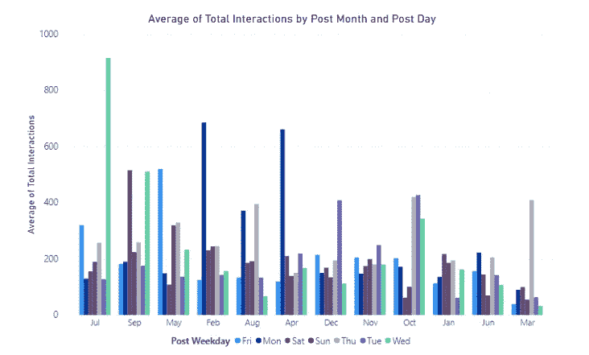

# 在社交媒体上做广告最好的方式是什么？

> 原文：<https://medium.com/analytics-vidhya/what-is-the-best-way-to-advertise-on-social-media-ee04da783b6?source=collection_archive---------23----------------------->

在线广告已经迅速成为大多数人商业和个人生活的重要部分。在这篇文章中，我将研究在 facebook 上发布广告的最佳条件，以最大限度地吸引消费者的注意力。

我们将使用一家知名化妆品公司 2014 年的脸书邮报数据，其中包括发帖日期、发帖类型、是否得到赞助以及 500 篇帖子的总互动量等变量。该数据集可公开用于研究，详情见(Moro 等人，2016)。

本文中的所有数据清理、分析和可视化都是使用 Python、Power BI 和 SQL 实现的。

## 赞助内容是否获得更多关注？

图 1

我们可以从图 1 中看到，在这个样本中，付费帖子的平均互动次数比免费帖子多 90 次。尽管付费帖子确实得到了更多的关注，但这并不一定意味着它们是公司的更好选择。为了调查这一点，我们需要广告定价的数据，以及帖子上的互动与实际销售之间的关系。

## 发布广告的最佳月份和星期几？

图 2

我们可以从上面图 2 的漏斗图中看到，7 月份发布的帖子获得了最高的平均总交互量。我们还看到，三月份的平均总互动次数最低，不到七月份的 30%。现在让我们看看哪一天是最好的发帖日。

图 3

图 3 中的线形图显示了平均总交互量在周三达到峰值，在周日达到最低点。我们还可以看到，评论和分享在一周内几乎没有变化，所以互动中的波动主要是因为喜欢的数量在变化。现在让我们一起来看看图 2 和图 3 中的结果是如何成立的。

图 4

图 4 显示了平均总交互量在七月的周三达到峰值，从我们目前的分析来看，这是非常直观的。然而，在这个情节中有一些矛盾，例如我们可以看到，在大多数月份中，星期三并不是一周中发表文章的最佳日子。它还显示，在像周四这样的日子里，7 月不一定是发布帖子以获得最多关注的最佳月份。

这显示了反对存在“最佳发布时间”的证据，但相反，我们应该使用数据在某些限制下找到最佳选项，例如必须在某个月。

## 哪种类型的帖子最受关注？

图 5

图 5 中的圆环图显示，图片在 facebook 上获得了最多的总互动。请注意，上图是基于总数的总和，而不是总数的平均值，这一点在后面很重要。图 5 还显示，链接和视频仅占交互总数的 2%左右。

图 6

图 6 显示了一个有趣的结果，尽管视频只占总互动量的 2%，但它们实际上获得了最高的平均总互动量。图片和状态获得了大致相同的平均交互，我们可以使用这些信息和图 5 来推断该公司发布的绝大多数帖子都是图片。在这四种类型中，链接最不受消费者关注。

## 摘要

这项研究的主要结果总结如下。据统计，赞助帖子比免费帖子获得的互动更多。该数据还显示，7 月的周三是发帖的最佳时间，因为这些帖子的平均总互动量最高。我们还发现，就平均互动而言，视频是最受欢迎的帖子类型，链接最不受欢迎。

因为这是一篇以商业为重点的研究文章，所以记住商业对他们的广告有一定的要求是很重要的，例如某个月或某类广告。因此，在现实世界中找到广告最佳条件的最佳方法是分析包括公司限制在内的数据，看看会发现什么结果。

我想用很多方法来扩展这项研究。首先，这个数据集只有 500 个实例，而且只来自一家公司。为了让结果更加严谨，我想分析更多公司和不同社交媒体平台的更多数据。我还想看看一天中的时间和赞助广告的价格数据，因为我认为这可以揭示一些启发性的和非常有帮助的见解。

由乔丹·伯克斯撰写

引用:(莫罗等人，2016 年)莫罗，s .，丽塔，p .，&瓦拉，B. (2016 年)。预测社交媒体性能指标和评估对品牌建设的影响:一种数据挖掘方法。商业研究杂志，69(9)，3341–3351。