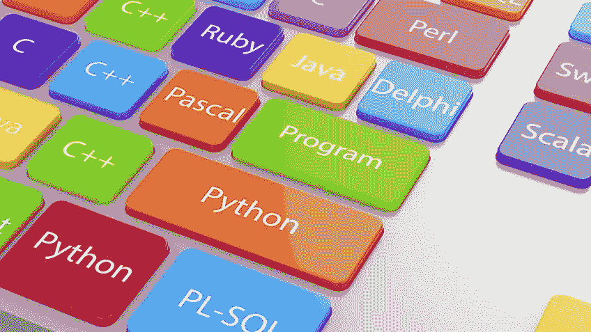
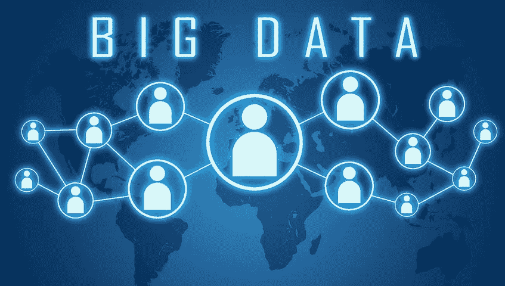

# 作为初学者，学习数据科学的最佳方式是什么

> 原文：<https://medium.com/analytics-vidhya/what-is-the-best-way-to-learn-data-science-as-a-beginner-317d8603a41a?source=collection_archive---------13----------------------->

数据科学被定义为通过使用各种工具和技术从结构化和非结构化数据中获取有价值见解的过程。数据科学中实践的一些技术包括数据提取、数据分析、数据挖掘和数据检索，以产生有价值的结果。从事这种工作的人被称为数据科学家。对数据科学家的需求很高。截至 2020 年，印度数据科学家的平均年薪为 60 万英镑。

# **学习数据科学的 4 个要点**

1.  **论**:

使用 Coursera 和 EdX 构建概率、统计、线性代数、微积分和机器学习的理论、概念和应用。甚至你可以使用在线证书课程也可以非常有用地启动数据科学的职业生涯。有几个在线机构提供了更适合新生和工作专业人员的数据科学课程，如 Simplilearn、Upgrad、Great learning、Analytics Vidhya…等等。

2.**数据可视化**:

Tableau 和 Power Bi 是易于使用的工具，具有数据可视化和商业智能的 GUI 功能。这两种工具在工业中广泛使用。甚至你可以使用一个很棒的软件包 Matplotlib 来使用 python。Python 中的 Matplotlib 和 R 中的 ggplot 都是很好的可视化包。

3.**编程**:

Python 和 R 都是很棒的免费工具，你可以从网上下载。R Studio for R 和 Anaconda for Python 是编写和测试代码的两个好工具。可以用 Data camp 进行学习，动手练习 Python 和 r，然后用 Python 或 r 练习机器学习算法。

4.**大数据**:

AWS 或者 Azure 可以用来存储，Spark 可以用来处理。您需要从数据库中提取数据，处理或过滤数据，并将其转换成可用的格式。对于获取和处理数据，SQL 是一个很好的工具。您可以使用 R 中的 dplyr 包或 Python 中的 pandas 来执行数据处理任务。

> ***“做一个学习者，一切从零开始”***