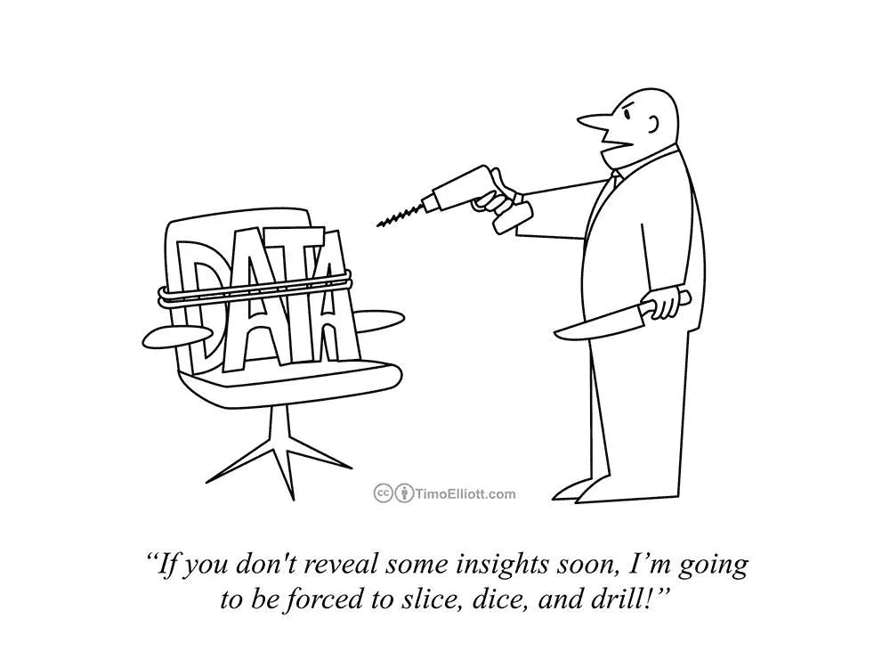

# 数据科学市场在寻找什么？

> 原文：<https://medium.com/analytics-vidhya/what-is-the-data-science-market-looking-for-f940ce054c77?source=collection_archive---------9----------------------->

蒂姆·高在 [Unsplash](https://unsplash.com?utm_source=medium&utm_medium=referral) 上拍摄的照片

在上一篇[文章](https://shri13.medium.com/why-are-data-science-interviews-so-unique-b8ac4dab098)中，我们探讨了数据科学需要什么。在这篇文章中，让我们了解市场正在寻找数据科学家的哪些技能。

当我与 NASA 喷气推进实验室的商业 IT 数据科学家和团队负责人 Laura Siahaan 交谈时，她解释说，她的工作的一个重要方面是向非技术观众传达分析结果。因此，在面试数据科学家时，她寻找的主要技能之一是以简单而精确的方式解释复杂的数据科学概念的能力。她强调了利用数据讲述故事的能力，以此作为候选人之间的一个区分点。

> 将复杂的发现转化为可行的见解有时可能是一项艰巨的任务，但拥有这一技能将使你的工作有所收获。

一位来自四大的分析领域的顾问说:“当你申请咨询公司的职位时，你首先是一名顾问，然后是一名数据科学家。成为一名战略思考者并全面理解你试图解决的商业问题是至关重要的。当你从宏观层面吸收所有信息时，深入分析和解决问题就变得容易多了。确定了业务需求和期望后，数据科学家自然会提出数据请求，并推荐用于解决问题的分析技术。”

就在那时，我意识到在任何时候都有一个问题的鸟瞰图是多么重要。作为一名数据科学家，很容易迷失在茫茫人海中。如果需要的话，将此作为一个持续的提醒将有助于课程的修正！

虽然这两种输入更多地涉及到解决问题和有效沟通的无形技能，但在某些角色中，特定工具或编程语言的知识是必不可少的。谷歌的一位产品经理告诉我，他们的团队几乎总是选择 Python 作为语言。鉴于他们的团队严重依赖深度学习技术来进行分析，因此需要 Pytorch 和 TensorFlow 的知识。

在与数据科学领域的人交谈后，我注意到当今市场上需要大量的技能。下面的图片记录了我从各行各业的数据科学家那里得到的不同答案。

有了如此广泛的答案，我试图了解这些技能在不同的数据科学角色中有何不同。如果你在 LinkedIn 或任何其他招聘网站上搜索“数据科学家”职位空缺，你会注意到结果列在不同的职位名称下。其中一些受欢迎的是人工智能专家、数据科学家、机器学习工程师、数据分析师、数据可视化专家、业务分析师、数据工程师和数据架构师。

为了简洁起见，我将这些进行了分组，并为准备这些领域面试的人提供了更具战略性的方法。

# **机器学习工程师**:

根据 LinkedIn 的新兴工作报告，这个角色包括机器学习、深度学习、TensorFlow、Python 和自然语言处理领域的技能。[1]

以下是苹果和 Spotify 发布的机器学习工程师职位要求的几个亮点。

*   机器学习和自然语言处理各个方面的专业知识和**经验，例如分类、特征工程、信息提取、结构化预测、聚类、半监督学习、主题建模和排序**
*   **具有以下一种或多种编程经验**:Java、C++、Python 或类似语言
*   对研究团体的贡献，例如 ACL、NIPS、ICML 和 CVPR
*   你拥有用 Java、Scala、Python 或类似语言大规模实现生产机器学习系统的实践经验。有 XGBoost、TensorFlow 经验也是加分项。
*   你关心**敏捷软件过程**、数据驱动的开发、可靠性和有纪律的实验。

正如你可能注意到的，在两份工作描述中，他们都强调精通大规模编程语言，如 Python 或 Java。他们还需要精通最新的机器学习技术。机器学习工程师通常有机会在最先进的技术环境中工作，并有机会使用尖端技术在竞争市场中区分公司的产品。

# **数据科学家:**

被吹捧为“21 世纪最性感的工作”的数据科学家角色在更广泛的层面上包含了描述性、预测性和规范性分析的知识。[2]

麦肯锡公司 QuantumBlack 的一些工作要求显示，这个角色普遍需要机器学习算法、Python、R 和 SQL 的知识。

*   在**统计建模和机器学习技术方面的经验**
*   **至少使用以下两种语言的编程经验**: R、Python、Scala、SQL
*   **将数据科学方法应用于业务问题的经验**
*   良好的**表达和沟通技巧**，能够向其他领域的人解释复杂的分析概念

# **商业分析专家:**

该角色不同于机器学习工程师和数据科学家角色，因为**更强调分析用例开发及其适用的特定行业/领域知识的需求**。考虑到你需要能够获得组织中关键利益相关者的认同，这一角色还需要出色的沟通和演示技巧，这些利益相关者通常是高管层成员的执行观众。此外，**角色可能需要良好的人际交往技能，以便能够在整个组织中采用分析技术**。以下是联合利华招聘商业分析经理的一个亮点:

*   为组织内的领导者提供可信赖的数据和分析顾问，为他们提供快速解决业务问题的产品和解决方案。
*   在不同团队之间交付总体联合业务计划优先级。
*   确保市场内数据科学家团队的职业发展，作为通向集群中心的人才管道。

此外，请注意以下业务分析角色的工作要求片段，因为它们也出现在其他多家公司中。

*   统计学方面的专业知识(回归、聚类、随机福里斯特、决策树、优化、时间序列、概率和其他相关的高级方法)。
*   具备可视化工具的工作知识，如 Microsoft PowerBI、QlikView 或 Tableau。
*   用 R、R Shiny、微软 Azure 机器学习**编写代码的工作知识和基本技能。**

你可能也注意到了，到目前为止，我们看到的不同角色的工作要求各不相同。因此，你如何准备面试会因工作角色的不同而有很大的不同。在下一篇文章中，我们将探讨如何有效地确定准备什么！

___________________________________________________________________

在这一系列文章中，我分享了我的书《成为局外人》中的摘录和故事。我希望你喜欢这篇文章——如果你喜欢它的内容并想联系我，你可以通过 LinkedIn 联系我。另外，你也可以在亚马逊上找到我的书。

___________________________________________________________________

[1]《LinkedIn:2020 年新兴工作报告》，LinkedIn，2020 年 5 月 16 日访问。

[2] Thomas H. Davenport 和 D.J. Patil，“数据科学家:21 世纪最性感的工作”，《哈佛商业评论》，2012 年 10 月。