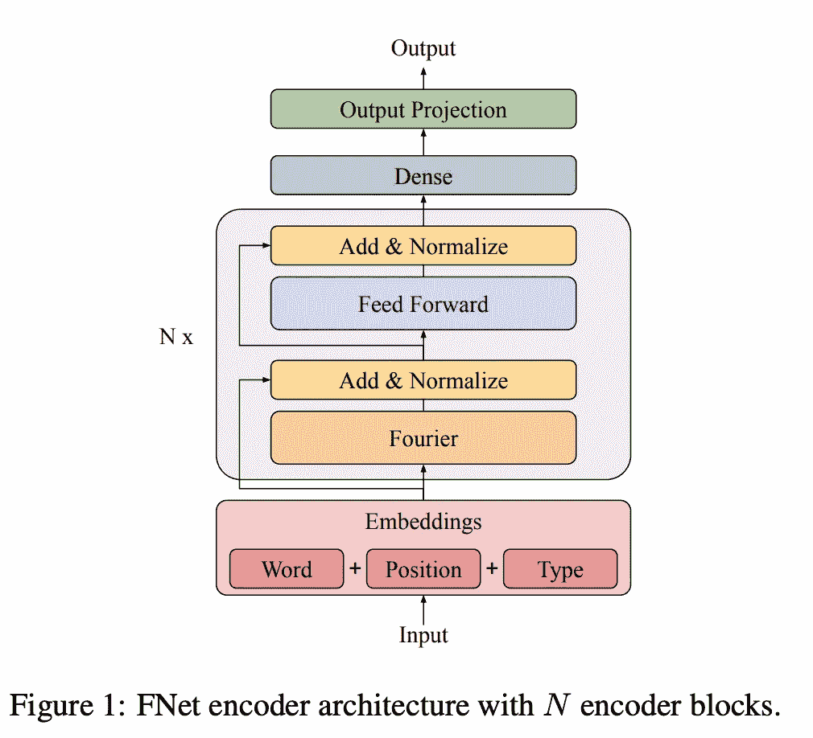

# 视觉变形金刚里最重要的东西是什么？

> 原文：<https://medium.com/analytics-vidhya/what-is-the-most-important-stuff-in-vision-transformer-7635d02f0baf?source=collection_archive---------2----------------------->

这篇博客文章描述了论文“补丁是你所需要的吗？”([在审，2021](https://openreview.net/forum?id=TVHS5Y4dNvM) )，已提交 ICLR2022(截至 10 月底在审)。本文提出的 ConvMixer 由 CNN+BN 组成，与之前的 Vision Transformer 系列不同，它甚至可以在 CIFAR 等小数据集上实现结果。然后，我们将从模型包含全局信息和局部信息处理机制的角度讨论补丁是否真的是唯一重要的东西。在这篇文章中，我将根据以下几项进行解释。

1.  摘要
2.  视觉变压器
3.  拟议模型的结构
4.  结果
5.  你真的只需要补丁吗？
6.  结论

# 1.摘要

本文摘要如下。

在 PyTorch 中，ConvMixer 可以用大约 6 行代码实现。该模型比 ViT 和 MLP 混合器更有效，即使在 CIFAR 这样的小数据集上也能达到 96%的准确率。作者认为，根据这一结果，修补图像可能比变压器本身更重要。

本文提出的 Conv 混频器采用 CNN 和批处理范数的结构。近年来，基于变压器的模型已被用于计算机视觉(CV)任务，如图像识别，但在本文中，变压器没有被使用。然而，本文没有使用变压器。然而，它的特点是比以前基于变压器的模型更精确。

基于这一结果，作者认为最近基于变压器的模型的突破可能不是由于变压器本身，而是由于在那里发生的“图像修补过程”。

# 2.什么是视觉变形金刚？

首先，我要解释一下本文比较的对象 ViT(视觉变压器)，以及它所基于的变压器。那么让我们从变压器开始。

## 变压器

该变压器是在论文“注意力是你所需要的一切”( [Vaswani et al .，2017](https://arxiv.org/abs/1706.03762) )中提出的模型。它是一个使用称为自我关注的机制的模型，这种机制既不是 CNN，也不是 LSTM，并建立了 Transformer 模型，以显著优于现有的方法。结果比现有的方法好得多。

注意下图中标有多头注意的部分是 Transformer 的核心部分，但它也像 ResNet 一样使用了 skip-joining。

变压器架构。来自[瓦斯瓦尼等人，2017](https://arxiv.org/abs/1706.03762)

变压器中使用的注意机制使用了三个变量: ***Q*** (查询)、 ***K*** (键)、和 ***V*** (值)。简单地说，它计算一个查询标记(标记:类似于一个单词)和一个键标记的注意力权重，并乘以与每个键相关联的值。简而言之，它计算查询令牌和密钥令牌之间的关联(注意力权重),并乘以与每个密钥相关联的值。

将 **Q，K，V** 计算定义为单头，多头注意机制定义如下。上图中的(单头)注意机制原样使用了 ***Q*** 和 ***K*** 。尽管如此，在多头注意力机制中，每个头都有其投影矩阵*****【w_i^v***，并且它们使用使用这些矩阵投影的特征值来计算注意力权重。**

****

**多头注意力**

**如果这种注意机制中使用的 ***Q，K，V*** 都是从同一个输入计算出来的，则专门称为自我注意。另一方面，Transformer 解码器的上部不是一个“自我”注意力机制，因为它使用来自编码器的 ***Q*** 和来自解码器的 ***K*** 和 ***V*** 来计算注意力。**

**实际应用的图像如下图所示。该图示出了使用单词“making”作为查询为每个关键令牌计算的注意力权重的可视化。转换器使用多头自关注机制传播到后面的层，每个头学习不同的依赖关系。下图中的关键词是彩色的，代表每个头部的注意力权重。**

****

**注意力权重可视化。图片引自[瓦斯瓦尼等人，2017](https://arxiv.org/abs/1706.03762) 我已经注释过了。**

**注意力权重可视化。图片引自[瓦斯瓦尼等人，2017](https://arxiv.org/abs/1706.03762) 我已经注释过了。**

## **视觉转换器(ViT)**

**视觉变压器(ViT)是一种将变压器应用于图像分类任务的模型，于 2020 年 10 月提出( [Dosovitskiy 等人 2020](https://arxiv.org/abs/2010.11929) )。模型架构与原始的 Transformer 几乎相同，但有一点不同，它允许将图像作为输入处理，就像自然语言处理一样。**

****

**视觉转换器架构。图片引自 [Dosovitskiy 等人 2020](https://arxiv.org/abs/2010.11929) ，我已经给它做了注释。**

**视觉转换器架构。图片引自 [Dosovitskiy et al. 2020](https://arxiv.org/abs/2010.11929) ，我已经做了注释。**

**首先，ViT 将图像分成 N 个“小块”,例如 16x16。由于面片本身是 3D 数据(高 x 宽 x 通道数)，它们不能由处理语言(2D)的转换器直接处理，因此它将它们展平并进行线性投影，以将其转换为 2D 数据。因此，每个补丁都可以被视为一个令牌，可以输入到转换器中。**

**此外，ViT 采用先预训练后微调的策略。ViT 使用包含 3 亿张图像的数据集 JFT-300M 进行预训练，然后在 ImageNet 等下游任务上进行微调。ViT 是第一个在 ImageNet 上实现 SotA 性能的纯变形金刚模型，这导致了对变形金刚应用于计算机视觉任务的研究大幅增加。**

**但是，训练 ViT 需要大量的数据。变压器在数据较少的情况下不太准确，但在数据较多的情况下变得更加准确，并且在 JFT-300M 上进行预训练时表现优于 CNN。更多详情请参考原论文。**

****

**视觉转换结果。( [Dosovitskiy 等人 2020](https://arxiv.org/abs/2010.11929)**

# **3.拟议模型的结构**

**现在，让我们进入本文提出的 Conv 混频器的结构。首先，模型的架构如下面的图 2 所示。**

****

**ConvMixer 架构(来自[https://openreview.net/forum?id=TVHS5Y4dNvM](https://openreview.net/forum?id=TVHS5Y4dNvM))**

**该模型的总体架构与 ViT 相同:补丁嵌入、多次通过 ConvMixer 层块、使用全局平均池和全连接层进行分类。在结构上，不需要像 ViT 中那样添加位置嵌入向量，块本身也相对简单。ConvMixer 模型(不是 ConvMixer 层，而是整个模型)可以在 Pytorch 中实现，只有六行代码，如下图 3 所示。尽管这个实现有点特殊，但您可以看到它是一个结构相对简单的模型。**

****

**ConvMixer 代码(来自[https://openreview.net/forum?id=TVHS5Y4dNvM](https://openreview.net/forum?id=TVHS5Y4dNvM)**

**让我们更仔细地看看模型的结构，它可以被分解成以下步骤，我们将更详细地了解每一个步骤。**

****1。打补丁****

****2。ConvMixer 层 xN****

****— 2.1 深度方向 Conv****

****— 2.2 点 Conv****

****3。使用衬垫层分类****

## **1.修补**

**在 ViT 中，修补是通过将图像分成固定大小的块、展平它们，然后线性投影它们以将它们转换成 2D 数据来实现的。ConvMixer 不需要将图像(HxWxC)投影到 2D 数据，因为它使用 CNN。ConvMixer 做同样的事情，将图像分成小块，但在将图像分成小块后，它应用卷积为每个小块创建特征。如果你把它看成是[CNN -> BN]代替 ViT 的[Flatten -> Linnear]过程就很好理解了。公式如下。**

****

**修补**

**顺带一提，这里用到的激活函数σ叫做 GELU(高斯误差线性单位， [Dan et al .，2016](https://arxiv.org/abs/1606.08415v4) )。该激活函数使用高斯分布φ的累积函数，并且如下面的等式所示。它在无穷远处渐近于 RELU，但在零附近表现出平滑的行为。**

*****【GELU(x)= x *φ(x)*****

****

**GELU 激活函数([丹等，2016](https://arxiv.org/abs/1606.08415v4) )**

## **2 ConvMixer 层 xN**

**接下来，我们将看看 ConvMixer 层，这是本文的核心技术。图层的结构是深度方向 conv 和点方向 conv 的组合，如下所示。让我们详细看一下每一个。**

****

## **2–1.深度方向卷积**

**首先，让我们看看深度方向的 Conv，它位于 ConvMixer 层的前半部分。顾名思义，它对每个深度或每个通道执行单独的卷积。图表如下。(图摘自[这篇博文](https://towardsdatascience.com/a-basic-introduction-to-separable-convolutions-b99ec3102728)。)**

****

**正常卷积(图摘自[这篇博文](https://towardsdatascience.com/a-basic-introduction-to-separable-convolutions-b99ec3102728))**

****

**深度 conv(图摘自[这篇博文](https://towardsdatascience.com/a-basic-introduction-to-separable-convolutions-b99ec3102728))**

**上图显示了正常的 CNN，下图显示了 12x12x3(HWC)图像上的深度卷积。对于普通的 CNN，卷积核的维数是[核大小，核大小，通道]。每个内核的输出图被聚集成单个特征图(一个通道)。通过对输出声道的数量(在这种情况下为 256)使用该滤波器，输出具有输出声道数量的深度的特征图。**

**另一方面，在深度 conv 中，每个内核是[内核大小，内核大小，1](*多个通道可以被视为一组，但为了简单起见，我使用 1)。与跨越所有输入通道的普通卷积不同，卷积是针对每个输入通道进行的。换句话说，全局处理是基于每个特征图中的信息完成的。**

## **2–2.逐点 Conv**

**接下来，我们来看看逐点卷积，它是在 ConvMixer 层的后半部分执行的(下图摘自这篇博文)。**

****

**逐点 conv(图摘自[这篇博文](https://towardsdatascience.com/a-basic-introduction-to-separable-convolutions-b99ec3102728))**

**这与前面描述的深度方向的 Conv 相反，其中每个位置都在整个深度上进行处理。换句话说，在考虑完整特征图中的信息的同时进行局部处理。**

## **3.分类使用**衬垫层****

**这与常规 ResNet 和 EfficientNet 中完成的过程相同。通过取平均值(全局平均池)，将每个要素地图中的信息转换为单个值。然后通过加权这些值来执行分类(密集层)。**

**在基于变换器的方法中，输出向量是二维的，因此它可以传播到所有便利层，而不需要这个平均过程。**

# **4.结果**

**首先，我们来看看 ImageNet 训练的结果(见下图)。这是在没有预训练的情况下训练 ImageNet 的结果，我们可以看到对于相同数量的参数，ConvMixer 具有更高的精度。**

****

**ImageNet 结果(来自[https://openreview.net/forum?id=TVHS5Y4dNvM](https://openreview.net/forum?id=TVHS5Y4dNvM)**

**ConvMixer 的另一个特性是它在大型数据集(如 ImageNet)和小型数据集(如 CIFAR)上的准确性。在很多提出 ViT、MLP 混频器等 ViT 系列的论文中，都包含了 CIFAR10 经过微调后的训练结果，但全刮训练的精度却没有。我觉得这是因为 ViT 系列的模型需要大量的数据，精度不是很好。本文给出了 CIFAR 的全划痕训练结果，并声称 ConvMixer 是数据高效的，准确率约为 96%(表 3)。**

****

**CIFAR10 结果(来自 https://openreview.net/forum?id=TVHS5Y4dNvM)**

# **5.你真的只需要补丁吗？**

*****注！这部分包含了很多个人观点。*****

**自 2020 年底推出 ViT 以来，提出了各种改进方法。有些改进使用了变压器，有些结构不依赖变压器，比如本文和 MLP 混频器( [Ilya et al，2021](https://arxiv.org/abs/2105.01601) )。那么，像这篇论文声称的那样“打补丁”重要吗？在这一节中，让我们从不同的角度来观察这个架构。**

**首先，让我们比较三种架构:ViT、MLP 混频器和 ConvMixer。**

****

**视觉转换器架构。图片引自 [Dosovitskiy et al. 2020](https://arxiv.org/abs/2010.11929) ，我已经做了注释。**

****

**MLP 混合器([伊利亚等人，2021](https://arxiv.org/abs/2105.01601)**

****

**ConvMixer(来自[https://openreview.net/forum?id=TVHS5Y4dNvM](https://openreview.net/forum?id=TVHS5Y4dNvM)**

**ViT 的 Transformer 编码器模块、MIP-Mixer 的 MLP1 和 ConvMixer 的 ConvMixer 层都包含将局部信息处理(补丁内的信息传播)和全局信息处理(补丁间的信息传播)结合在一起的处理。**

**对于全局信息处理，ViT 使用自我注意，MLP 混合器使用 MLP1，而 ConvMixer 使用深度 conv 来处理全局信息。像 ResNet 和 EfficientNet 这样的传统 CNN 模型滑动一个固定大小的内核(主要使用三个)，因此它们的层处理和传播的范围很窄。**

**ConvMixer 中使用的深度 conv 对于全局信息处理来说似乎较弱。尽管如此，ConvMixer 将 CNN 的内核大小设置为 7 或 9(通常经常使用 3)，并且它被认为是为处理全局信息而设计的。事实上，随着内核大小的减小，精确度也会降低。至于本地信息处理，ViT 使用(位置式)FFN，MLP 混频器使用 MLP2，而 ConvMixer 使用点式 conv 来处理本地信息。**

**这样，ViT 系列的网络遵循变压器模块的结构，其中使用全局信息处理和局部信息处理。我相信这种处理全球信息的机制不同于传统的 CNN 模式。**

**除了《变形金刚》、《MLP》和 CNN 之外，全球处理还有哪些选择？不是简历论文，而是测试这一点的论文是“FNet:将令牌与傅立叶变换混合”(J [ames et al .，2021](https://arxiv.org/abs/2105.03824) )。**

****

**FNet (J [艾姆斯等人，2021](https://arxiv.org/abs/2105.03824) )。**

**FNet 采用傅立叶变换作为全局过程。由于它是在不同的基础上求和，因此从物理上进行解释具有挑战性，但它已经取得了一些良好的结果。如题，本文重点讨论混合令牌。除了傅立叶变换，作者还尝试了将符号(如单词)与随机矩阵和线性变换混合的模型，以解释全局信息。**

**虽然打补丁可能也有帮助，但从这篇 FNet 论文来看，除了本地信息之外，考虑全局信息似乎也有一些效果**

# **6.结论**

**在这篇文章中，我解释了 ConvMixer，它可以通过使用 CNN 的简单模型超越 ViT。在标题中，作者声称打补丁很重要。但是，也许做传统 CNN 无法考虑的全局处理也很重要。**

**— — — — — — — — — — — — — — — — — — –**

# **🌟我每周发布时事通讯！请订阅！🌟**

** [## 阿基拉的机器学习新闻- Revue

### 由 Akira 的机器学习新闻-由 Akihiro FUJII:制造工程师/机器学习工程师/硕士…

www.getrevue.co](https://www.getrevue.co/profile/akiratosei) 

— — — — — — — — — — — — — — — — — — –

# 其他博客

 [## 机器学习 2020 摘要:84 篇有趣的论文/文章

### 在这篇文章中，我总共展示了 2020 年发表的 84 篇我觉得特别有趣的论文和文章…

towardsdatascience.com](https://towardsdatascience.com/machine-learning-2020-summary-84-interesting-papers-articles-45bd45c0d35b)  [## 计算机视觉 x 变形金刚的最新发展和看法

### 《变形金刚》和 CNN 的区别，为什么《变形金刚》很重要，它的弱点是什么。

towardsdatascience.com](https://towardsdatascience.com/recent-developments-and-views-on-computer-vision-x-transformer-ed32a2c72654)  [## 超大质量模型 GPT-3 的到达和极限

### 在这篇博文中，我将从技术上解释 GPT 3 号，GPT 3 号取得了什么，GPT 3 号没有取得什么…

medium.com](/analytics-vidhya/reach-and-limits-of-the-supermassive-model-gpt-3-5012a6ddff00)  [## 视觉变形器看起来像卷积神经网络吗？(论文解释)

### 我将仔细研究 CNN 和变形金刚之间的差异

towardsdatascience.com](https://towardsdatascience.com/do-vision-transformers-see-like-convolutional-neural-networks-paper-explained-91b4bd5185c8) 

— — — — — — — — — — — — — — — — — — –

# 关于我

制造工程师/机器学习工程师/数据科学家/物理学硕士/[http://github.com/AkiraTOSEI/](https://t.co/hjHHbG24Ph?amp=1&utm_campaign=Akira%27s%20Machine%20Learning%20News%20%20%20&utm_medium=email&utm_source=Revue%20newsletter)

推特:【https://twitter.com/AkiraTOSEI 

 [## Akihiro FUJII - Engineering Manager - 株式会社エクサウィザーズ/ExaWizards Inc. | LinkedIn

### Twitter(我对最新的论文有一个简单的解释) :机器上的 https://twitter.com/AkiraTOSEI-周报…

www.linkedin.com](https://www.linkedin.com/in/%E4%BA%AE%E5%AE%8F-%E8%97%A4%E4%BA%95-999868122/)**