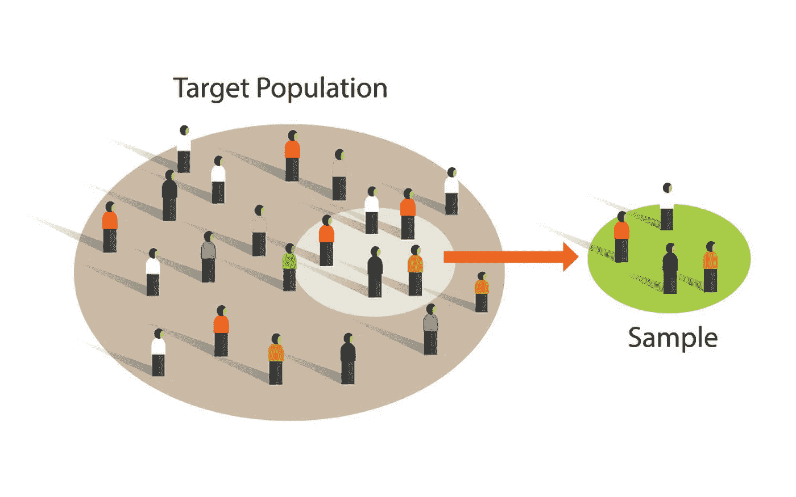

# 什么是抽样偏倚？

> 原文：<https://medium.com/analytics-vidhya/what-is-the-sampling-bias-bbde6560fa?source=collection_archive---------3----------------------->

得出一个有效的结论很大程度上取决于你如何收集数据。

在许多统计分析和数据驱动的决策中，我们需要得出一个可操作的结论，由已经收集或需要收集的数据来支持。**然而，从数据中得出的结论的质量很大程度上取决于你收集的数据的质量。**在数据收集过程中，您通常会从一个较大的数据集中抽取数据。在大多数情况下，您没有足够的时间收集所有情况下的数据，因此无法真实地度量预期的指标。然而，您可以通过更小的数据子集(称为*样本*)来推断更大数据集(但有时是理论的或想象的)的一些特征，通常称为*总体*。样本也用于各种测试中(例如，比较网页设计对点击的影响)。总体通常遵循未知的分布。**利用从样本推断出的经验分布，我们旨在估计总体分布或相关统计量。**

[*总体对样本*](https://www.vectorstock.com/royalty-free-vector/sample-from-population-statistics-research-survey-vector-16452707)

# 抽样

样本是从大型数据集(总体)中提取的数据子集。数据质量通常比数据数量更重要。因此，获取高质量的数据是得出有效结论的关键步骤，因为我们的统计模型和实验中可能潜伏着许多错误，导致无效的结果。在下文中，我们回顾了抽样中一些重要的和常见的偏差。

## 统计偏差

统计偏差是指测量或采样过程中产生的系统性测量或采样误差。**应区分因随机机会导致的误差和因偏差导致的误差。**在随机情况下，偏差是测量误差的结果，不会向特定方向倾斜，并且通常独立于每个样本。然而，对于由偏差引起的误差，该误差在某种程度上是相关的，并且具有围绕固定值的集中趋势。例如，所有样本都有一个常数的附加误差。这种类型的偏差可能是一个统计或机器学习模型被错误指定的指标，或者是一个重要的变量被遗漏了[1]。

为了对抗这种类型的偏差，提出了许多采样方法，但所有这些方法的核心都是随机采样。**随机抽样是指在每次抽签时，人口中的每个可用成员都有相同的机会被选中。**抽样可以通过替换来完成，即每次抽取时，每个被选中的样本都被重新包含在群体中，也可以不进行替换，即一旦群体中的某个成员被选中，就不能用于下一次抽取。

有时，即使抽样过程是随机的，如随机抽样，抽样也可能不能反映真实的总体。设想这样一种情况，人口由两种类型的成员组成，称为 I 型(99%)和 II 型(1%)。如果我们进行随机抽样，II 型成员被包括在我们的抽样中的机会是很小的。为了保持抽样的比例，一种抽样方法是*分层抽样*。在*分层抽样*中，人群被分成*个阶层*，从每个阶层中随机抽取样本。通过这样做，类型的每个成员都有与总体数据中的成员相同的机会。

## 选择偏差

选择偏差是统计偏差的一种形式，其中人口中的每个成员都被有意识或无意识地选择性选择，这导致了误导性的结论。

选择偏置之一是*数据监听*。当您将真实模式与所谓的噪声混合在一起时，就会发生数据窥探。当您检查数据并试图辨别模式而不检查它是否可重复时，这是最常见的。如果你发现的模式在许多情况下或可重复的实验中是不可证明的，它被认为是一种随机现象，通常被称为噪声。这是最常见的情况，尤其是当数据很小时。正如丹尼尔·卡内曼的一本可读的书《思考的快与慢》中提到的，

**“随机过程产生很多序列，让人们相信这个过程根本不是随机的。”**

还有另一种形式的选择偏差，它对数据分析特别有意义。这是一种选择偏差，约翰·艾尔德(一家受人尊敬的数据挖掘咨询公司艾尔德研究公司的创始人)称之为*巨大的研究效应*。如果你反复运行不同的模型，用一个大的数据集问不同的问题，你一定会发现一些有趣的东西。但是你发现的结果真的很有趣吗，或者只是偶然的异常？[1]我们可以通过使用维持集来测试模型的可预测性，从而最大限度地减少这种偏差。埃尔德还建议使用他称之为目标洗牌法，其实质是排列测试。

其他形式的选择偏差可能是精选数据、选择强调特定统计效果的时间间隔以及当结果看起来“有趣”时停止实验的结果

# 结论

在这篇短文中，我们旨在了解抽样和统计推断应用中常见的统计偏差。提出了一些方法来减少偏差以提高结论的质量。

参考

[1]布鲁斯、彼得、安德鲁·布鲁斯和彼得·格德克。*数据科学家实用统计学:使用 R 和 Python 的 50 多个基本概念*。奥莱利媒体，2020。