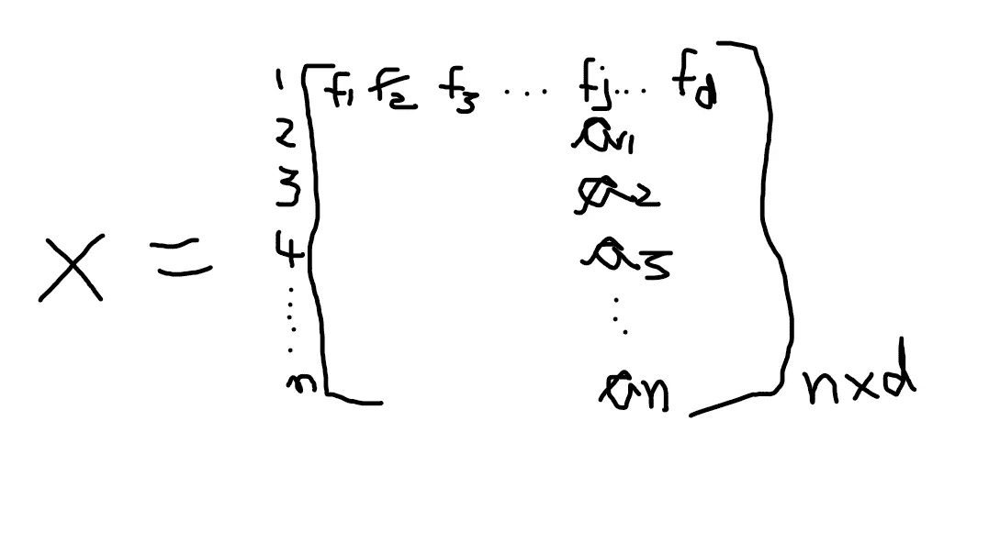
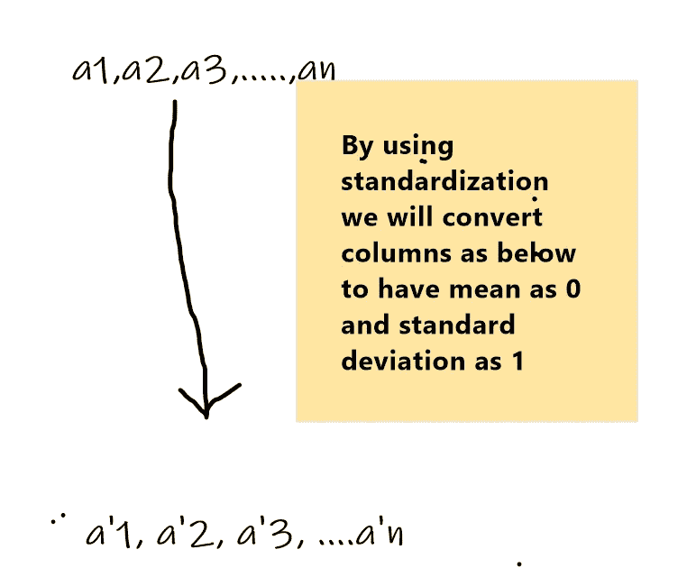
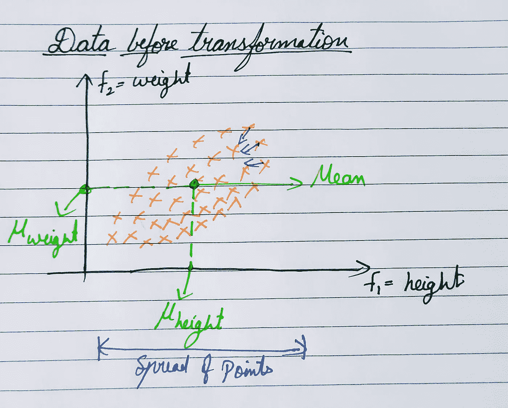
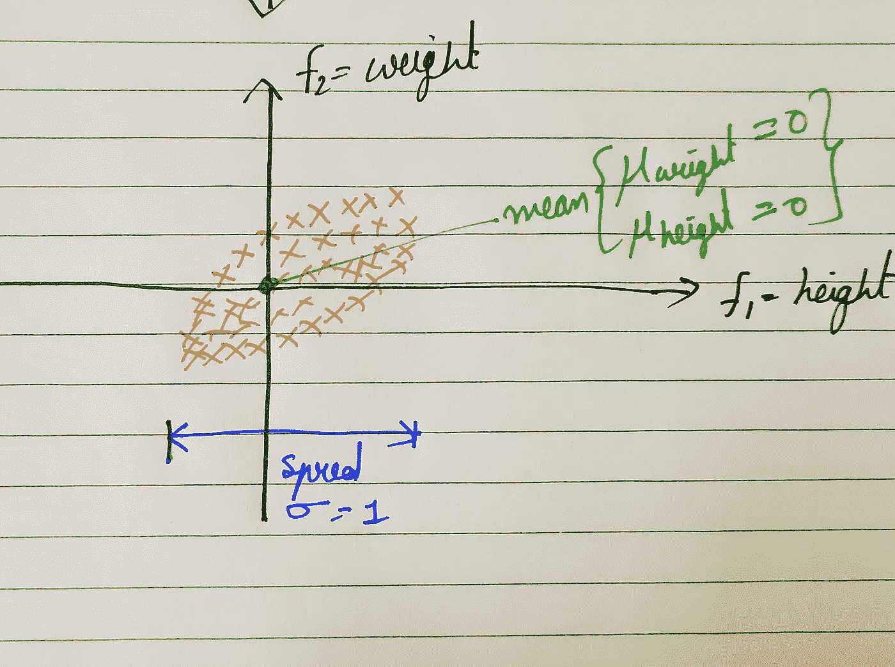
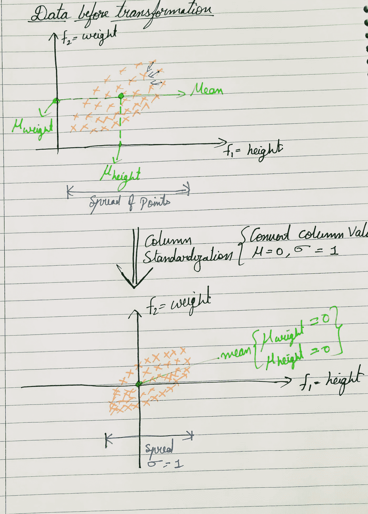

# 数据标准化有什么用，我们在机器学习中用在哪里

> 原文：<https://medium.com/analytics-vidhya/what-is-the-use-of-data-standardization-and-where-do-we-use-it-in-machine-learning-97b71a294e24?source=collection_archive---------0----------------------->

在学习机器学习的过程中，您会遇到单词标准化、列标准化或均值居中加缩放，但导入标准标量的目的是什么

`from sklearn.preprocessing import StandardScalar`

标准化到底是什么？？

在拟合机器学习模型之前，如何标准化数据以及为什么要这样做？

首先要标准化什么？

在这篇文章中，你将了解到关于标准化的清晰见解，所以让我们开始吧。

数据预处理阶段引入了标准化过程。在学习标准化之前，您还需要了解标准化。

**正常化:**

在列归一化中，我们工具化列值并将其压缩在[0，1]之间的范围内，以消除每个特征的尺度。

例:假设我们有一个数据集，它有一些特征，如一个人的身高和体重，这两个特征有不同的标度值，如身高(厘米)和体重(公斤)。

为了摆脱这种规模的特征，我们去归一化，类似于归一化我们有“**标准化**

**注意:**在实践中，列标准化比规范化更常用。

假设我们的数据集矩阵如下

其中 f1、f2、f3、..fj，…fd。是 d 个特征，1，2，3，…n 是特征/行值。

考虑一列 a1，a2，a3，…an。是特征“fj”的“n”个值

column standardize 具体做的是将列值(a1，a2，a3，…an)转换为(a'1，a'2，a'3…..a’n ),使得变换数据的平均值为零，标准偏差为一。在列规范化中，我们将{a'1，a'2，a'3…..a'n}从[0 到 1]范围内的所有值。

a1，a2，a3，…，an 可以是变换前的任何分布，但在变换后{a'1，a'2，a'3…..a'n}的均值= 0，标准差=1。

## **但是这种转变到底为什么重要呢？**

让我们从几何学的角度理解它的重要性。

考虑下面的数据集，其中' **x'** 是人的身高， **'y'** 是人的体重，**表示**位于数据集的中间，如下所示，还有**方差**。

方差度量数据的分布，分布越大→方差值越大。

通过使用列标准化转换上述数据集，我们得到了原点的平均值，如下所示，我们将点推得更近，使其分布/标准偏差=1。如果转换前的标准偏差小于 1，那么转换后，我们将彼此拉远，以达到标准偏差为 1。

色谱柱标准化也称为平均居中加缩放。

## 如果我们不进行标准化，会有什么影响吗？

如果特征遵循不同的缩放，那么模型将难以更快地收敛，并且训练的计算时间增加，并且也不会产生更好的结果。

当基础分布是高斯分布，比如均值=μ，标准差=σ时，列标准化更有效。这是因为当您归一化这样的特征时，您会得到 N(0，1)分布的新特征。这是一个理想的分布，有大量的 ML，统计和优化技术，假设高斯分布，使证明工作漂亮。

这并不意味着标准化对非高斯分布特征不好。它仍然会产生一个均值为 0、方差为 1 的新要素，但不是 N(0，1)分布。在实践中，我们执行标准化，而不考虑底层的特性分布。但是数学证明非常适合于高斯分布的情况。

# 总结:

1.  *数据标准化是重新调整属性的过程，使其均值为 0，方差为 1。*
2.  *执行标准化的最终目标是在不扭曲数值范围差异的情况下，将所有特征归入一个通用范围。*
3.  *在 sk learn . preprocessing . standard scaler()中，居中和缩放在每个特征上独立发生。*

# 如果你有任何反馈或批评，请随时与我分享。如果本演练对您有所帮助，请喜欢👏文章。干杯！