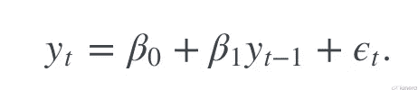

# 什么是时间序列预测？

> 原文：<https://medium.com/analytics-vidhya/what-is-time-series-forecasting-d34cdc2d9a2b?source=collection_archive---------3----------------------->

时间序列预测是机器学习的一个关键部分，但有时会被低估。这是很重要的，因为有许多预测问题与时间的组成部分。这些问题被忽略了，因为是时间成分使得时间序列问题难以解决。

在标准的机器学习方法中，我们通常将数据随机分为训练、测试和交叉验证数据。

当实际结果直到未来阶段才知道时，对初始数据进行预测。虽然未来是可以预测的，但所有早期的观察几乎总是被同等看待。也许用一些轻微的时间动态来克服“概念漂移”的概念，比如只使用最近一年的观测数据，而不是所有可用的数据。

时间序列数据集则不同。时间维度由时间序列添加，这提供了观察值之间的显式顺序依赖。

# 预测的类型

# 时间序列的组成部分

时间序列分析是一组用于更好地理解数据集的方法。将一个时间序列分成四个主要部分可能是最有帮助的:

1.  **级别—** 如果是直线，则为系列的基线值。
2.  **趋势—** 序列在整个时间内的可选且频繁的线性增长或下降趋势。
3.  **季节性—** 在整个时间内重复出现的行为模式或周期。
4.  **噪声—** 模型无法解释的观察值的可选可变性。

# 时间序列分析在哪里使用？

时间序列分析有助于分析以前的数据，这随后成为预测未来的一个重要方面。大多数公司依靠时间序列预测来确定将要进行的活动和决策。组织通过收集大量历史数据并将其与当前趋势进行比较来做到这一点，从而做出更明智的决策。下面是时间序列预测的两个最常见的应用。

## 1.股票市场分析

股票价格本质上是离散时间模型，其数据点(如价格)与时间无关。一些主要组成部分，如趋势和季节性，可以使用时间序列预测和算法来计算，以帮助投资者预测价格运动。

## 2.预算分析

保持稳定的现金流收入对一个公司来说至关重要，因为它可以让利益相关者准确预测该财政年度的收入和支出。这就是为什么预算是至关重要的。它使公司能够根据当年的分配和成本计划下一年的预算。

# 业界流行的算法

下面显示的所有算法对所提供的数据进行某种类型的基本分析，以确定用于预测目的的一些相关属性。

## 自回归(AR)

为了估计未来趋势，自回归模型学习先前数据的行为模式。在回归模型中，先前时间段的响应变量已经成为新的预测因子，并且误差已经被假定为关于任何基本线性回归模型中的误差。这很容易理解。值得注意的是，对于时间 t 的预测，该方程依赖于 t-1 等等，直到 t-n。这被称为滞后预测，因为它是基于先前时间段的数据点。

## 移动平均线

与 AR 模型不同，移动平均技术在类似回归的模型中利用先前预测的错误(或噪声)来开发数据的平均趋势。

移动平均定义为当前随机误差和先前误差的加权和，如下式所示:

*   **c** 指一些均值为零、方差较小的白噪声
*   **θ1** 指第一个数据点的系数
*   **ϵt-1** 和 **ϵt** 分别指过去和当前时期

## 自回归移动平均(ARMA)

ARMA 方法只是上面讨论的移动平均和自回归算法的组合。趋势的速度和模式用自回归提取，白噪声效应用移动平均捕捉，两者结合形成 ARMA。

*   **p** 是自回归模型的阶数
*   **q** 是移动平均模型的阶数

## 自回归综合移动平均(ARIMA)

ARIMA 是时间序列预测中最常用的算法之一。ARIMA 试图解释数据点之间的自相关，而其他模型描述了数据点的趋势和季节性。

为了使其稳定，ARIMA 算法生成的模型可以描述为差分时间序列预测模型。

*   **α** 表示白噪声的某个值
*   **p** 是自回归项的阶(滞后预测)
*   **q** 是移动平均的阶数(滞后误差)

一般来说，ARIMA 以如下格式表示:

ARIMA( **p，d，q**

## 指数平滑法

指数平滑程序用于通过指数降低早期数据值的权重，产生加权平均值，从而生成相对平滑的时间序列预测趋势。为了将模型性能最大化到缓慢波动的平均值，需要修改平滑度(移动平均值的宽度)。

指数平滑的最基本版本如下:

*   **α** 是平滑度范围 0 < *α* < 1。换句话说，在那个特定的时间框架内，那个特定的观察有多重要。

指数平滑法适用于任何时间序列预测或分析，因为它们需要很少的计算能力。

*总而言之，可以使用几种替代的时间序列预测算法和分析方法来获得必要的信息。无论是使用自回归算法来生成预测的趋势模式，还是使用 ARIMA 模型来推断数据的相关模式，这都取决于应用程序的使用案例和复杂性。因为大多数时间序列预测评估很容易，所以选择最简单和最容易的模型是最好的方法。*

 [## ravindu kavishwara -机器学习研究员-自雇| LinkedIn

### 我想象有一天我们生活在一个一切都自动化的社会。人工智能处理一切。我…

www.linkedin.com](https://www.linkedin.com/in/rkavishwara/)