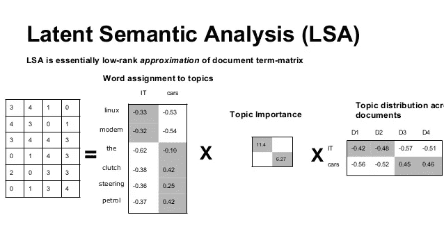

# 什么是主题建模？

> 原文：<https://medium.com/analytics-vidhya/what-is-topic-modeling-161a76143cae?source=collection_archive---------9----------------------->

Joyce McCown 在 [Unsplash](https://unsplash.com/s/photos/pages?utm_source=unsplash&utm_medium=referral&utm_content=creditCopyText) 上的照片

主题建模是一种统计建模工具，用于评估一组文档中讨论的所有抽象主题。主题建模通过其构造解决了以无监督的方式创建主题的问题。

一般来说，使用统计方法是因为考虑到每个文档谈论几个不同的主题，而每个主题通常由词的分布来表示。也就是说，假设文档有一个两步结构，例如文档=[主题 1，主题 2，主题 3，…，主题 N]，然后主题 1 = [w 1，w 2，…，w N]。

很明显，主题建模一般是通过统计字数、其比例以及相关指标来进行的。我将基于我刚刚讨论的想法描述两个模型，LSA(潜在语义分析)和 LDA(潜在狄利克雷分析)。

因此，主题建模是一种无监督的机器学习方法，用于从未标记的数据中建模主题，因此它可以在没有任何训练的情况下工作。由于显而易见的原因，主题建模因此是一个粗略的开始方法，而不是一个复杂的最终解决方案。

**主题分类建模** 虽然主题建模是一种无监督的建模，但我们需要针对我们的定制主题训练模型，以实现高端和更准确的系统使用。例如，如果您正在构建用于检测支持票证的分类模型，在这种情况下，您可能希望为票证分配特定的主题，而不是像我们在主题建模中那样从票证创建主题。因此，主题分类模型更像是一个简单的文本分类模型，我们将文本分类到多个主题中。

**主题建模与主题分类建模的区别** 正如我在上面的段落中所描述的，很明显，主题分类是一个有监督的过程，而主题建模是一个无监督的建模工作。在一般的建模工作中，我们从主题建模开始，然后找出自然出现的主题。最后，我们创建人类策划的主题，用于主题分类建模。

两种不同的主题建模技术:

在本文中，我们将讨论主题建模的两种主要方法。这两种方法是:

1.  LSA:潜在语义分析
2.  LDA:潜在狄利克雷分析

# **LSA:潜在语义分析**

这是一种利用词包和术语-文档矩阵来检测主题的方法。LSA 背后的假设是，不同的主题有不同的词汇分布，以及不同的主题有不同的主题分布。

o 用数学方法解决这个问题，我们首先从语料库中创建一个单词包。然后，我们创建一个单词-文档频率矩阵，其中行中有单词，列中有不同的文档。因此，矩阵的单元(I，j)表示单词 w_i 在文档 D_j 中出现了多少次

现在，我们使用 LSA 的上述假设将这个矩阵分解为三个矩阵，它们是:

1.  单词-主题频率矩阵:在这个矩阵中，单词在行，主题在列。每个单元格表示一个单词在相应列中的出现。[MxN 矩阵]
2.  主题重要性矩阵:这是一个对角矩阵，矩阵的第 I 个对角元素表示主题的重要性
3.  主题-文档矩阵:在这个矩阵中，主题在行，文档在列，每个单元格表示一个主题在相应文档中的权重。[NxM 矩阵]

来源:https://goo.gl/images/Fsw2ak

对于矩阵使用，我们使用奇异值分解矩阵分解。使用 SVD，我们分解矩阵 M 如下:

M = UDV

其中 U 是酉矩阵，D 是对角矩阵，V 也是酉矩阵。这确保了中间矩阵是对角线。现在你可能会问，为什么我们要用这个特殊的矩阵分解。

这个问题的答案是，从线性代数的角度考虑，SVD 将线性映射转换为不同的基表示，这样它就变成了 d。例如，因为 U 和 V 是酉矩阵，所以我们可以写为，

M = UDV => UTMVT = D

这可以解释为术语频率矩阵基本上是通过创建由主题(单词的线性组合)构成的基础，然后通过另一个从主题到单词的映射来表示从单词到矩阵的映射。

因此，由于原始 svd 将对角矩阵表示为改变的基表示的 SVD(某种重要性值);这清楚地暗示了在这种情况下对角矩阵代表主题的权重(这是新的基础)。

# **LDA:潜在狄利克雷分析**

LDA 是 LSA 的一个重大改进，因为 LSA 认为在文档结构中没有概率确定。在 LDA，这是主要的变化。

潜在狄利克雷分配(LDA)是一种语料库的生成概率模型。其基本思想是将文档表示为潜在主题的随机混合，其中每个主题都以单词分布为特征。LDA 为语料库 D 中的每个文档 w 假设以下生成过程:

1.  选择 N，它服从泊松分布，λ= e
2.  选择θ，它遵循狄利克雷分布，α=α
3.  对于 N 中 N 的每个单词 w_n:选择一个服从θ的多项式分布的主题 z_n，选择一个来自 p(w_n|z_n，beta)的单词 w_n，p 是以主题 z_n 为条件的多项式概率

由此，我们可以计算出理论上依赖于α，β的单字的概率分布。对于不同的单字，我们也可以从实际数据集得到分布。

为了最终解决这个问题，我们需要优化α和β，以减小理论概率分布和观测概率分布之间的 kullback leibler 散度距离