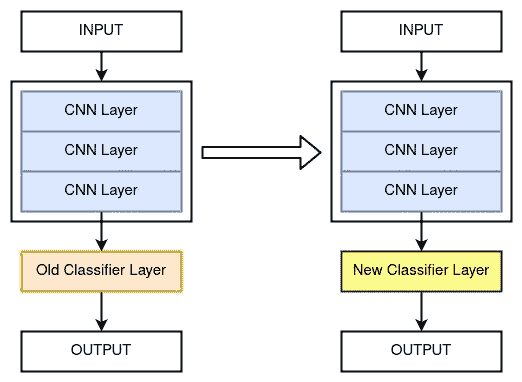
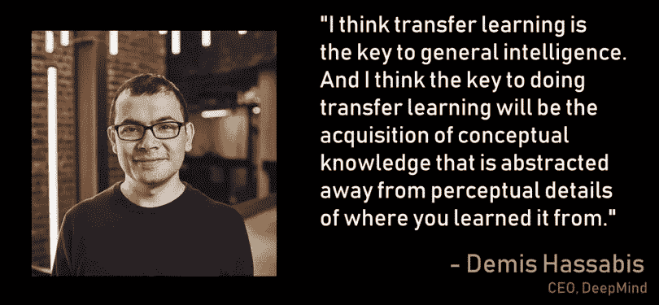

# 什么是迁移学习？—白痴开发者

> 原文：<https://medium.com/analytics-vidhya/what-is-transfer-learning-idiot-developer-d68446ca9cf6?source=collection_archive---------9----------------------->

迁移学习是机器学习中的一种技术，其中我们重用预先训练的模型来解决不同但相关的问题。这是训练深度神经网络的常用方法之一。它通常用于数据集量较小的影像分类任务。

在本文中，我们将介绍什么是迁移学习，它是如何工作的，以及它提供的优势。此外，我们还将讨论与之相关的最常见问题。

> *迁移学习是深度学习中的一个研究问题，在这种情况下，在一项任务上训练的模型被重用来初始化另一个模型，以训练类似的任务。*

**目录:**

1.  什么是迁移学习？
2.  迁移学习是如何工作的？
3.  为什么要用迁移学习？
4.  进一步阅读
5.  摘要

# 什么是迁移学习？

人类有能力利用在不同任务中学到的知识。我们能够很容易地将从一项任务中学到的知识转移到另一项类似的任务中。

例如:

*   如果你知道如何骑自行车，你可以很容易地学会骑汽车。
*   如果你懂数学，你就可以轻松地学习物理。

在传统的深度学习中，模型只被训练来学习一种类型的任务。要学习另一项任务，我们必须从头开始重新构建模型。为了克服这个限制，我们将学习迁移学习的概念。

迁移学习是深度学习中的一个研究问题，在这种情况下，在一项任务上训练的模型被重用来初始化另一个模型，以训练类似的任务。例如，您有一个为野生动物分类而训练的影像分类模型。你可以使用这个预先训练好的模型，并将其用于犬种分类。它主要用于计算机视觉和自然语言处理任务。

## **阅读更多:**

*   [**什么是深度学习？**](https://idiotdeveloper.com/what-is-deep-learning/)
*   [**tensor flow**](https://idiotdeveloper.com/dog-breed-classification-using-transfer-learning-in-tensorflow/)中利用迁移学习进行犬种分类

在深度神经网络方面，我们使用预训练模型的权重，并使用它来初始化另一个深度神经网络，以创建新的模型。这个新模型包含先前预训练模型所学习的特征。这样，我们利用从一项任务中获得的知识来提高另一项任务的绩效

# 迁移学习是如何工作的？

在[深度卷积神经网络](https://idiotdeveloper.com/convolution-neural-network-cnn-fundamental-of-deep-learning/) (CNN)中，我们有不同的层，它们从数据中学习不同的特征。这些特征最终形成了整个深度神经网络。这些功能检测早期图层中的线条和边缘以及中间层中的形状。最后一层中的功能是特定于任务的。在迁移学习中，我们使用早期和中间层的特征，并从头开始训练最后一层。这有助于我们利用预训练模型在之前的任务中学习到的特征。

早期和中间层由通用特性组成，这些特性可以很容易地用于其他类似的任务。而最后的层或分类器层由特定于任务的特征组成。这些特征需要从新的数据集中学习。

# 为什么要用迁移学习？

迁移学习比现有的方法有几个优点。

1.  节省训练时间。
2.  需要较少的标记数据。
3.  更好的性能。
4.  更好的泛化能力。

深度神经网络由大量需要大量数据的参数组成。训练过程需要很多时间，当数据集非常大时，有时需要几天甚至几周。使用迁移学习方法，我们不需要从头开始训练模型，因此它需要更少的标记数据和更少的训练时间。

因为，我们使用的是一个预先训练好的模型，它已经在各种各样的数据上进行了训练。因此，即使在极端情况下，新形成的模型也会有更好的性能。这将使模型具有更好的泛化能力，并使其更加健壮。

# 进一步阅读

*   [**温和介绍转移学习进行深度学习**](https://machinelearningmastery.com/transfer-learning-for-deep-learning/)
*   [**迁移学习— CS231n 卷积神经网络用于视觉识别**](https://cs231n.github.io/transfer-learning/)

*   [**什么是迁移学习？探索流行的深度学习方法**](https://builtin.com/data-science/transfer-learning)
*   [**关于迁移学习的调查**](https://www.semanticscholar.org/paper/A-Survey-on-Transfer-Learning-Pan-Yang/a25fbcbbae1e8f79c4360d26aa11a3abf1a11972?p2df) —研究论文
*   [**深度神经网络中特征的可转移性如何？**](https://arxiv.org/abs/1411.1792) —研究论文

# 摘要

在本文中，您已经了解了什么是迁移学习，以及它如何优于经典的深度学习方法。具体来说，您已经了解了:

*   什么是迁移学习？
*   迁移学习是如何工作的？
*   为什么要用迁移学习？

仍然，有一些问题或疑问？就在下面评论吧。更多更新。跟我来。

*   [**YouTube**](https://www.youtube.com/idiotdeveloper)
*   [**脸书**](https://facebook.com/idiotdeveloper)
*   [**推特**](https://twitter.com/nikhilroxtomar)
*   [**Instagram**](https://www.instagram.com/nikhilroxtomar)

*原载于 2021 年 8 月 24 日 https://idiotdeveloper.com***。**