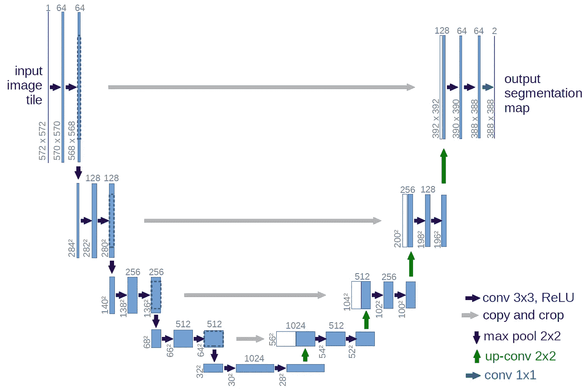

# 什么是 UNET？

> 原文：<https://medium.com/analytics-vidhya/what-is-unet-157314c87634?source=collection_archive---------1----------------------->

UNET 是由 Olaf Ronneberger 等人于 2015 年在德国弗莱堡大学开发的用于生物医学图像分割的架构。这是当今任何语义分割任务中最常用的方法之一。这是一个完全卷积的神经网络，旨在从较少的训练样本中学习。它是对现有 FCN 的改进，即 Jonathan Long 等人在(2014)开发的“用于语义分割的全卷积网络”。

UNET 建筑

# **UNET —网络架构**

UNET 是一种 U 形编码器-解码器网络架构，它由四个编码器模块和四个解码器模块组成，通过一个桥连接。编码器网络(收缩路径)将空间维度减半，并将每个编码器块的滤波器(特征通道)数量加倍。同样，解码器网络使空间维度加倍，特征通道的数量减半。

**编码器网络**

编码器网络充当特征提取器，并通过一系列编码器块学习输入图像的抽象表示。每个编码器模块由两个 3×3 卷积组成，每个卷积之后是一个 ReLU(校正线性单元)激活函数。ReLU 激活函数将非线性引入网络，这有助于更好地概括训练数据。ReLU 的输出充当对应解码器块的跳跃连接。

接下来，遵循 2x2 最大池，其中特征地图的空间维度(高度和宽度)减少一半。这通过减少可训练参数的数量来降低计算成本。

**跳过连接**

这些跳过连接提供了帮助解码器生成更好的语义特征的附加信息。它们还充当快捷连接，帮助渐变间接流向早期层，而不会出现任何退化。简而言之，我们可以说，跳过连接有助于在反向传播时更好地流动梯度，这反过来有助于网络学习更好的表示。

**桥**

网桥连接编码器和解码器网络，并完成信息流。它由两个 3x3 卷积组成，每个卷积后面都有一个 ReLU 激活函数。

**解码器网络**

解码器网络用于获取抽象表示并生成语义分割掩码。解码器模块从 2x2 转置卷积开始。接下来，它与来自编码器模块的相应跳过连接特征映射相连接。这些跳跃连接提供了早期图层中的要素，这些要素有时会因网络深度而丢失。之后，使用两个 3×3 卷积，其中每个卷积后都有一个 ReLU 激活函数。

最后一个解码器的输出通过 sigmoid 激活的 1x1 卷积。sigmoid 激活函数给出了表示逐像素分类的分割掩模。

# **注**

*   一些研究人员更喜欢在卷积层和 ReLU 激活函数之间使用批处理归一化层。批量归一化减少了内部协方差漂移，使网络在训练时更加稳定。
*   在 ReLU 激活功能之后的某个时候也使用 dropout。它通过丢弃(忽略)一些随机选择的神经元，迫使网络学习不同的表示。这有助于网络减少对某些神经元的依赖。这反过来有助于网络更好地概括和防止它过度拟合。

**原载**:【https://idiotdeveloper.com/what-is-unet/】T4