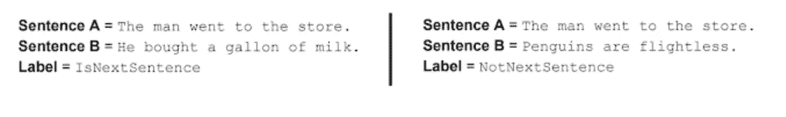
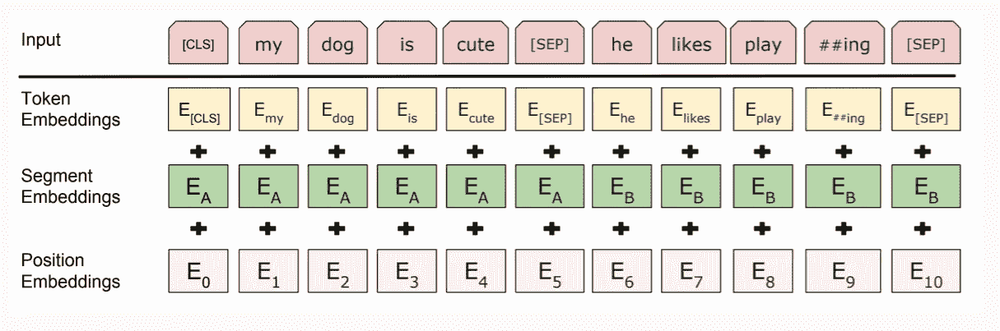
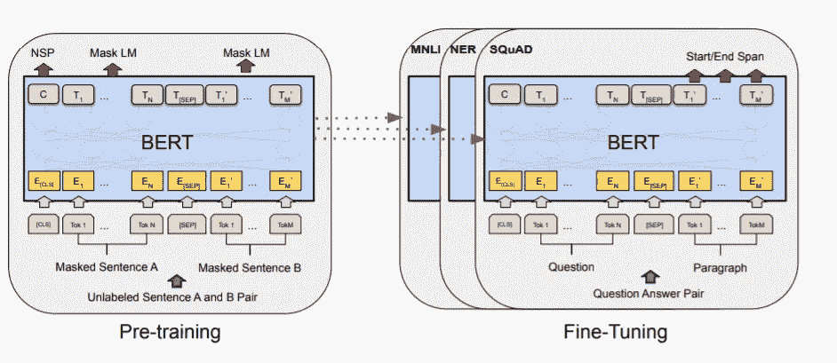

# 伯特有什么特别之处？

> 原文：<https://medium.com/analytics-vidhya/what-makes-bert-special-a4b85c1ea68e?source=collection_archive---------1----------------------->

## 为什么 BERT 在 NLP 中这么特别？我对这个开创性的 NLP 变压器模型的理解。

众所周知，大多数基于自然语言处理的模型受益于大量的训练数据。但是，获得更多的训练数据一直是一项具有挑战性的任务，大多数特定于任务的数据集只包含几千行人类标记的训练样本。

为了帮助缩小训练数据可用性的差距，我们现在有几个 NLP 预训练模型，如 ELMO，GPT，可以在特定的语言相关任务上进行微调。BERT 就是其中之一，它在情感分析、问题回答等 11 个自然语言理解任务中的突破性表现似乎已经在 NLP 中创造了突破。

# **伯特是什么？**

2018 年，谷歌开发了一种基于变压器的 NLP 预训练模型，称为 BERT 或变压器的双向编码器表示。它只不过是一个[转换器语言模型](https://jalammar.github.io/illustrated-transformer/)，有多个编码器层和自我关注头。随着 BERT 的发布，世界上任何人现在都可以在单个云 TPU 上在大约 30 分钟内，或者使用单个 GPU 在几个小时内训练自己的问题回答模型、情感分析或任何其他语言模型。

酷…对吧？

现在让我们看看它在 NLP 中有什么特别之处。

# 伯特有什么特别之处？

BERT 是一个深度双向、无监督的语言表示模型，与以前的模型不同，它能够处理与句子中所有其他单词相关的单词。它可以通过同时查看单词前后的单词来考虑单词的完整上下文。

例如，考虑下面的句子，

我的**背**疼。我会在 5 分钟后回来。

这里的 **back** 是指上面句子中两种不同的语境。先前可用的上下文无关模型对于在上面的句子中单词**后面**的出现将具有相同的向量表示。而 BERT，由于其双向性，比单向语言模型具有更深的语言上下文感，因此将上述单词**存储为基于句子上下文而不同的不同向量。**

# 伯特是如何工作的？

## 预处理:

BERT 中的预训练包括两个步骤，

蒙面 LM(MLM)

下一句预测(NSP)

## 蒙面 LM(MLM):

在将单词序列输入 BERT 之前的这一步中，每个序列中 15%的单词被替换为一个[MASK]标记。然后，该模型将被训练成通过查看序列中其他非屏蔽词的上下文来预测屏蔽词。

来源

## 下一句预测(NSP):

在训练过程的这一步，BERT 接收一对句子作为输入，并学习预测第二个句子是否是前一个句子的下一个句子。在训练期间，50%的输入是一对，其中第二个句子是原始文档中的下一个句子，而在另外 50%中，从语料库中随机选择一个句子作为第二个句子。

[来源](https://ai.googleblog.com/2018/11/open-sourcing-bert-state-of-art-pre.html)

## 输入表示:

使用以上两个步骤，在预训练阶段，我们创建了输入的密集表示，如下所示。

[来源](https://nlp.stanford.edu/seminar/details/jdevlin.pdf)

如上所示，句子对被打包成一个输入序列。输入序列在第一个句子的开头插入了一个“分类器”[CLS]标记，在每个句子的结尾插入了一个[分离]标记。每个标记具有标记嵌入、指示句子 A 或句子 B 的段嵌入和指示每个标记在序列中的位置的位置嵌入。然后，每个令牌被视为所有这三个嵌入的总和。

在训练 BERT 模型时，掩蔽 LM 和下一句预测一起训练，使得两种策略的组合损失函数最小。

**注意:**对于预训练语料库，BERT 使用了图书语料库(800M 单词)和英语维基百科(2,500M 单词)。

## 微调:

[来源](https://arxiv.org/pdf/1810.04805.pdf)

正如您所看到的，除了输出层，预训练和微调都使用了相同的架构。经过预训练后，我们只需将特定于任务的输入和输出插入 BERT，并端到端地微调所有参数。

例如，在问题回答的情况下，输入序列将是两个句子，句子 A 代表问题，下一个句子 B 代表其相应的答案。

最后，在输出端，记号表示被馈送到用于记号级问题回答任务的输出层，并且[CLS]表示被馈送到用于分类任务(例如情感分析)的输出层。

## 总结:

所以总结一下，

我们首先将任务的输入输入到 BERT 中，这涉及到 MLM 和下一句预测的组合，一旦经过预训练，我们就可以针对特定语言的任务进行微调，方法是在末尾添加一个额外的输出层，将预测转换为特定任务的答案。

请记住，这种微调的成本相对较低，所有上述过程在单个云 TPU 上最多只需 1 小时，在 GPU 上只需几个小时。

如果你对这篇文章感兴趣，请在下面的评论中告诉我。请关注我，获取更多与 NLP 相关的文章。

感谢您的阅读！

## 参考资料:

[https://jalammar.github.io/illustrated-transformer/](https://jalammar.github.io/illustrated-transformer/)

[https://ai . Google blog . com/2018/11/open-sourcing-Bert-state-of-art-pre . html](https://ai.googleblog.com/2018/11/open-sourcing-bert-state-of-art-pre.html)

【https://arxiv.org/pdf/1810.04805.pdf 