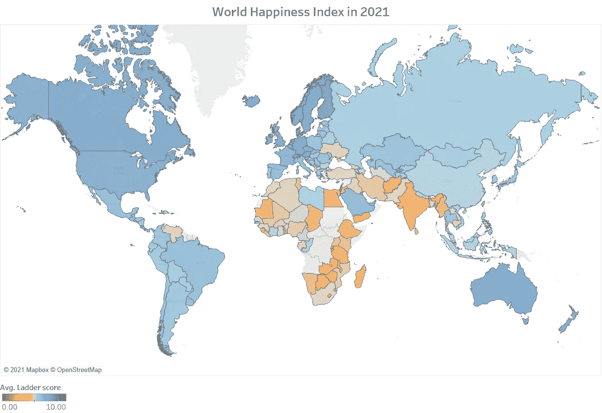
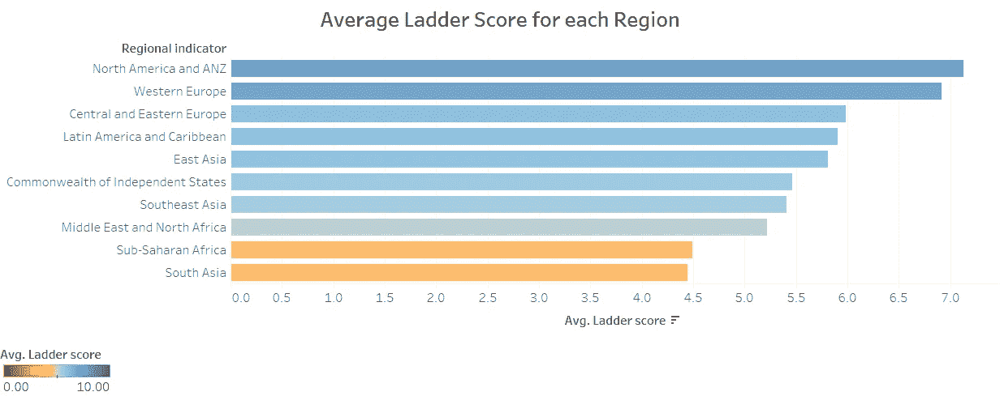
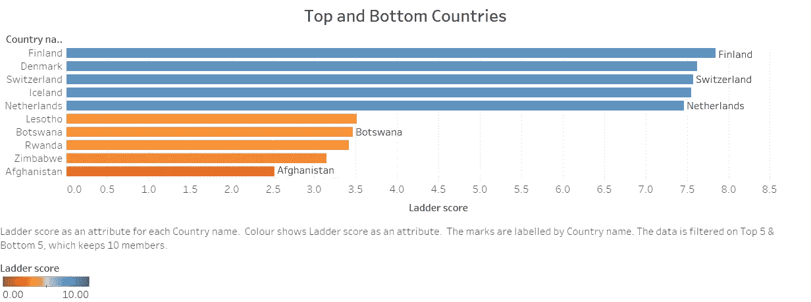
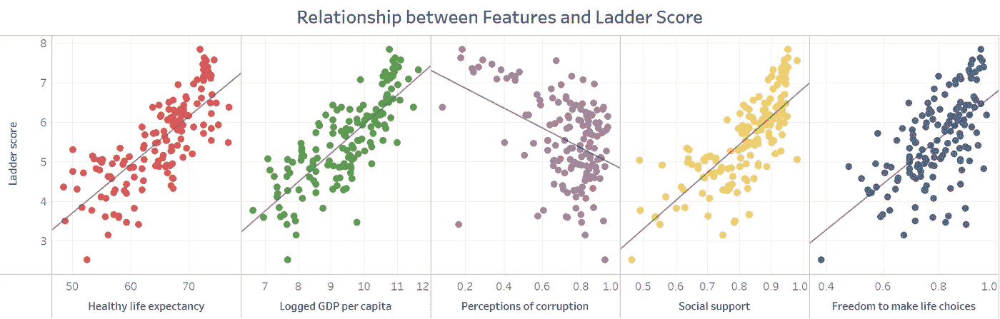
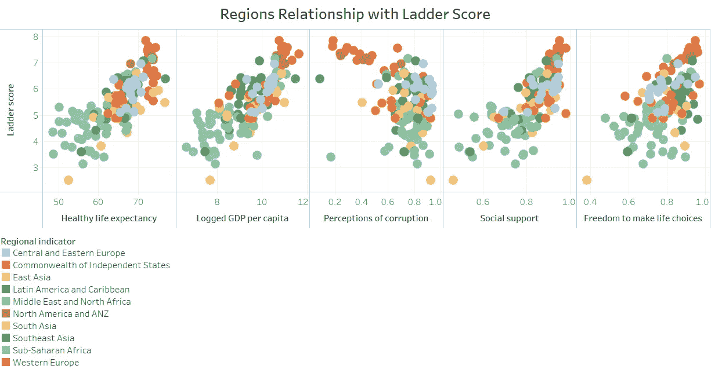
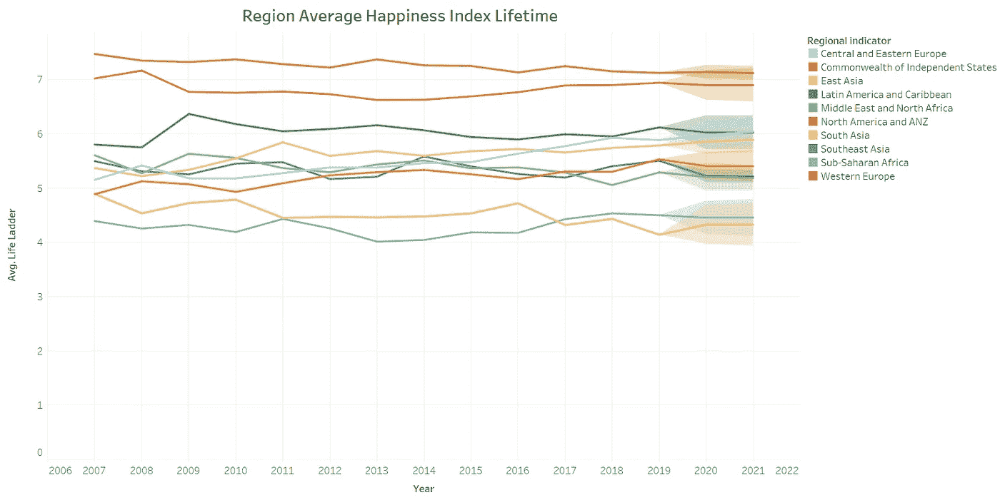
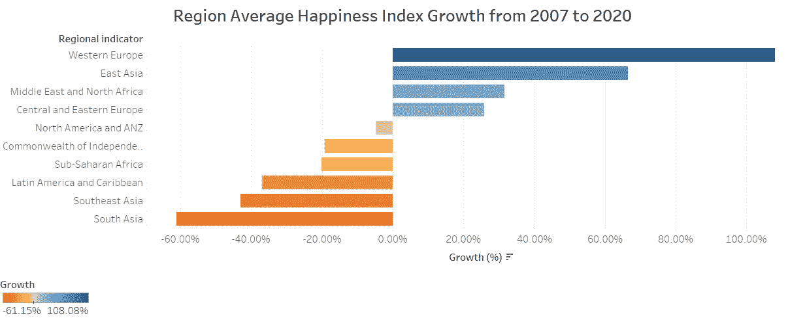

# 什么让我们更快乐？

> 原文：<https://medium.com/analytics-vidhya/what-makes-us-happier-53761e8a6d36?source=collection_archive---------19----------------------->

## 让我们分析一下盖洛普世界民意调查的历史数据。

[球场品牌](https://unsplash.com/@ballparkbrand?utm_source=medium&utm_medium=referral)在 [Unsplash](https://unsplash.com?utm_source=medium&utm_medium=referral) 上的照片

你可能想知道，每次旅行时，你都会看到人们之间快乐的差异。也许你会想到一些国家，那里的普通人看待生活的方式比你积极。这可能有解释，也可能没有——但有数据可以解释为什么每个国家的一些人比其他人更幸福。

幸福很难衡量，因为每个人都是不同的，然而，盖洛普做了调查，以创造幸福指数。有了这些结果，我们可以分析数据，更好地理解是什么让我们更快乐。

为了进行这一分析，我使用了最近在 2021 年更新的盖洛普世界民意调查的数据。主要目标是观察各国幸福指数以及变量和指数之间的关系。我使用 Python 进行数据清理，使用 Tableau 进行数据分析和可视化。

上面我们可以观察到 2021 年幸福指数的大致地图。幸福是通过 0-10 分的阶梯分数来衡量的。我们可以看到，蓝色程度的国家幸福程度更高，橙色程度的国家最不幸福。但是当我们看到地图时，我们能理解什么呢？

根据阶梯评分，北美和西欧是幸福水平最高的地区，撒哈拉以南地区和南亚是幸福水平最低的地区。北美人口的幸福感几乎是南亚人口的两倍。

最幸福的五个国家是芬兰、丹麦、瑞士、冰岛和荷兰。而最不幸福的 5 个国家是莱索托、博茨瓦纳、卢旺达、津巴布韦和阿富汗。排名前 5 的国家比排名后 5 的国家快乐两倍。有了这些数据，我们可以了解哪些国家更幸福，而且根据常识，我们可以考虑与每个国家的经济发展相关的因素。与最不发达国家相比，经济发达国家的阶梯得分更高，但让我们试着了解影响该指数的主要变量是什么，并证明这一假设。

盖洛普提供的数据提供了 5 个不同的变量——健康的预期寿命、人均 GDP、对腐败的看法、社会支持、做出生活选择的自由以及慷慨程度。根据我的回归分析，健康的预期寿命、人均 GDP、社会支持和做出生活选择的自由与阶梯分数呈正相关。对腐败的看法与阶梯得分呈负相关。慷慨程度与阶梯分数无关，因此从回归模型中移除。人均国内生产总值是相关性最强的变量，其次是健康预期寿命和社会支持。较高的健康预期寿命、较高的人均国内生产总值、较高的社会支持、较高的生活选择自由度和最低的腐败认知与阶梯得分呈正相关。

西欧和北美国家似乎拥有最高水平的健康预期寿命、人均 GDP、社会支持和做出生活选择的自由。在此图中，我们可以清楚地观察到一些区域的数据聚类。西欧和北美国家的腐败程度似乎也很低。这些数据可以让我们理解为什么这些地区的幸福水平表现良好。一些南亚国家在这些指标上表现不佳。撒哈拉以南非洲国家在健康预期寿命和人均 GDP 方面明显表现不佳。很明显，西欧和北美国家表现良好，但与其他国家相比，拉丁美洲国家也表现良好，它们的表现与中欧和东欧国家相似。

根据现有数据，自 2007 年以来，北美和西欧国家的幸福感已经持续了 10 多年。我们可以观察到，在过去的几年里，南亚国家变得越来越不快乐，他们出现了负增长。这带来了有趣的分析，表明多年来西欧国家变得更加幸福。在过去的几年里，南亚、东南亚、撒哈拉以南地区和拉丁美洲国家变得越来越不幸福。这可能反映了这些区域在与阶梯分数有关系的变量中变得更差。另一个有趣的观察是，北美国家变得越来越不快乐。

拥有这些特征定义了我们的幸福？

有明显的特征可以解释更幸福和更不幸福的国家。更幸福的国家往往腐败更少，更富有，有社会支持，也更自由。然而，在我看来，这些区别并不能让我们确信，如果我们生活在这些国家，我们会更幸福。每个人都不同，都有自己的衡量标准。我们可以分析成千上万的变量，但永远不会给我们幸福的确定性。

我曾在萨尔瓦多、巴西、葡萄牙等国家生活过，也去过不同类型的国家——我在这些国家生活和访问的经历清楚地表明，这一分析中提出的特征可能会产生积极影响，例如更大的财富、更健康的生活、更少的腐败和做出生活选择的自由，但这并不适用于所有人。将来分析新冠肺炎对我们幸福的长期影响会很有趣。

[**关注我获取更多**](https://duranerick2011.medium.com/)