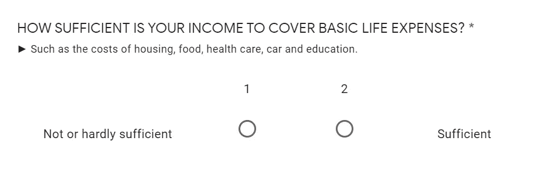

# 什么能预测工作与生活的平衡？使用 Scikit-Learn 线性回归从 15，000 多份幸福调查数据中发现真知灼见

> 原文：<https://medium.com/analytics-vidhya/what-predict-work-life-balance-uncovering-insights-from-15-000-happiness-survey-data-70e7f485f20b?source=collection_archive---------1----------------------->

[混合动力](https://unsplash.com/@artbyhybrid?utm_source=medium&utm_medium=referral)在 [Unsplash](https://unsplash.com?utm_source=medium&utm_medium=referral) 上拍照

由于世界仍在疫情，保持心理稳定的挑战变得越来越重要。对于我们这些有幸参加工作的人来说，工作安排变化带来的额外复杂性会对我们的心理健康产生压力。有些人仍能在工作中蒸蒸日上，有些人则不然。那么，是什么导致了这种差异呢？

“真实的幸福”在 5 年多的时间里完成的一项研究(来源: [Kaggle](https://www.kaggle.com/ydalat/lifestyle-and-wellbeing-data/code) )为我们提供了>15000 份对工作生活平衡分数不同的人的观察，控制了性别、年龄、健康和对收入水平的看法等分类特征。使用多元线性回归的方法，我们将更深入地研究什么样的特征可以预测谁在工作生活平衡方面更成功，希望能给我们一些启示。

> 声明:我不是训练有素的统计学家，也绝不是统计专家。因此，这篇文章不应该作为如何进行良好的统计分析的参考，而应该作为在 Python 中建立多线性回归模型的尝试。话虽如此，我将尽力忠实于多线性回归的程序和假设，这样模型仍然可以产生有意义的见解。

这篇文章的结构如下:

1.  数据加载和预处理
2.  探索性分析
3.  特征转换和选择
4.  多元线性回归模型
5.  洞察力生成

**数据加载和预处理**

本文使用的数据集来自于这个 [Kaggle 数据集](https://www.kaggle.com/ydalat/lifestyle-and-wellbeing-data)，这个数据集来自于这个[真实幸福](http://www.authentic-happiness.com/your-life-satisfaction-score)调查，该调查基于发表在《360 生活指南》上的研究来衡量工作与生活的平衡得分。

我用的是 Google Collaboratory，它支持直接从 Kaggle 加载和提取数据。该方法的更多解释可参见[这里的](https://www.analyticsvidhya.com/blog/2021/06/how-to-load-kaggle-datasets-directly-into-google-colab/)。

从 Kaggle 加载数据集

从 kaggle 数据集创建数据帧 *df* 并添加变量年份和月份以供以后探索。

创建数据框架并添加年和月功能

下表显示数据已正确加载。请注意，在继续之前，我们可能需要先了解许多特性。因为所有的特征都来自调查数据，所以通过直接进入[调查链接](http://www.authentic-happiness.com/your-life-satisfaction-score)可以更好地理解描述的细节。

数据帧俯视图

通过 df.dtypes 检查特征数据类型表明，几乎所有的变量都是整数。我们的目标变量是工作 _ 生活 _ 平衡 _ 得分，自变量是分类(性别、年龄)或顺序尺度(计数数据类型，即核心循环数)的其余变量。

唯一意外的类型来自显示 Object 的 DAILY_STRESS 特性，我们需要在 EDA 之前首先将它转换为 integer。

数据帧类型

以下代码将 DAILY_STRESS 对象转换为整数，并将任何不可转换的值替换为中值(注意:在手动检查时，只有一行观察值会受到影响)

将对象转换为整数

使用 df.describe()还可以了解我们正在查看多少数据以及所有的描述性统计数据。从下表中可以明显看出，我们正在处理 15，972 条观察结果。不错！

**探索性分析**

现在让我们研究一下我们的数据。使用直方图映射，我们将能够更好地理解数据分布和所需的任何预期转换。

以下语法将为 df 数据帧中的所有 int/float 变量生成直方图。我们将用 14x16 的比例来缩放这个图形。

探索数据分布

结果如下。

DF 列的分布(特征)

请注意，*没有一个特征是正态分布的*并且带有非负值。这是意料之中的，因为调查数据属于计数数据类型(有序/离散)，其中的值不能为负。事实上，他们中的许多人都严重左倾(即 TODO_COMPLETED)或右倾(即 FLOW)。

幸运的是，[多元线性回归并不强制其因变量呈正态分布](https://www.theanalysisfactor.com/the-distribution-of-independent-variables-in-regression-models/)。然而，值得考虑的是，稍后转换数据以减少偏斜。

上面要注意的另一件事是身体质量指数范围和充足收入，它们遵循二进制分布，而不是顺序/离散比例。在重新访问调查链接时，很明显 1 和 2 的比例确实是二进制的

要素身体质量指数范围在测量中是二元的

特征充分 _ 收入在调查中是二元的

现在我们已经确定了分类变量。性别，年龄，年，月，**身体质量指数 _ 范围和充足 _ 收入。让我们研究一下这些变量的数据分布控制。**

首先，让我们检查一下数据是否在月份和年份之间均匀分布。使用月和年的交叉表，代码如下。

月和年的交叉表

从下面可以看出，除了 2021 年，几乎所有的年份和月份都有充分的表示。数据显示，调查确实是从 H2 2015 年到 Q1 2021 年的不同时期取样的。

年和月的数据分布

接下来，让我们使用下面的交叉表语法来检查性别和年龄划分。

性别和年龄的交叉表

看起来大多数受访者是女性(61%)，受欢迎的年龄范围是 21-35 岁和 36-50 岁。虽然受访者的性别很不相称，但大样本量仍应使性别分类有效。年龄分布反映了调查的目标受众是工作的成年人，这本身仍然是一个有效的类别特征。

年龄和性别的数据分布

对身体质量指数靶场重复同样的过程表明，身体质量指数男女比例几乎相等，59%的受访者进行了<25 BMI.

BMI Range for each Gender

Lastly, the same process for Sufficient Income shows that 73% of our respondent consider they have sufficient income.

Income Sufficiency for Each Gender

The Categorical variable exploration is meant to detect potential biases and may help us in better understanding the result. So far, despite some disproportionate distribution in some categorical features, i.e Income Sufficiency, due to the large sample size we won’t be omitting any categorical feature for this analysis.

**特征转换&选择**

我们将使用两种特征转换:虚拟变量编码和偏斜度转换。

使用二进制缩放将虚拟变量编码应用于所有分类数据，然后生成 n-1 列。例如，由男性和女性组成的性别特征将被编码为女性:0 或女性:1(1 对应女性，0 对应男性)。

虚拟特征 n-1 编码

使用转换后的[“年龄”]的转换后虚拟变量示例如下:

转换的年龄数据帧

好了，现在让我们把虚拟特征和主数据框结合起来。请注意，我们现在还将删除时间戳、月份和年份，因为我们不会在分析中使用它们。

组合数据帧

现在我们有了组合的数据框架，我们下一步的转换是检查数据偏斜。偏斜度转换是针对我们的非分类独立变量的，可以通过 box-cox、二次或 log 转换来实现，这取决于哪一种转换可以最好地减少偏斜度(参见此处)。

我们将运行以下语法来检查和可视化我们的特征的偏斜度。

检查并可视化偏斜度

根据一般经验，正常偏度接近 0，如果 abs 偏度> 0.5，则为中度偏度。查看可视化，我们可能需要转换下面的前 8 个特征(偏斜度> 0.25)。

出于本分析的目的，我们将使用 [yeojohnson 变换](https://docs.scipy.org/doc/scipy/reference/generated/scipy.stats.yeojohnson.html)，它对倾斜模式更具鲁棒性。唯一需要注意的是，逆向转换可能很棘手，因为它需要一个动态范围的λ参数来搜索最优解(最小偏斜度)，尽管目前可以使用[用户定义的函数来完成，比如这个](https://gist.github.com/mesgarpour/f24769cd186e2db853957b10ff6b7a95)。

约·约翰逊变换公式

将为每个新转换的要素创建一个新要素，以便我们可以比较转换后(偏斜度降低)和未转换数据集之间的结果。

转换和非转换数据集

这是偏斜度转换后的结果。好多了！

最后，特征选择是检查[多重共线性](https://link.springer.com/chapter/10.1007%2F978-0-585-25657-3_37)，多重共线性是多元回归方程中独立变量与一个或多个其他独立变量高度相关的可能性。将使用[可变通货膨胀系数(VIF)](/analytics-vidhya/variance-inflation-factor-vif-c0a39522114e) 进行评估，其中得分 VIF > 5 表示存在多重共线性。

计算独立变量的 VIF 分数

正如我们在下面看到的，SLEEP_HOURS 是 VIF 得分最高的，表明与其他变量有很高的多重共线性。事实上，前 11 个变量似乎显示出多重共线性的症状，因为它们的 VIF 大于 5。然而，VIF 是一个迭代过程，每次我们处理特征时都需要重新计算。

非转换数据的 VIF

转换后的数据集呢？偏度变换实际上并不能减少多重共线性。因此，下面的结果是可以预期的。我们在转换数据的 VIF 得分和排名中只看到一些微小的变化。

转换数据的 VIF

如何处理高 VIF 分数？现在，处理具有高 VIF 分数特征的一个可能的解决方案是通过特征工程，其中之一可以通过与其他特征的组合用新特征替换它们来完成。另一个解决方案，特别是对于那些缺乏底层数据集中的领域知识的人(假设我们仍然有少量剩余的特性)，是简单地放弃它们，这就是我们将要做的。

丢弃特征并每次重新计算 VIF

让我们将 VIF 滤波后的选定特征可视化。我们将使用 seaborn 进行并排比较，以更好地了解每个选定变量的最终 VIF 分数。

可视化每个数据框的所选要素

请注意，从下图中可以看出，对于变换后的数据来说，VIF 值约为 5.5 或更低的要素数略少于原始数据集。我们将继续处理每个数据帧。

**多元线性回归**

好了，现在我们有了两组具有可接受 VIF 的特征，我们可以继续将数据输入到模型中。因为在多元线性回归中有几个假设需要检验，所以让我们再回顾一下。

1.  **多重共线性** 多重共线性解释了自变量之间存在的重叠相关性。这一点已在功能选择过程中进行了解释和说明。
2.  **残差中的正态分布/多元正态分布** 与流行的观念相反，[回归的自变量不需要正态分布](https://data.library.virginia.edu/normality-assumption/)。这就是为什么我们可以接受对预测值进行二元分布。事实上，通常鼓励对分类变量进行二进制转换。然而，残差需要是正态或近似正态的，以便我们进行测试来确认我们的模型的有效性。当**残差为~0 且呈正态分布时，无论自变量的分布如何，模型都是好的。**
3.  **同方差** 同方差描述了[自变量](https://www.statisticssolutions.com/free-resources/directory-of-statistical-analyses/homoscedasticity/)所有值的误差项相同的情况。换句话说，残差的方差是常数。缺少同方差性也意味着标准误差是有偏差的，这会导致关于回归系数显著性的错误结论。我们将使用 Goldfeld Quandt 检验来检验同质性的存在。
4.  **观察值的独立性/无自相关** 该模型假设观察值应相互独立，尤其适用于检测季节性效应的时间序列数据。为了检验这一假设，我们通常使用 Durbin Watson 检验，其中值~2 表示不存在自相关。然而，我们的数据不是时间序列，因此这个测试应该是不必要的。

好了，现在我们开始吧！首先，让我们定义我们的 x 和 y。因为我们有每个转换和非转换数据集，我们将用& yi(非转换)和 xt & yt(转换)来定义。

已转换(xt，yt)和未转换数据集(，yi)的 x 和 y

现在我们有了 x & y，我们将导入 sklearn 并在 [StandardScaler()中解析我们的因变量，然后处理到模型](https://stackabuse.com/feature-scaling-data-with-scikit-learn-for-machine-learning-in-python/)中。这是通过从每个特征中减去平均值以使它们以 0.0 为中心，并除以标准偏差以给出标准偏差 1.0 来完成的，以便我们的模型产生更优的性能。

将 StandardScaler()解析为独立变量

接下来是培训、测试和模型性能。由于我们有 2 个数据集(未转换和已转换)，我们将执行此步骤两次，并在继续下一步之前基于 R 平方性能评估每个数据集。我们将只选择性能最佳的模型进行假设检查。

未转换数据集的模型训练

对变换后的数据集使用相同的方法(用 Xt 和 yt 替换 Xi 和 yi)，我们可以比较 R 的平方值:

1.  未变换的数据集 R 的平方:0 . 46860 . 48868686861
2.  转换后的数据集 R 的平方:0.9000036366867

哎呦！不幸的是，转换数据迫使我们在 VIF 选择过程中丢弃更多的变量，因此降低了 R 平方。由于删除了更多的特性，我们可能会丢失一些有用的信息。但是好吧，**因为未转换的数据集表现更好，我们现在将忽略转换的数据集。**

**假设检验 1:无多重共线性**

我们已经通过 VIF 的特性选择解决了这个问题。

**假设检验 2:多元正态性**

这个假设检查有两个步骤。剩余均值及其分布。残差均值越接近 0，意味着模型是好的。在我们的例子中，我们的残差均值为-5.4514596426 e-14。残差均值检查的语法如下。

剩余均值检验

由于我们的均值接近于 0，所以我们的分布应该是正态或近似正态的。视觉上，让我们使用下面的语法来检查我们的平均残差分布。

绘图剩余误差

从下面的视觉，很明显，我们的残差分布是正常的。不错！

残差分布是正态的

**假设检验 3:同质性**

通过将残差与拟合的 y 预测值进行映射，可以直观地检查同质性，同质性表示误差项中是否存在显著差异。如果没有明确的模式，那么可以假设是同质的。

同质性检验

从下图中可以明显看出，残差与拟合 y 值的离差没有可识别的模式。

将残差映射到 Y 预测值

另一种检验异方差性(定量)的方法是使用 Goldfeld Quandt 检验。零假设是误差项是同方差的，它的替代假设是误差项是异方差的。评估统计是通过查看 p 值，[如果 p 值高于α，则不拒绝空值](https://www.statisticshowto.com/probability-and-statistics/f-statistic-value-test/)。测试的语法如下:

异方差统计检验

由于 p 值的结果是 0.8768297786771517(高于α0.05)，那么我们不拒绝零假设。也就是说，我们的分布确实表明了同质性。

**假设检验 4:自相关**

自相关一般只适用于时间序列数据，以避免季节性因素。在这种情况下，由于我们的数据不是时间序列，我们可以放心地忽略这一假设。

**应用于测试数据集**

现在，我们知道我们的模型适用于训练数据集(R Adj. Squared 0.92，并通过了多重共线性、多元正态性和异方差性检查)，让我们将我们的模型应用于测试，使用 25%的数据集来检查它如何对未经训练的数据进行概括。

根据测试数据可视化模型性能

看下面的图片，我们的模型在测试数据上表现也很好！这意味着我们的模型不会过度拟合，可以推广到测试数据。

在测试数据集上模拟性能

让我们更深入地研究残差的离差。这样，我们将更好地了解我们的模型可能如何偏离基于训练数据的实际结果。

描述剩余语法

从下表中，我们可以看到，对于我们的测试数据集，最大残差百分比约为 7%。这意味着在最坏的情况下，我们可以预期标准偏差与实际值相差 7%。还不错！在中位数(p50%)的基础上，我们可以预计标准差仅变化 2.17%。

残差的描述性统计

**检查特征权重**

既然我们已经知道了我们的模型在测试和训练数据集上的表现，让我们运行下面的代码来看看哪些特性最能驱动我们的目标变量。换句话说，哪些特征对工作与生活的平衡影响最大。

可视化特征权重

全部完成！从下图中我们可以看到最重要的特征(从绝对值最高到最低排列)。但是要小心，这里的一些特征是分类的，因此应该相对于它的基本分类值来解释。

特征权重可视化

解释是这样的:

**分类特征**

1.  第一个最高的预测变量是收入充足性。由于充足性的调查措辞不在于客观价值，而更在于感知，这可以转化为一个人对其收入水平的感激之情。换句话说，在其他条件相同的情况下，那些认为自己的收入“足够”或“足够”的人会获得更多的工作生活平衡分数。
2.  第二高的预测变量是身体质量指数分数。**在其他条件相同的情况下，身体质量指数分数低(肥胖)的人与肥胖的人相比，工作生活平衡感明显较低。**360°生活指南理论认为工作生活平衡不佳会导致人们肥胖，还是肥胖会导致人们无法平衡工作生活，目前尚不清楚。然而，身体质量指数在这里扮演着重要的角色。换句话说，健康是幸福的重要预测指标！
3.  第三大预测变量是年龄，其基本分类值指的是年龄段< 20 years old. **在其他条件相同的情况下，年龄越大，工作生活平衡程度越高，51 岁以上的人与 20 岁的人相比工作生活平衡程度最高<。**也许随着年龄的增长，随着职业生涯的成熟，他们的重点会转移到照顾自己的身体(和家庭)上。然而，与感恩和健身相比，体重仍然很小。

**非分类特征**

1.  令人震惊的是，首先是捐赠。查看调查结构，这指的是每年的时间(志愿者)和金钱捐赠。在其他条件相同的情况下，一个人回馈他人越频繁，工作生活平衡得分就越高！
2.  第二个是去过的地方(我们在 12 个月里去了多少地方，包括新的州、新的城市以及博物馆、名胜古迹和你家附近的公园)。在其他条件相同的情况下，喜欢探索新地方的人似乎在工作生活平衡上得分更高。对于喜欢冒险或新体验的人来说，这无疑是个好消息:)
3.  第三和第四，同样重要的是每日步数(每天走的步数，以千计)和成就(在过去的 12 个月里有多少个人成就)。在其他条件相同的情况下，每天走更多步数的人工作生活平衡得分更高。我想，现在我们对记录我们日常步骤的重要性有了更多的共识。同样的，个人成就越多的人，工作生活平衡得分越高，其他都一样。这无疑是一个很好的提醒，提醒我们重温那些新年决心，并确保我们能实现它们！

这基本上是我们关于更好的工作生活平衡生活的最佳预测的要点。总的来说，我想如果我们想要更多的工作生活平衡，那么它可以归结为:(1)用我们所赚的去实践感恩——尽管如果你的收入客观上不足以满足你的日常生活，那就另当别论了，(2)过健康的生活方式(探索一些地方，增加你的日常步数)，(3)回报社会(捐赠/志愿者)，以及(4)设定并记录你的个人成就

**关闭**

很高兴发现分析可以应用于包括积极心理学在内的许多领域。在结束这篇文章之前，我想引用英国统计学家乔治·e·p·博克斯的话；“所有的模型都是错的，但有些是有用的。”我将由您来决定上述模型的有用程度，并随时评论/讨论您的想法。干杯！

完整的笔记本可以在我的 github repo [这里获得。](https://github.com/taufiqbashori/wellbeing-regression)