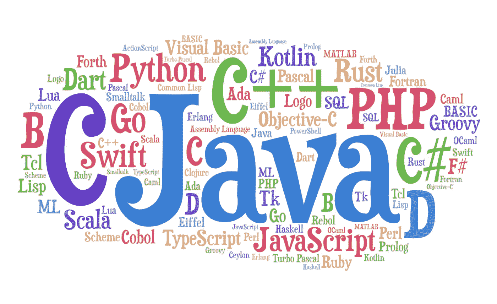
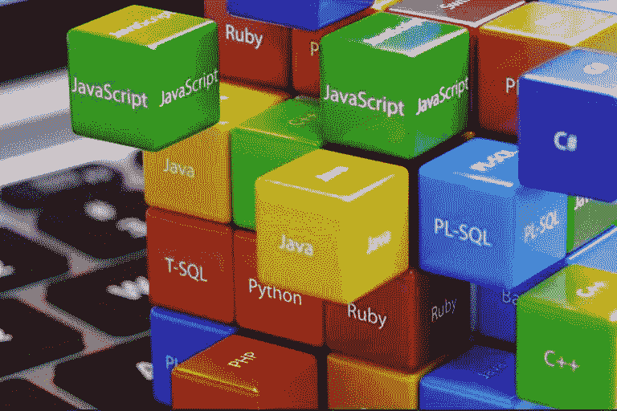

# 应该先学什么编程语言？

> 原文：<https://medium.com/analytics-vidhya/what-programming-language-should-you-learn-first-ff6e8f9c5000?source=collection_archive---------14----------------------->

你好！对于编程新手来说，这往往是一个复杂的问题:“从什么语言开始学习编程？”我想从我的角度和纯粹的个人经历来解释这个主题。

在我看来，首先你应该决定你想在哪个领域编码。在开始之前，我想解释一下软件中的三个重要术语:

*   **后端开发**:是应用的服务器端。这段代码对用户是隐藏的，用户看不到后端工作。它是在数据库和浏览器之间提供通信的代码。应用程序中的所有事务都在后端部分进行编码。
*   **前端开发**:前端专注于用户在浏览器或应用中看到的视觉效果。在前端开发人员负责网站的外观和感觉。
*   **全栈开发**:后端和前端两不误。

我们可以列出一些软件领域如下(还有很多) :

*   数据科学、机器学习、人工智能
*   Web 开发
*   移动应用程序开发
*   桌面应用程序开发
*   游戏开发
*   网络安全
*   嵌入式软件开发

# 数据科学、机器学习和人工智能

如果你对数据科学、大数据、人工智能或机器学习感兴趣，你可以开始学习 Python 编程。Python 在数据科学中有着重要的地位。它有很多有用的库，如 sklearn、pandas 等。您可以使用 Python 库创建机器学习应用程序并可视化大数据分析。此外，Python 最近成为一种非常流行的语言，因为它既实用又易学。

使用 Python 你也可以创建网络应用，桌面和移动应用。

# Web 开发

在我看来，web 开发是一个广阔而有趣的软件领域。如果你想成为一名网络开发人员，你有很多软件语言可以选择。

如果你对**后端感兴趣:**

*   可以从 **Java** 开始。Java 是一种面向对象和功能丰富的编程语言。这是一种在该领域有很多就业机会的语言。这很容易学。它有“写一次，到处运行”的逻辑，这使得 Java 非常有用。Java 有很好的 web 开发框架，比如 **Spring boot** 。Java 是最受欢迎的高级编程语言之一，但是它的启动和部署过程很慢。
*   **C#** 也类似于 Java。你可以用 C#创建 web 和桌面应用程序。它是一种基于 C 的语言。一些很好的 web 开发框架，如 **Asp。NET** 都是基于 C#的。
*   Javascript 是一种非常流行的、最近大放异彩的网络编程语言。javascript 有非常有用的框架。如果说后端的话， **Node.js** 是一个非常高效的服务器端框架。您可以使用 node.js 创建良好的后端应用程序，但首先我建议您学习 javascript。
*   另外 **Python** 可以用于 web 开发。Python 有很好的 web 库，如 Flask，它还有开源的 web 开发程序，如 Odoo。
*   **PHP** 是 JavaScript、Python 等编程语言的子集。不同的是，PHP 一般用于服务器端通信，而 JavaScript 用于前端和后端。Python 只用于客户端(后端)。PHP 可以被视为一种通用的编程语言，但它最常用于 web 开发。它可以放在 HTML 文件中，这是它的一大特点。

如果你对**前端感兴趣:**

*   **Javascript** 、 **HTML** 、 **CSS** 是 web 开发不可或缺的前端三联体。你也可以使用 B **ootstrap** 功能让你的网站更漂亮。 **Angular js** 和 **React** 是最近在前端社区变得极为流行的实用性很强的框架(Angular)和库(React)。
*   前端也在积极使用新技术，如 **jQuery** 和 **Swift** 。

# 移动应用程序开发

你想为 Android 或 iOS 创建移动应用程序吗？要不要把你的应用留在人家手机里？学习 Java 是开始创建移动应用程序的好方法。Android studio 是一个基于 Java 的工具。学习 Java 后，可以在 Android 或 iOS 中提升自己，创建移动应用。

你也可以用 Python 创建移动应用程序。

# 桌面应用程序开发

要创建桌面应用程序，可以使用很多编程语言。最流行的桌面应用程序语言一般是 Java 和 C#。

# 游戏开发

C++和 Java 是两种最流行的游戏开发语言。C#对 Unity 也非常有用。你可以从其中一个开始。

# 网络安全

如果你想成为一名专业的网络安全程序员，C 和 C++是你需要了解的非常关键的低级编程语言。

这些语言可以访问低级 IT 基础设施，如 RAM。这些没有得到很好的保护，黑客可以很容易地利用。

# 嵌入式软件开发

对于嵌入式系统来说，C 和 C++是非常重要且使用最多的语言。

希望我的文章能让你对软件语言有所了解。感谢您的阅读:)