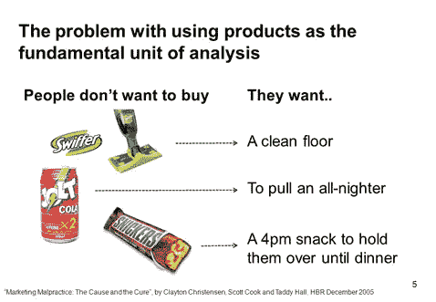

# 什么是真正的洞察力？

> 原文：<https://medium.com/analytics-vidhya/what-really-is-an-insight-65f65d1ddf39?source=collection_archive---------8----------------------->

在 [Unsplash](https://unsplash.com/s/photos/insight?utm_source=unsplash&utm_medium=referral&utm_content=creditCopyText) 上由 [Rohan Makhecha](https://unsplash.com/@rohanmakhecha?utm_source=unsplash&utm_medium=referral&utm_content=creditCopyText) 拍摄的照片

现在收集的数据比以往任何时候都多。以至于数据分析和洞察力之间的界限经常变得模糊。

在像分析这样一个不断发展的领域，误解和术语使用不严谨是很常见的。

这是我的想法—

1.  ***数据不洞察***

虽然数据激发了很多见解，但实际上不可能准确地收集所有方面的数据。所以，数据可能无法完全解释你试图研究的行为。数据也有不同程度的丰富性，可能是真实行为的一个非常微弱的信号。虽然数据是洞察力的重要组成部分，但观察、倾听和与商业生态系统内外的人交谈的力量是数据无法替代的。

我确信亨利·福特在改革汽车工业之前没有收集调查数据。更不用说调查的局限性(思维偏差)。

***2。洞察需要发现***

一个好的洞察力不仅仅是对数据的观察，它试图触及因果关系。例如，仅仅说你的产品或服务在特定的客户群体中更受欢迎是不够的。真正的问题是为什么，那又怎样？

颠覆性创新领域的知名人士 Clayton Christensen 谈到了理解客户需求的“要做的工作”框架。下图很好地描绘了这个框架，你可以在线阅读更多关于他的作品(尤其是奶昔的例子)。

更深刻的见解需要批判性思维和发现。它们也对企业更有价值，因为它们让你更接近客户。

***3。好的见解不明显***

“告诉我一些我还不知道的事情”这句话我们听过多少次了。

例如，千禧一代和 Zs 一代的在线杂货交付应用的采用率每年都在以一定的速度增长，这是一回事。这完全是另一回事，因为婴儿潮一代已经退休，有更多的时间去购物。

好的洞察力挑战普遍持有的假设，甚至可能是逆向思维。

***4。为了有效，洞察必须是可操作的***

你发现了一个洞见，那又怎样？你应该能够付诸行动。虽然由于法规、法律或文化原因，有些见解可能无法付诸行动，但有些见解可以间接付诸行动。

例如，在您的发现中，您可能意识到您的客户正在寻找一种您不提供或可能无法直接提供的产品，您仍然可以通过建立合作伙伴关系来满足这种特殊需求。

> 我错过了什么？