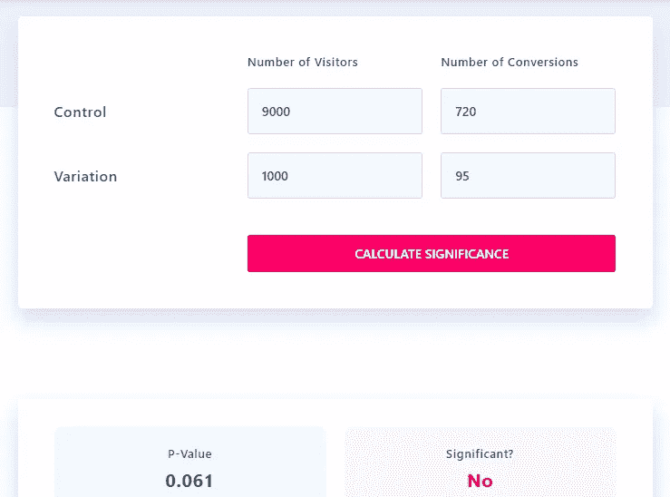

# 什么是真正的统计学意义？

> 原文：<https://medium.com/analytics-vidhya/what-really-is-statistical-significance-7463acb65407?source=collection_archive---------3----------------------->

在 [Unsplash](https://unsplash.com/s/photos/statistics?utm_source=unsplash&utm_medium=referral&utm_content=creditCopyText) 上由 [Carlos Muza](https://unsplash.com/@kmuza?utm_source=unsplash&utm_medium=referral&utm_content=creditCopyText) 拍摄的照片

“统计显著性”这个术语经常在分析实验或观察研究的结果时出现。

我在实验环境中听到的一个普遍解释是-

*统计显著性告诉我们不同人群之间的结果差异是否足够大，或者简单地说，一个实验是否有显著的影响。*

这是一种有缺陷的解释，驱动这种解释的可能是“重大”这个词。

统计显著性源于推断统计学领域，该领域主要处理从样本中推断人口的问题。

让我们用一个例子来理解——

您创建了一个新的在线营销活动，并想了解它是否比当前的更好。通常情况下，您会向新营销活动的访问者样本展示，并比较新旧两个样本之间的目标指标(如转化率)的平均值。

你运行这个实验一周，并评估结果。

让我们考虑两种情况。

***场景一:***

旧活动的基线转化率为 8%，新活动吸引了 10%的访客，平均转化率为 9.5%。

场景 1 结果

在 95%的置信水平下不显著

正如你所看到的，这个结果在 95%的置信水平上没有统计学意义(这是大多数在线计算器默认使用的)。本质上，1.5 个百分点的增长在统计上并不显著。

***场景二:***

旧活动的基线转化率为 8%，新活动吸引了 50%的访客，平均转化率为 9%。

情景 2 结果

在 95%的置信水平下显著

这是一个具有统计意义的结果，尽管新活动的转化率为 9%，低于第一种情况下的 9.5%。我们改变的只是新活动的样本量。

那么，这告诉我们什么是统计学意义呢？

1.  这与目标指标的差异大小无关
2.  这是关于对结果的信心，也就是说，从相对较大的样本中得出的结果不完全是偶然的。我们知道较小的样本通常更易变，并且有可能由于偶然因素得到更好(或更差)的结果。

统计显著性的计算背后有更多的理论，如 p 值、置信区间等。它们本身就是主题。这篇文章的目的是从实践的角度证明“意义”的含义。

统计意义不同于实际意义。例如，情景 1 中 1.5%的转换率差异可能仍然具有实际意义，只是与情景 2 中 1%的差异相比，我们对其不太有信心。

另一方面，在一个非常大的样本中，微小的差异可能在统计上是显著的，但从实际的角度来看，对企业来说意义不大。

专业人员在决策时应同时考虑统计和实际意义。

***你对统计学意义有什么想法？***