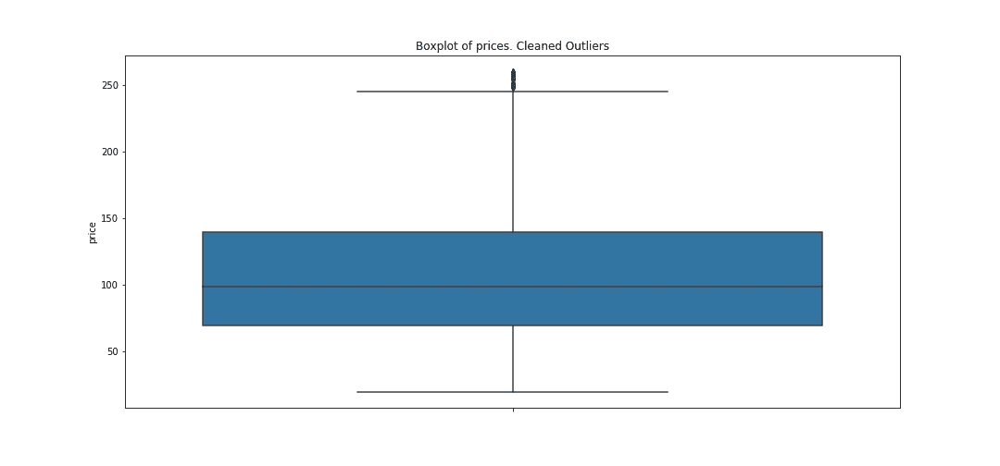

# Airbnb 的数据告诉了我西雅图的哪些秘密？

> 原文：<https://medium.com/analytics-vidhya/what-secrets-does-airbnb-data-tell-me-about-seattle-49fba69eb362?source=collection_archive---------20----------------------->

## 我对自然语言处理(NLP)的第一次体验

我必须承认，我从未去过西雅图，也从未想过要去参观它。但那改变了！完成这个项目后，我准备去参观这个充满活力、热爱咖啡的大学城，它似乎提供了从酒吧到公园的一切！

*   西雅图的一晚有多贵？
*   **我应该什么时候去西雅图？**
*   **我能不花太多钱就找到很棒的地方吗？**
*   **我能从不同的地区及其氛围中学到什么？**

我在没有任何关于这座城市的背景知识的情况下开始了这个分析。

> 演示数据来自西雅图 Airbnb 开放数据竞赛— [**点击此处**](https://www.kaggle.com/airbnb/seattle) 访问数据集。这些房源从 2016 年 1 月 1 日到 2017 年 1 月 1 日不等，是在“2016 年 1 月 4 日”抓取的

## 西雅图一晚有多贵？

价格从每晚 20 美元到 1000 美元不等。然而，大多数住宿费用只有 100 美元每晚，价格似乎负担得起。

我有两种最喜欢的图表类型来获得目标变量的第一个概览。直方图和箱线图。此外，我还检查了 min。还有麦克斯。价值。如果数据集有太多的异常值，我通过使用**四分位间距** ( **IQR** )来移除它们。

带有异常值的直方图显示了数据的偏斜程度

无异常值的箱线图显示中值

## 我应该什么时候去西雅图？

尽量在 10 月到 6 月间去，那时旅游季节已经结束。如果你计划一次短途旅行，你可能想在一周内去，这样可以节省大约。8$.但是要小心！那你可能会错过所有的酒吧生活！

西雅图正在流行。不仅上市数量会随着时间的推移而增加，价格也会上涨。

每天可用的列表

炎热的季节是在夏季的六月和九月之间。

这并不奇怪，但周末房源短缺，因此价格上涨。

每个工作日的价格与每个工作日的可用列表

## 我能不花太多钱就找到很棒的地方吗

简单的回答就是，是的！

根据我的经验，有两个因素让你的 Airbnb 保持成功。**客户评级**和**地点**！而且看评论分数和价格几乎没有关联。也就是说，有实惠的隐藏宝石，有惊人的评论！

散点图审核分数与价格

看似直观，但在物业类型和房型上可以节省很多。整个家庭>房间>共享房间

## 我能从不同的地区及其氛围中学到什么？

西雅图有 16 个主要区，我对它们一无所知。我想知道哪个区对我来说最有意思，但是浏览每一个街区的描述并不是一个选项(我也不想谷歌)

地区及其价格

**使用自然语言处理提取最重要的名词和形容词**

想法—找出前 20 个形容词和前 20 个名词，并比较每个位置的平均提及量。

**现在扣好安全带，让我知道，如果我的描述是准确的！**

*   ***安妮女王*** :著名的观光胜地。美丽，山，咖啡，
*   ***【Ballard】***:当地，餐厅，市场，酒吧，可步行，
*   ***梯级*** :湖泊，便于出入
*   ***中心区*** :地方、山丘、咖啡、公园、美食
*   ***大学区*** :本地、大众、公共、充满活力、多样、商店、大学巴士
*   ***市区*** :逛街？
*   ***白玉兰*** :靠近市中心、公园、中心
*   ***西西雅图*** :海滩！
*   *:商店、杂货店、家、邻居、保险箱*
*   **:住宅、咖啡**
*   ***:多样，公园，散步，咖啡***
*   ******德尔里奇*** :关门，逛街，***
*   *****苏厄德公园*** :美丽、散步、公园、湖泊、国会大厦、公共汽车**
*   ***:方便出入、购物***
*   ******国会山*** :酒吧***
*   *****湖城*** :可步行，公园**

**我这次分析的重点是什么？形容词“多样”！各区之间的差异如此明显，这难道不令人惊讶吗？**

****

**每个地区“多样化”的平均提及率**

## **如果我去西雅图，我会住在哪里？**

**大学区对我来说听起来很完美！更好的是，这是迄今为止最便宜的地区之一。**

# **你的下一个假期目的地是哪里？**

**用我的[笔记本](https://github.com/EriRika/airbnb_prices)分析你选择的 Airbnb 数据！**

**希望你喜欢我的第一篇帖子！**

**艾莉卡**