# 三角洲湖里面有什么

> 原文：<https://medium.com/analytics-vidhya/whats-inside-delta-lake-35952a6c033f?source=collection_archive---------1----------------------->


弗兰基·查马基在 [Unsplash](https://unsplash.com?utm_source=medium&utm_medium=referral) 上拍摄的照片

三角洲湖这个词你可能在上百个博客中听说过或者读到过，或者你可能在你的项目中使用过。

这个博客的目的不仅仅是谈论三角洲湖和它的概念，而是让你熟悉它是如何在引擎盖下工作的。

在我们深入之前，让我们先打好基础。

# 三角洲湖是什么？

Delta Lake 是一个开放式存储层，可为您的数据湖提供可靠性、安全性和性能，适用于流和批处理操作。通过用结构化、半结构化和非结构化数据的单一平台取代数据孤岛，Delta Lake 成为经济高效、高度可扩展的 lakehouse 的基础。

来源:https://databricks.com/product/delta-lake-on-databricks

**三角洲湖泊的特征**

> 耐酸性
> 
> 架构实施
> 
> 支持流数据
> 
> 时间旅行
> 
> 向上插入和删除兼容

[https://delta.io/](https://delta.io/)

# 三角洲湖的组成

1.  **三角洲湖泊储层**

我们使用 delta lake 存储数据，使用 Spark 访问数据。这种方法提供了性能提升和数据的一致性。

**2。增量表**

***拼花文件*** *:* 增量表以拼花文件格式存储数据。

***交易日志:*** 它的每一笔交易都已经在这个表中有序的录入过了

在 delta 表的顶部触发任何查询时，spark 检查事务日志，查看哪些新事务已经被提交到表中。并用新的更改更新表格。

这确保了用户表总是与最新的变化同步

***metastore:*** 存储模式和元数据。

**3。德尔塔发动机**

Delta Engine 是一个高性能的 Apache Spark 兼容查询引擎，它提供了一种有效的方法来处理数据湖中的数据，包括存储在开源 Delta Lake 中的数据。Delta Engine 可加速数据湖操作，支持从大规模 ETL 处理到即席交互式查询的各种工作负载。许多这样的优化是自动进行的；您只需为您的数据湖使用数据块，就可以获得这些 Delta 引擎功能的好处。

来源:https://docs.databricks.com/delta/optimizations/index.html

# 让我们进入增量表

当我们谈到 Delta 表时，它与普通表有什么不同？

Delta 表主要由以下两部分组成。

**拼花文件:**存储文件/数据的文件格式。

**事务日志:**是增量表上发生的事务的有序记录。将此视为真实的来源，delta 引擎将使用它来保证原子性。

**显示增量表路径:**

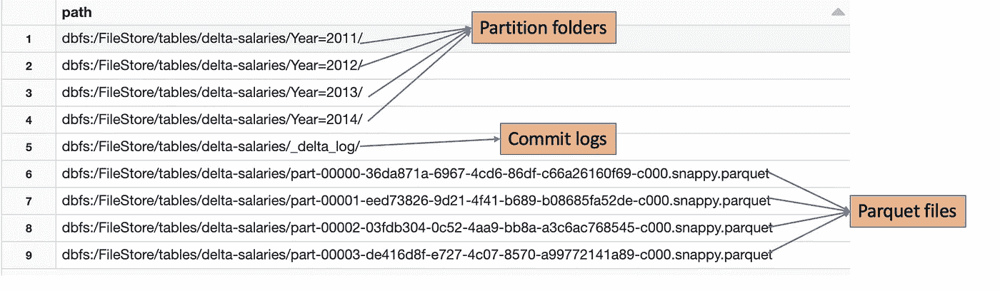

让我们深入了解 _delta_log 文件夹。

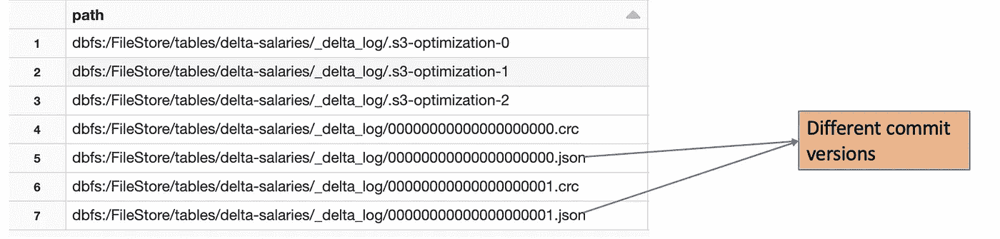

**delta_log** 文件夹包含 JSON 文件，用于跟踪给定表中发生的所有事务。

很快将有演示，并会谈论它更多。

# 三角洲湖时间旅行

使用三角洲湖时间旅行，我们可以参考以前版本的数据。

增量表，跟踪每个事务，在给定的时间点，它可以灵活地引用任何以前的快照。

时间旅行会有所帮助

将数据的先前版本与当前版本进行比较

在数据损坏的情况下，我们可以返回到以前的快照。

# **演示**

让我们使用 CSV 文件创建一个简单的数据帧。

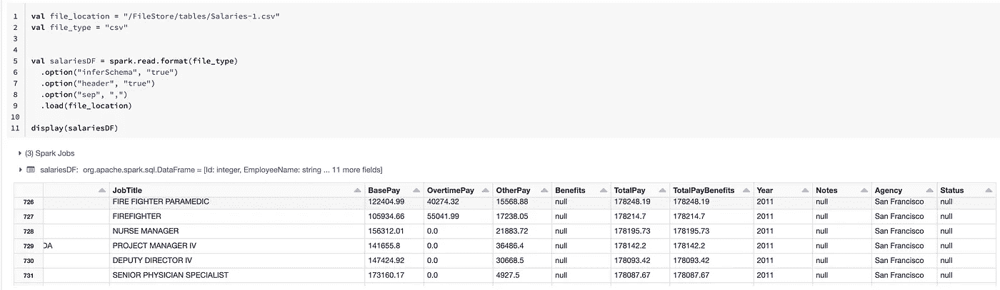

让我们通过将格式指定为“Delta”来将数据转换为 **Delta**

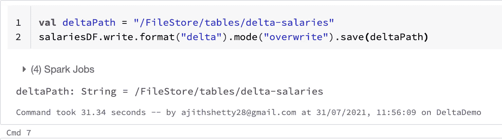

我们还可以在 metastore 中创建表。

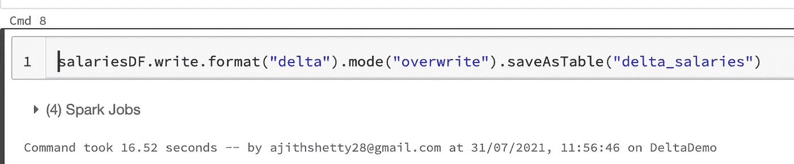

Delta 支持数据的分区。所以让我们用 Year 作为我们的分区列。

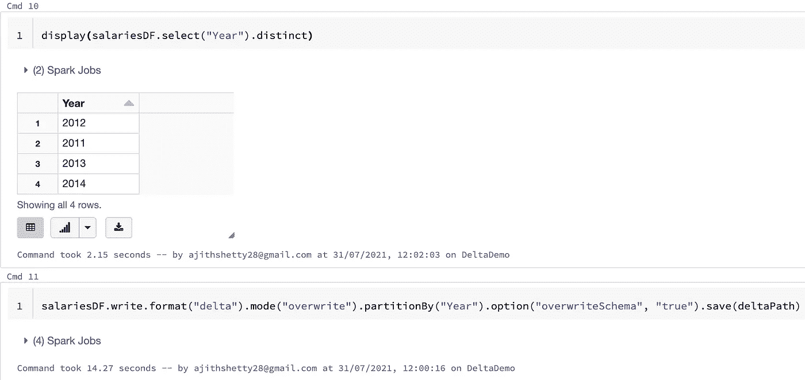

让我们看看增量路径下有什么:

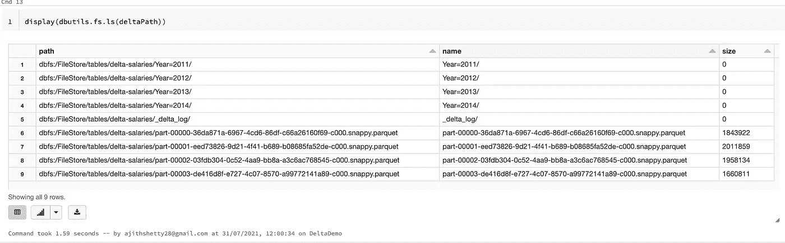

**第 6，7，8，9 行:**是我们第一次向表中插入数据时创建的 parquet 文件。

**行 1，2，3，4:** 是当我们将数据插入相同的增量路径时创建的分区文件夹，但是是分区的。

**第 5 行:_delta_log:** 包含事务日志

让我们来挖掘 delta_log:

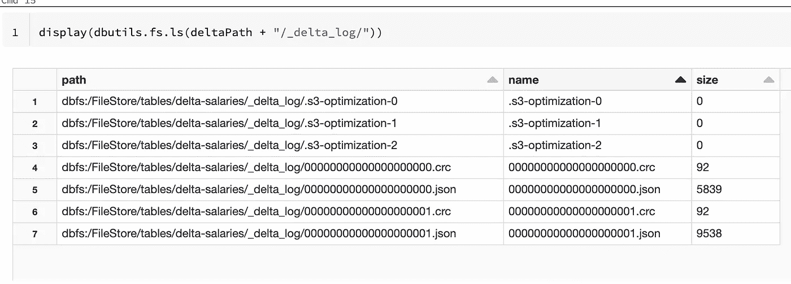

**第 5，6 行:**是事务日志，它保存了表中发生的事务

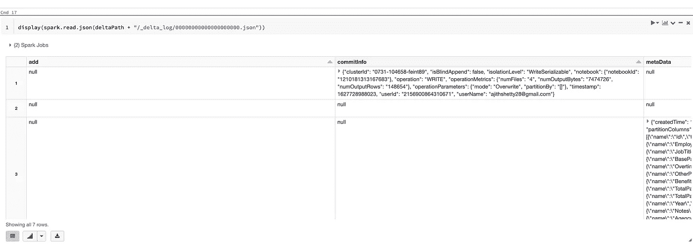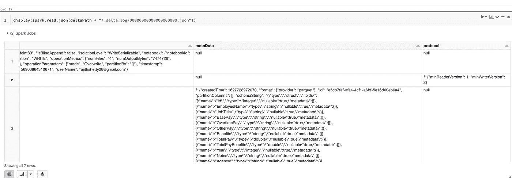

[四列](https://docs.databricks.com/delta/delta-utility.html)每一列代表对增量表的第一次提交的不同部分，创建该表。

*   `add:`包含关于各个列的信息。
*   `commitInfo:`包含有关读或写操作类型的详细信息。加上时间戳和用户。
*   `metaData:`包含了模式信息。
*   `protocol:`包含增量版本。

因为我们已经应用了 2 个写函数。

1.  通过读取 CSV >版本 0 进行初始写入
2.  在分区列上写入>版本 1

我们可以查看版本 1 文件，并确认它捕获了变更。

PartitionValue 包含我们进行分区所依据的列。

你可以在下面的截图中确认这一点。

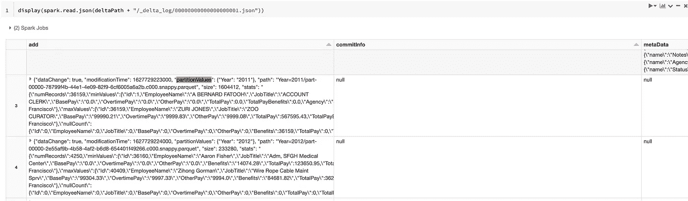

让我们编写版本 3，对相同的数据进行过滤，并将其写回到相同的增量路径。

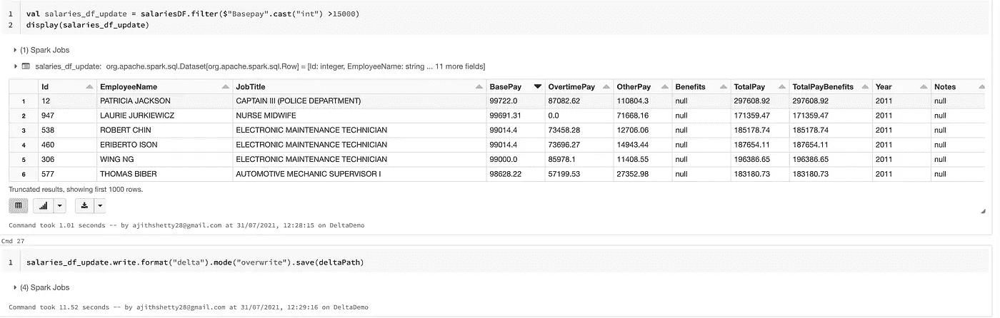

因此，即使在我们进行了覆盖之后，我们仍然可以看到与以前的提交相关的数据仍然存在。

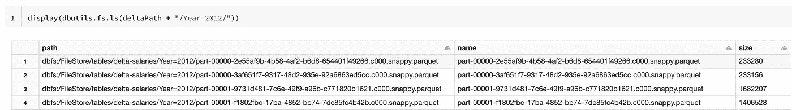

# 使用时间旅行访问表的先前版本

到目前为止，我们已经执行了 3 次写入:

1.  读取初始 CSV 文件并写入增量路径
2.  已写入于年分区的 csv 文件
3.  对基本工资列应用筛选器并写入差值路径

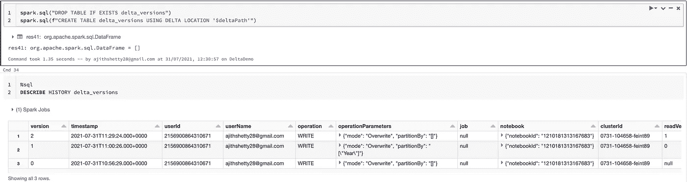

因此，根据我们的 3 次写入，我们在表中有 3 个不同的版本。

我们可以回到指定的时间或版本。

要访问特定版本，我们可以传递带有版本号的“versionAsOf”。

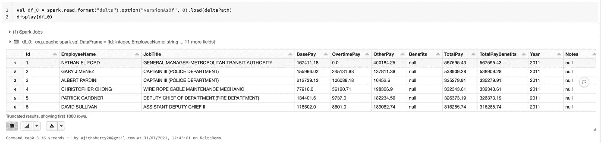

为了回到特定的时间戳时间，我们可以传递带有时间戳值的“ **timestampAsOf** ”。

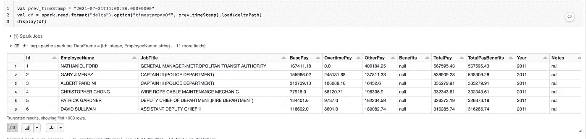

# 真空

Vaccum 是一个命令，可以用来清理我们的目录并删除任何以前版本的数据。

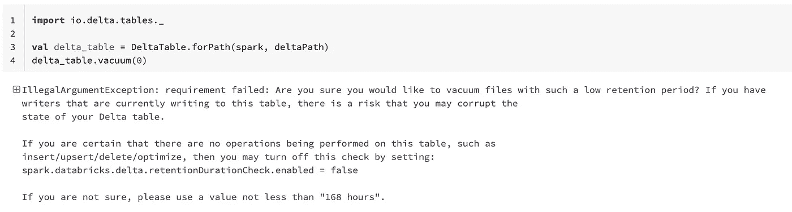

当我们试图删除以前的版本时，我们得到了错误。这是为了防止意外删除。

我们可以通过将“spark . data bricksδretentiondurationcheck . enabled”设置为 **false** 来绕过默认的保持期检查。

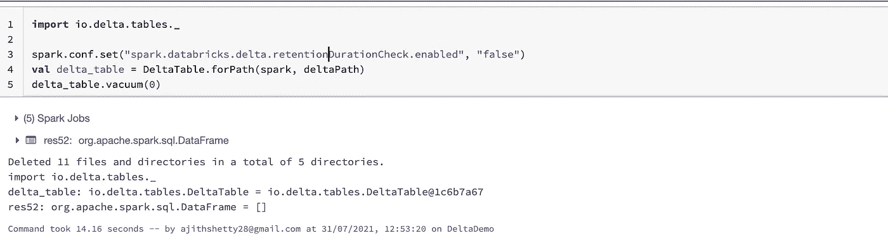

为了确认版本 0 已被删除，让我们尝试运行版本 0 的 read 命令。

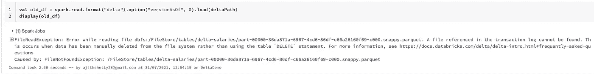

现在，由于我们删除了版本 0，我们仍然应该看到版本 1，它是一个分区写入。

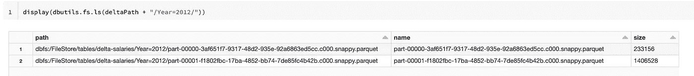

递归清空与 Spark 表相关的目录，并删除超过保留阈值的未提交文件。默认阈值是 7 天。数据块在数据写入时自动触发`VACUUM`操作。

```
VACUUM [ table_identifier | path] [RETAIN num HOURS]
```

要清理 Spark 作业留下的未提交文件，使用`VACUUM`命令删除它们。通常`VACUUM`会在 Spark 任务完成后自动发生，但是如果任务中止，您也可以手动运行它。

例如，`VACUUM ... RETAIN 1 HOUR`删除超过一小时的未提交文件。

```
// recursively vacuum an output path
spark.sql("VACUUM '/path/to/output/directory' [RETAIN <N> HOURS]")

// vacuum all partitions of a catalog table
spark.sql("VACUUM tableName [RETAIN <N> HOURS]")
```

 [## 真空(数据块 SQL)

### 了解如何在 Databricks SQL 中使用 SQL 语言的真空语法。

docs.databricks.com](https://docs.databricks.com/sql/language-manual/delta-vacuum.html) 

你可以在我的 github repo 中找到上面的代码:

[](https://github.com/ajithshetty/DeltaLakeDemo) [## GitHub-ajithshetty/DeltaLakeDemo

### 通过在 GitHub 上创建一个帐户，为 ajithshetty/DeltaLakeDemo 开发做出贡献。

github.com](https://github.com/ajithshetty/DeltaLakeDemo) 

**参考:**

[](https://databricks.com/product/delta-lake-on-databricks) [## 达布里克斯的三角洲湖-达布里克斯

### Delta Lake 是一个开放格式的存储层，可为您的数据湖提供可靠性、安全性和性能——

databricks.com](https://databricks.com/product/delta-lake-on-databricks) [](https://delta.io/) [## 三角洲湖-可靠的大规模数据湖

### 大数据中的可扩展元数据处理，甚至元数据本身也可以是“大数据”三角洲湖对待元数据只是…

delta.io](https://delta.io/)  [## 真空

### 了解如何在 Databricks 中使用 SQL 语言的 VACUUM 语法用于 Spark 和 Delta 表。

docs.databricks.com](https://docs.databricks.com/spark/latest/spark-sql/language-manual/delta-vacuum.html) [](https://databricks.com/blog/2020/08/21/top-5-reasons-to-convert-your-cloud-data-lake-to-a-delta-lake.html) [## 将您的云数据湖转换为三角洲湖的五大理由

### 如果你检查一下过去五年中任何一次星火峰会的议程，你会注意到没有…

databricks.com](https://databricks.com/blog/2020/08/21/top-5-reasons-to-convert-your-cloud-data-lake-to-a-delta-lake.html) 

[https://docs.delta.io/latest/quick-start.html](https://docs.delta.io/latest/quick-start.html)

https://docs.microsoft.com/en-us/azure/databricks/delta/


**阿吉特·库玛尔·谢蒂**

大数据工程师—热爱大数据、分析、云和基础设施。

[订阅](https://ajithshetty28.medium.com/subscribe) ✉️ || [更多博客](https://ajithshetty28.medium.com/)📝|| [链接于](https://www.linkedin.com/in/ajshetty28)📊|| [个人资料页面](https://ajithshetty.github.io/)📚|| [Git 回购](https://github.com/ajithshetty/)👓

**订阅我的:** [**每周简讯刚刚够数据**](https://justenoughdata.substack.com/)