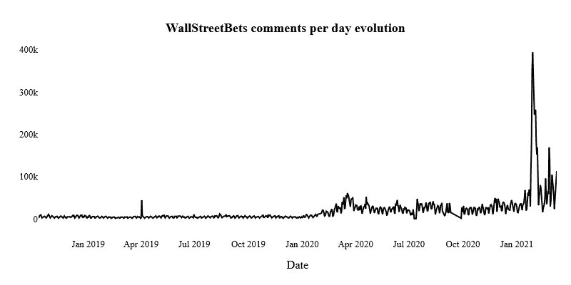

# 华尔街 Bets 帖子里有什么？—主题建模和二元模型

> 原文：<https://medium.com/analytics-vidhya/whats-inside-wallstreetbets-posts-topic-modeling-and-bi-grams-d00352082e55?source=collection_archive---------10----------------------->


[crainsnewyork.com](https://www.crainsnewyork.com/markets/reddit-amateurs-stock-frenzy-actually-delivered-huge-gains-some-wall-street-pros)

围绕 **GameStop** 的故事产生了大量数据，无论是帖子、评论、文章、采访，还是特别是 *GME* (GameStop index)股票的财务数据。
由于它主要始于众所周知的***wall street bets***subreddit，因此在开始分析内容本身之前，先看看它的演变是很有趣的。

***wall street bets***subreddit 专注于金融、股票市场、金融建议…它现在拥有超过**950 万订户**，每天超过**83000 条评论**，每天超过**3700 条帖子**。它被每日评论列为第二个子编辑。

如果我们看看用户的每日变化，我们会注意到在 2021 年初(GME 的故事开始)的急剧上升，从 12 月下旬左右的 2M subs 到 3 月初的近 1000 万。


图 1 (reddit 统计数据)

在此期间，每天的评论数量也呈现出同样的趋势。到 2020 年底，华尔街日报每天的平均评论接近 22k，而今天，大约是 55k。



图 2 (reddit 统计数据)

既然我们引入了这个主题，就让我们进入问题的核心吧。

在这篇文章中，我与 [Basssall](https://medium.com/u/98f4c4e7cd9f?source=post_page-----d00352082e55--------------------------------) 一起对我们将在后面展示的数据集进行了分析。我们想研究在 GME 故事的高潮部分，华尔街赌注的用户互动的方式。讨论的主题是什么？哪些词用得最多？出现了一些趋势吗？有不同的人群吗？

*让我们来看看我们使用的数据…*

# **数据**


拉斐尔·亨里克/SOPA 图片/LightRocket via Getty Images

我们决定分析来自 **Kaggle** 的一个数据集，名为:[Reddit wall street bets Posts](https://www.kaggle.com/gpreda/reddit-wallstreetsbets-posts)(由 [Gabriel Preda](https://www.kaggle.com/gpreda) 分享)。这些数据由超过 40k 行组成，使用[***praw***](https://praw.readthedocs.io/en/latest/)*(*Python Reddit API 包装器*)收集。帖子期从 2021 年 1 月 28 日到 2 月 15 日，这正是 GameStop 和整个市场崩溃的时刻。
我们的分析将主要针对内容(主题建模)中**主题的搜索。***

*这是表格的样子:*

**

*表 1*

*有趣的是文章的标题和正文。然而，评论的数量和讨论的分数是注意到主题重要性的重要信息。*

**我们去分析……**

# *初步研究*

**

*照片由 [Aaron Burden](https://unsplash.com/@aaronburden?utm_source=medium&utm_medium=referral) 在 [Unsplash](https://unsplash.com?utm_source=medium&utm_medium=referral) 上拍摄*

*首先，我们想展示数据集的概况和主要信息(除了文本数据)。*

## *帖子频率*

*期间内容分发情况如何？我们按照日期对表格进行了分组，以创建这种可视化效果:*

**

*图 3*

*1 月 29 日显然是 subreddit 上最活跃的一天，有 15，694 条独特的帖子。*

## *评论*

*看看评论最多的帖子，就能知道我们最近要分析的内容。我们还使用了 groupby 函数来获得下面的图表:*

**

*图 4*

*我们很快了解到，1 月 29 日是评论最多的一天，前 10 名中有很多帖子。*

# *自然语言处理*

*在突出数据集的一些特征之后，让我们把注意力集中在主要内容上，帖子的**标题**和**正文**。为此，我们首先使用正则表达式用一个基本函数清理文本。然后，我们使用 NLTK 库对文本进行标记化、词条化，并删除停用词，以尽可能获得最相关的语料库。*

```
*body_df = pd.DataFrame(body_df.body.apply(lambda x :clean_text(x)))
body_df.body = body_df.body.apply(lambda x: ' '.join([word for word in x if word not in (stop)]))
body_df.body = body_df.body.apply(lambda x: word_tokenize(x))
body_df.body = body_df.body.apply(lambda x : [lemmer.lemmatize(y) for y in x])
body_df.body  = body_df.body .apply(lambda x: ' '.join(x))*
```

*清理的结果导致了我们用 wordcloud 显示的词频计数(我们选择了**文章的主体**来做这件事，即) :*

**

*文字云 1*

**、*股票*、*股票*是帖子中使用频率最高的词汇。*做空*、*买入*、*价格*也出现在顶部。这主要是发生在 GameStop 和对冲基金上的金融词汇。**

***现在我们已经通过查看词典介绍了语料库，让我们进一步了解主题建模……***

## **主题建模**

**我们的目标是确定一些主题，并最终看是否有团体从上下文中出现。因此，我们使用著名的**非负矩阵分解** (NMF)方法来创建我们的主题。在此之前，我们试图建立一个**潜在狄利克雷分配** ( **LDA** )模型，但结果不同，所以我们决定保留 NMF 结构。**

**首先，我们建立了一个 TFIDF 矢量器来去除最不频繁的标记并拟合模型。然后我们创建了 NMF 模型(有 5 个主题),并用过去的矩阵来拟合它。最后，我们创建了一个包含组件及其在主题中的重要性的数据框架。**

```
**vectors = TfidfVectorizer(min_df=50, stop_words='english')
X = vectors.fit_transform(title_df_clean.title)
model = NMF(n_components=5, random_state=5)
model.fit(X)**
```

**我们这样做是为了文章的标题和正文，但我们决定只显示正文，因为它是基于一个更好更大的语料库，而标题只是一个句子。**

****

**第一个话题与股票市场有关，这是一个带有诸如股票/市场/价格等词语的一般性话题**

****

**第二个话题围绕着术语:购买。这是指购买 GME 和其他股票。**

****

****第三题**更多的是围绕持仓，“到月球”，赢…**

****

**这个**第四个话题**是针对股票本身:AMC，GME，挪威克朗，BB，NAKD…**

****

**最后，最后一个话题非常有趣，因为它展示了来自 WSB 的 reddit 用户与著名的 ***Robinhood*** 等交易应用之间的斗争。**

***在语料库中寻找主题可以解释内容的上下文，看看是否可以看到一些二元语法并加以详述……***

## **双字母频率**

**最后，我们希望查看语料库中的二元语法，并最终找到一些有趣的二元语法。一个**二元模型**或**二元模型** *是一串记号中两个相邻元素的每个序列，这些记号通常是字母、音节或单词* (definition.net)。**

**为了创建这些序列，我们通过函数 *nltk.bigrams()* 再次使用了 NLTK 库。**

```
**nltk_tokens = nltk.word_tokenize('\n'.join(title_df_clean.title))
titles_bigrams = ['_'.join(b) for b in nltk.bigrams(nltk_tokens)]**
```

**我们查找了标题和正文的双字母组合，结果如下:**

****

**图 5**

**我们注意到顶部的 **gme_amc** 是子编辑瞄准的两只股票。而且我们看到 **buy_gme** (业余投资者的目标) **hedge_fund** (来自华尔街注的用户最好的敌人)**still _ hold**/**hold _ line**/**hold _ hold**(期间到场的主力动作)。**

****

**图 6**

**对于身体，我们发现 **x_b** 是最常见的双字母组合。其次是**对冲基金**和**金融建议**。我们并没有真正发现 x_b 是什么意思，但其他的双字母组合相当连贯。**

# **结论**

**通过这一分析，我们想了解华尔街如何押注作者和读者在围绕 GameStop 及其财务影响的故事中的谈话内容。总的来说，他们更团结，而不是分散在多个群体中。我们可以清楚地发现对冲基金和 Robinhood 等交易平台的异常行为，这是故事的主要方面之一。GameStop 在这里并不是作为一家公司提供服务，而主要是作为一只股票来打击做空者。我们发现的主题讲述了事件的重要性，关于语料库中出现的唯一一个主题。**

**感谢你阅读这篇文章，我希望你喜欢它，你可以关注我，了解我未来的作品。整个分析可以在我的 Github 上找到。**