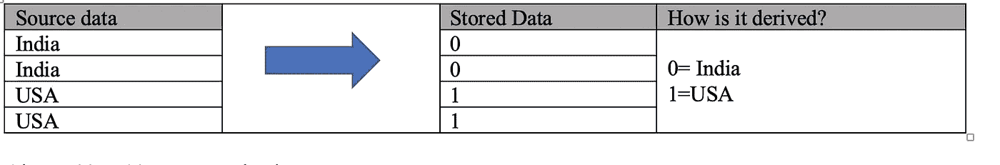

# 拼花文件格式有什么嗡嗡声？

> 原文：<https://medium.com/analytics-vidhya/whats-the-buzz-about-parquet-file-format-8a1fe4f65de?source=collection_archive---------0----------------------->

由 [Unsplash](https://unsplash.com?utm_source=medium&utm_medium=referral) 上的[Cup 先生/杨奇煜·巴拉](https://unsplash.com/@iammrcup?utm_source=medium&utm_medium=referral)拍摄的照片

Parquet 是一种高效的行列文件格式，支持压缩和编码，这使得它在存储和读取数据时性能更高

Parquet 是 Hadoop eco 系统中广泛使用的文件格式，它之所以被大多数数据科学界广泛接受，主要是因为它的性能。

我们知道，parquet 是一种行列式文件格式，但它在有效存储数据方面做得更多。

在这篇博客中，我们将深入探讨 parquet 文件格式，以及为什么在大数据生态系统中它是首选。

概述:

拼花地板是由 twitter 和 cloudera 发起的，灵感来自 https://research.google/pubs/pub36632/[的 Dremel](https://research.google/pubs/pub36632/)

为什么我们需要担心文件格式？？

> 1.易于与当前管道集成
> 
> 2.更少的 IO
> 
> 3.更少的存储
> 
> 4.网络 IO
> 
> 5.费用
> 
> 6.询问时间
> 
> 7.还有更多

Parquet 是一种开源文件格式，适用于 Hadoop 生态系统中的任何项目。

从高层次上讲，我们知道拼花文件格式是:

1.  混合存储

2.支持嵌套列

3.二进制格式

4.编码

5.压缩的

6.高效存储

我们将深入讨论以上所有内容。

**混合存储**

让我们举一个例子，看看数据是如何在 Parquet 中表示的。

一个简单的示例文件:

示例数据

基于行的存储

基于列的存储

混合存储

在这里，我们可以看到混合存储是行存储和列存储的组合。

在单个列变大的情况下，以面向列的方式存储它们不会带来任何更好的性能。

假设我们需要读取一个记录大小为一百万的表中的第二列。这里我们需要遍历第一列的一百万条记录，然后我们可以到达第二列。

另外，我们知道文件是不可变的，我们不能真正地在旧的列块中存储追加的新数据。

混合存储将在这方面提供帮助。

**支持嵌套列**

当我们列出任何包含拼花文件的目录时，我们会看到:

/my/path/to/parquet/folder/

-part-r-00000-dhb 447 FH 5-c123s-w 2232–23 hghgg 4534 a 12-snappy . parquet

-part-r-00001-dhb 447 FH 5-c123s-w 2232–23 hghgg 4534 a 12-snappy . parquet

让我们取一个嵌套的列文件，看看它在 parquet 文件格式中是如何表示的

**必需的**:与父级相同的重复和定义级别

**可选**:与父级相同的重复值，递增定义级别

**重复**:增加重复和清晰度等级

r 值=该列是否重复，重复哪一级嵌套

D value =我们需要挖掘多远才能确定该值是否为空

**已编码**

使用 Dremel 编码方法，parquet 将对嵌套的列进行编码。

基于数据的多少次重复，它将检查在什么定义，我们需要遍历找到该列的值。

有不同的编码方案可用。对于当前的讨论，我们将只谈论重要的。

普通:

在普通编码中，数据将按原样一个接一个地存储。

增量编码:

在增量编码中，该列的值将被定义一次，对于重复的列，它将从先前定义的值中导出该值。

在下面的例子中，我们可以看到该列的值正在增加。

因此，我们将一次性写入编码数据，对于剩余的列，我们将从先前的列值中导出它。

将近 50 次裁员

字典编码:

几乎减少了 80%到 90%

注意:

1.  如果字典变得太大，自动退回到普通

2.你可以增加拼花地板的尺寸

3.或者减小拼花地板的尺寸

其他编码方案

>素色

>字典

>游程编码

>增量编码

>增量长度字节数组

>三角弦

**拼花文件中的数据表示**

*   数据块(hdfs 数据块):存储层(hdfs、adls、s3)中数据的逻辑分割
*   文件:存储层(hdfs、adls、s3)中数据的物理块
*   行组:数据按行的逻辑水平划分。对于行组，没有保证的物理结构。行组由数据集中每一列的列块组成。
*   列块:特定列的数据块。它们位于特定的行组中，并且保证在文件中是连续的。
*   页面:列块被分成页面。页面在概念上是一个不可分割的单元(就压缩和编码而言)。在一个列块中可以有多种页面类型。

绘画作品:

**文件元数据**

包含模式、节俭头、偏移量、行数

行组:一组行

单个文件中的多个行组

在行组下，将列剪切成块

如果单个值为空:不打算存储它

如果一整列为空:不存储

列块:

在列块共享页面标题内:

在页眉下我们有页面

拼花地板的单个原子值

元数据

r 值

d 值

编码数据

页脚:元数据>文件、行组和列元数据

**使用拼花地板进行优化**

谓词下推

在使用 where 子句进行 select 查询的过程中，将根据查询子句省略数据的读取。

Where 子句将被推送到文件中，并与编码的元值(如 min、max)进行比较，如果文件中不存在所需的数据，则将被排除。

parquet . filter . dictionary . enabled = true

**使用谓词下推时要记住的事情:**

1.下推过滤器不适用于 AWS s3，没有随机访问。因此，网络 IO 提取数据并应用过滤器

2.下推过滤器不适用于嵌套列

3.极高值和极低值:先排序

4.在 where 子句中使用相同的数据类型

5.使用 parquet 写入速度较慢，因为它必须计算、创建行组、将其拆分成块，并使用编码数据写入元数据。

你可以在评论中发表你的反馈。

**阿吉特·库玛尔·谢蒂**

大数据工程师—热爱大数据、分析、云和基础设施。

[订阅](https://ajithshetty28.medium.com/subscribe) ✉️ || [更多博客](https://ajithshetty28.medium.com/)📝|| [链接在](https://www.linkedin.com/in/ajshetty28)📊|| [个人资料页面](https://ajithshetty.github.io/)📚|| [Git 回购](https://github.com/ajithshetty/)👓

**订阅我的:** [**每周简讯刚好够数据**](https://justenoughdata.substack.com/)