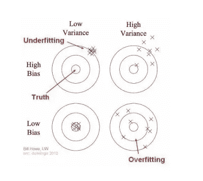

# 偏倚和方差之间的权衡是什么？

> 原文：<https://medium.com/analytics-vidhya/whats-the-trade-off-between-bias-and-variance-2e25dd08716b?source=collection_archive---------10----------------------->

*与其精确错误，不如近似正确*沃伦·巴菲特

来源:——【giphy.com】

假设你正在策划一个活动；你根据过去几年的数据来估算举办活动的成本。事后，你计算实际成本。你之前做了准确的预测吗？那是远程的！如果答案是肯定的，你要么非常幸运，要么你在撒谎；)但是，你的预测够好吗？当然，这是一种可能性！

你怎么知道你的预测是可以接受的？预测与实际的偏差很小。不是吗？在 ML 世界中，这种偏差(实际值和预测值之间的偏差)被称为误差。

> **误差=不可约误差+可约误差**

在您拥有的历史数据中，如果有任何缺失的信息(缺失的变量)，比如说，关于活动营销成本的信息根本没有被捕获。由此在你的预测中出现的偏差，就是**不可约误差**。发生这种情况是因为未捕捉到特征。换句话说， ***不可约误差是由于测量系统中存在的固有误差而产生的，即使通过建立良好的 ML 模型也无法控制或减少。*** 同样可以与测量体重、血压等的设备中的测量误差相关。

让我们来谈谈哪些是可以减少/控制的…

我们建立一个 ML 模型来估计事件的成本。对这种模式的期望是什么？该模型输入了一些输入(训练)数据，在此基础上，该模型可以对未知数据做出可接受的预测。因此，用于模型开发的数据质量决定了结果*(垃圾输入垃圾输出)*。为了便于讨论，我们假设训练数据质量良好。

# 偏见

预测变量——场地、客人数量、演讲者、餐饮成本等。用于估计事件的成本。在构建模型时，除了“餐饮”之外，您删除了所有变量。也就是说，模型仅使用变量“餐饮”构建。也就是说，活动的成本仅根据与餐饮相关的成本进行估算。你认为，这将是一个有效的模式吗？

一个过于简化的模型*(比如这个)*未能捕捉到预测因素和响应变量*(举办活动的成本)*之间的真实/潜在关系，被认为具有**高偏差**。我们上面的模型偏向于变量——“餐饮”。这种模型在训练数据和未知数据中效果不佳。高偏差的模型倾向于对数据进行欠拟合。

> 偏差是指简化假设或在训练数据中有错误的假设，这样更容易预测。

# 差异

另一方面，考虑训练数据中的每一个可能的变化来建立模型怎么样？

我给你打个比方。考试前，你把书上的东西一个字一个字背下来。你表现出色的机会有多大？—当问题与你书中给出的完全一致时。如果期望你应用逻辑会发生什么？我们都知道答案，不是吗？；)

类似地，学习训练数据中所有变化的模型，虽然使模型变得复杂，但在训练数据中表现得非常好，但在测试数据中表现得不太好。像这样对数据变化敏感的模型，据说具有**高方差**和*，它们倾向于过度拟合数据*。

> 方差是随着训练数据的变化，目标估计值的变化。

# 偏差与方差

来源:——[therbootcamp . github . io](https://therbootcamp.github.io/)

上图显示了回归(估计连续变量的值)和分类(将输入分类为带标签的输出)中的欠拟合、过拟合和期望模型。

> **可约误差=偏差+方差**

总可约误差是数据中总偏差和方差的总和。因此，当一个增加时，另一个减少。

# 代价是什么？

来源:——[primo . ai](https://primo.ai)

来源:——[datacadamia.com](http://datacadamia.com)

在高偏差和低方差的情况下，训练和测试数据中的预测误差都很高 ***(欠拟合)*** 。

方差大，偏差小，训练数据的预测误差很小，而测试数据的误差很大 ***(过拟合)*** 。

一方面，我们希望我们的模型不要错过训练数据中的相关特征和有趣的模式。另一方面，我们不希望它冒险过度解释数据中的异常值和不规则性。

理想的情况是具有低偏差和低方差。然而，那是不可能的。最大似然模型的主要目标之一是很好地推广到看不见的数据。从上面可以清楚地看出，欠拟合*(高偏差)*和过拟合*(高方差)*模型都不能达到目的。 ***权衡是介于两者之间的最佳点，偏差、方差和模型复杂度都在最佳水平。***

# 如何实现偏差-方差权衡？

来源:——[blog.insightdatascience.com](http://blog.insightdatascience.com)

## 减少偏差误差

增加预测器的特征或数量来估计目标将减少偏差。更多的特征允许模型更好地理解预测因子和响应变量之间的关系。

## 减少方差误差

增加训练样本将减少方差。更多的样本增加了数据噪声比，因此减少了方差。直观地说，这违反了 T2 大数定律，即随着样本量的增加，数据变得更能代表总体，从而减少了方差。

虽然上述两种方法是实现偏差-方差权衡的第一手处理方法，但以下是实现最佳偏差和方差的一些其他方法。

*   用最佳模型参数拟合模型。
*   调整超参数。
*   使用交叉验证，系综，装袋，助推技术。

下次会有更多关于这些技术的内容！