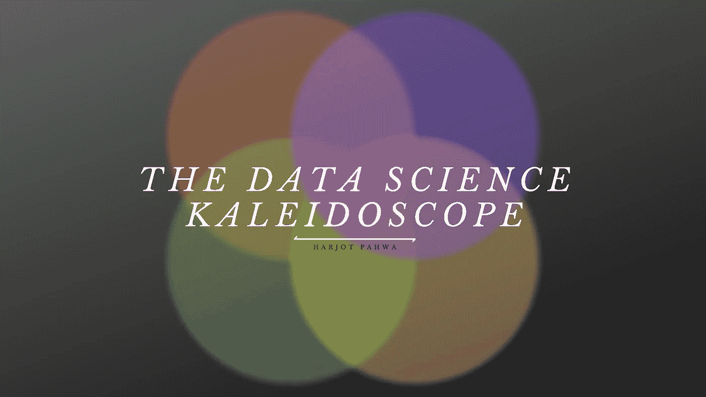
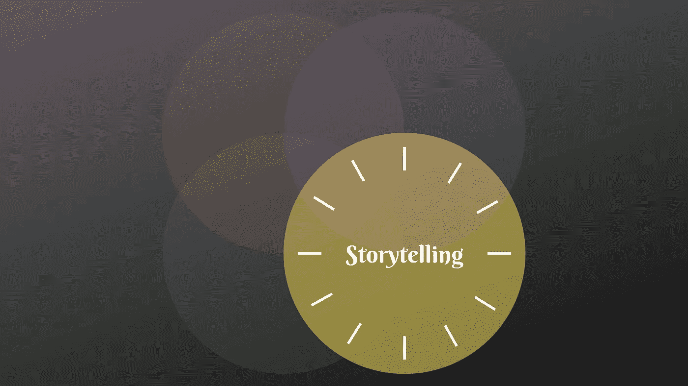

# 数据科学是怎么回事？

> 原文：<https://medium.com/analytics-vidhya/whats-up-with-data-science-37babe8cb034?source=collection_archive---------16----------------------->

我在职业生涯中学到的数据科学知识

数据科学就是这样一个工作，它的要求没有很好的定义。同一个概要文件可以有不同的需求，这取决于您所耦合的工作项目。有时你不得不拿出一张 excel 表来展示一些特别的分析，或者花几天时间设计一个合适的解决方案来帮助你的客户实现他们的业务目标或者维护你的生产流水线，等等。那这些神秘的巫师用他们的魔法处理数据是什么！？谁是数据科学家？

让我们从‘正常’状态退一步来观察；观察我们如何与世界互动，我们如何相互交流，我们如何理解周围的环境。假设你正在和你最好的朋友通电话，告诉她你在一个刚搬进去的新城市的*经历。你的 ***故事*** 可能会影响她对这座城市的看法，你的 ***推荐*** 可能会影响她的喜好。如果她打算去新的城市拜访你，她可以对将要发生的事情有一个粗略的估计。*

*将上面例子中的' ***经验*** '替换为' ***数据*** '瞧，你就要成为一名数据科学家了。尽管数据科学是一个不断发展的领域，每一步都有很多东西需要学习，但如果要我用一句话来定义数据科学家，我会说*

> *数据科学家是故事讲述者，拥有数据驱动的问题解决方法和强大的分析技能*

# *数据科学万花筒*

*数据科学是一种跨学科领域，它将许多不同的领域汇集在一起。在我的职业生涯中，我发现了让你成为优秀数据科学家的 4 个主要因素:*

## *1.计算机科学*

**

*我在骗谁呢？计算机无处不在，你可能非常了解如何操作计算机，使用一些基本的应用程序，但处理数据，设计解决方案，自动化任务，可视化发现，部署模型，调整模型等。你需要掌握一些编程技能，了解云技术、生产流程、数据库、运行时间，并且永远愿意学习新的有用的技术。需求最大的两种语言是 Python 和 r。精通其中一种并熟悉另一种是很好的。您很可能会遇到拥有大量数据和/或实时数据的项目，因此学习如何处理这些数据也是一项基本技能。根据你的工作，由于繁重的计算需求，你的大部分数据科学工作将发生在云上，这意味着你最好学习如何使用著名的云服务(AWS、Azure 和 GCP)；但是不要太担心这个，当你在工作中使用它们时，你会学到大部分的知识:)*

## *2.数学*

**

*数学不美吗？它是无所不在的和建构的。对于初学者来说，它的用法可能不是很明显，但当你开始探索算法、优化模型、调整它们的性能，甚至理解数据并展示结果时，它就是数学。这是一种数据、逻辑和理性的语言。它解释模式，帮助创建有用的模型，推动业务决策。分析能力和数学是交织在一起的。对算法背后的统计、概率和数学的良好理解会扩大你的数据科学职业生涯。*

***3。数据分析***

**

*如果数学是数据的语言，那么数据分析就变成了与数据的交流。如果你知道怎么听和听什么，数据会和你说话。对于真实世界的数据来说，理解数据的含义是一项挑战，即使使用所有高级算法和海量数据也是如此。即使有正确的模型，如果你不能理解信号，它也是无用的。假设我告诉你，某公司生产的次品灯的百分比在本月增加了 300%。如果你碰巧是那家公司质量保证部门的一员，那肯定不是你想听的。但是等等，让我给你提供更多的数字；假设该公司每月生产 100，000 盏灯，其中只有 5 盏有缺陷。所以当我说,%次品灯增加了 300%时，我是说次品灯的绝对增加量仅为 15%。真是如释重负，不是吗？*

***4。讲故事***

**

*如果你注意到了介绍，你可能已经预料到了这个部分。我们是讲故事的人；作为一名优秀的数据科学家，我认为能够讲述一个引人入胜且贴切的故事非常重要。如果数据分析是与数据的交流，那么讲故事就是与人交流，因为最终它是关于人的。我们为人们做出商业决策，为人们创建预测模型，为人们提供建议。你需要成为一名优秀的演示者，你的模型和分析必须能够向相关人员解释清楚。通过解决人们的问题，您正在弥合数据和人们之间的鸿沟。*

# *我作为数据科学家的经历*

*我希望现在您已经更好地理解了数据科学家的重要性和作用。在写这篇博客的时候，我已经完成了将近一年的数据科学家生涯。所以，我觉得分享一些我目前为止的旅程片段是个好主意:)*

**

*我在二月的第一周开始了我的实习生涯。在向经验丰富的专业人士学习的同时，研究新的有趣的问题是一件美妙的事情。但是是的，几个星期后，WFH 变成了一个必需品，我的房间变成了办公室。4 个月后，我成为一名全职员工，开始为一家大型科技巨头做一个非常有趣的项目。这个项目与我实习期间参与的项目大不相同，我花了很长时间才理解。在我涉足之后，我开发并试验了新的模型，做了大量的特别分析，与跨办公室团队协调，致力于向模型添加新的特性，每月更新我们的模型，调试代码，向客户展示结果，研究新的算法，等等。*

*简而言之，这就是我到目前为止在这个领域的经历。这是一次丰富的经历，对此我很感激，我看到了数据科学领域的巨大潜力。是的，自动化肯定也会影响这个行业，但我认为那是一个相当遥远的未来。正如我上面提到的，我们充当了数据和人类之间的桥梁。*

*好吧，如果这个博客激励你成为一名数据科学家，我建议你阅读 Jonny Brooks 的这个[博客](https://towardsdatascience.com/why-so-many-data-scientists-are-leaving-their-jobs-a1f0329d7ea4)，只是为了好玩……如果你仍然激励你成为一名数据科学家，请让我知道，并确保在 [LinkedIn](https://www.linkedin.com/in/harjot-pahwa-492375154/) 上关注我，因为我很快就会收集一些资源和方法，让你自己也成为一名数据科学家。干杯！*