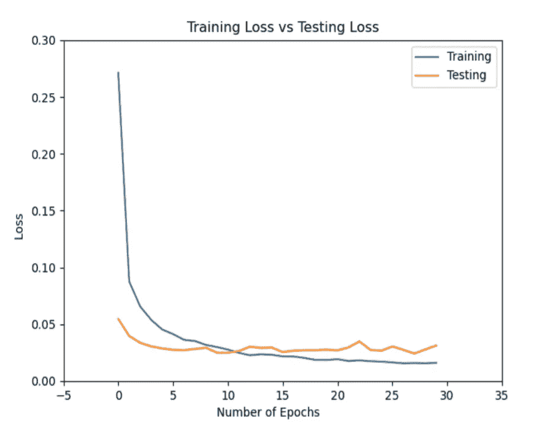

# 基于 Keras 的小麦病害检测

> 原文：<https://medium.com/analytics-vidhya/wheat-disease-detection-using-keras-48ae78990502?source=collection_archive---------5----------------------->


来源:[壁纸信号弹](https://www.wallpaperflare.com/wheat-field-low-angle-photography-of-wheats-sunset-macro-depth-of-field-wallpaper-tjn)

# 目录

1.  介绍
2.  资料组
3.  图书馆
4.  数据预处理
5.  数据扩充
6.  模型
7.  培养
8.  估价
9.  测试

# 介绍

印度不仅在文化上是一个多样化的地区，在食物上也是如此。印度是一个农业国家，75%的印度人口依靠农业为生。小麦是硒和镁等矿物质的重要来源。一些营养素对身体健康是必要的。叶锈病对小麦叶片的伤害最大。真菌性疾病，病毒性疾病，并有如此普遍。

小麦病害的特征，已经观察到小麦病害本质上集中在小麦叶片上，并且可以通过深度学习和计算机视觉技术来识别。

# 资料组

使用的数据集是 [***大型小麦病害分类数据集(LWDCD2020)***](https://drive.google.com/drive/folders/1OHKtwD1UrdmhqxrpQEeF_X_pqKotxRGD?usp=sharing) 。它由三类小麦病害和一类正常病害的大约 4500 幅图像组成。这些图像是为了尺寸的一致性而精心制作的。

数据集总共包含 4 个**类**，如下所示:

1.  叶锈病
2.  冠根腐烂病
3.  健康小麦
4.  小麦散黑穗病

> **注 *:*** *数据集图像*包括复杂的背景、各种不同的捕获条件、对疾病演变的不同阶段(疾病的早期、中期和晚期)的各种表征，以及不同小麦疾病之间的相似特征。

# 图书馆

我们导入处理数据和构建分类模型所需的所有库。

```
from keras.preprocessing.image import ImageDataGenerator
from sklearn.model_selection import train_test_split
from keras.layers.pooling import AveragePooling2D
from keras.layers.core import Dropout
from keras.layers.core import Flatten
from keras.layers.core import Dense
from sklearn.preprocessing import LabelBinarizer
from keras.layers import Input
from keras.models import Model
from keras.optimizers import Adam
from keras.models import load_model
from sklearn.metrics import classification_report
from keras.applications import VGG19
from imutils import paths
from collections import deque
import matplotlib.pyplot as plt
import numpy as np
import cv2
import os
import pickle
```

*   **Matplotlib**:Python 编程语言的绘图库。它设置后端，这样我们就可以将我们的训练图输出到一个. png 图像文件。
*   **Keras** : Keras 是用 Python 编写的开源神经网络库，运行在机器学习平台 TensorFlow 之上。
*   Sklearn :从 scikit-learn，我们将使用他们实现的 LabelBinarizer 对我们的类标签进行一次性编码。train_test_split 函数将我们的数据集分割成训练和测试两部分。我们还将以传统格式打印一份分类报告。
*   Numpy:由多维数组对象和处理这些数组的例程集合组成的库。
*   **Pickle** :用于序列化我们的标签二进制到磁盘。这个想法是，这个字符流包含在另一个 python 脚本中重建对象所需的所有信息。
*   cv2 (OpenCV) : OpenCV 是一个绑定库，旨在解决计算机视觉问题
*   **os** :操作系统模块将用于确保我们获取正确的文件/路径分隔符，这是依赖于操作系统的。

# 数据预处理

让我们继续初始化标签并加载数据:

```
LABELS = set(["Crown and Root Rot", "Healthy Wheat", "Leaf Rust", "Wheat Loose Smut"])imagePaths = list(paths.list_images(dataset))
data = []
labels = []# loop over the image paths
for imagePath in imagePaths:
 # extract the class label from the filename
 label = imagePath.split(os.path.sep)[-2]# if the label of the current image is not part of the labels
 # are interested in, then ignore the image
 if label not in LABELS:
 continue# load the image, convert it to RGB channel ordering, and resize
 # it to be a fixed 224x224 pixels, ignoring aspect ratio
 image = cv2.imread(imagePath)
 image = cv2.cvtColor(image, cv2.COLOR_BGR2RGB)
 image = cv2.resize(image, (224, 224))# update the data and labels lists, respectively
 data.append(image)
 labels.append(label)
```

1.  它包括我们的数据集将包含的一组类标签。不存在于该集合中的每个标签*将被*排除*成为我们数据集的一部分。为了节省训练时间，我们的数据集将只包含冠腐病和根腐病、健康小麦和叶锈病。通过对集合进行更改，您可以随意使用其他类。*
2.  我们初始化数据和标签列表，然后开始遍历所有的 imagePaths。在循环中，首先，我们从 imagePaths 中提取类标签。
3.  然后加载并预处理图像。预处理包括为 OpenCV 交换颜色通道以兼容 Keras，以及调整大小为 *224×224* px。
4.  然后，图像和标签被添加到数据标签列表中。

我们将对标签进行一次性编码，并对数据进行分区:

```
# convert the data and labels to NumPy arrays
data = np.array(data)
labels = np.array(labels)# perform one-hot encoding on the labels
lb = LabelBinarizer()
labels = lb.fit_transform(labels)# partition the data into training and testing splits using 75% of
# the data for training and the remaining 25% for testing
(trainX, testX, trainY, testY) = train_test_split(data, labels,
 test_size=0.25, stratify=labels, random_state=42)
```

# 数据扩充

图像数据扩充是一种可用于通过在数据集中创建图像的修改版本来人为扩展训练数据集的大小的技术。

```
# initialize the training data augmentation object
trainAug = ImageDataGenerator(
 rotation_range=30,
 zoom_range=0.15,
 width_shift_range=0.2,
 height_shift_range=0.2,
 shear_range=0.15,
 horizontal_flip=True,
 fill_mode="nearest")# initialize the validation/testing data augmentation object (which
# we'll be adding mean subtraction to)
valAug = ImageDataGenerator()# define the ImageNet mean subtraction (in RGB order) and set the
# the mean subtraction value for each of the data augmentation
# objects
mean = np.array([123.68, 116.779, 103.939], dtype="float32")
trainAug.mean = mean
valAug.mean = mean
```

> **注意:***train aug 对象对我们的数据执行随机旋转、缩放、移动、剪切和翻转。*

# 模型

VGG19 在大型数据集(ImageNet)上进行预训练，以构建图像表示。该模型在 ImageNet 中达到了大约 92.7%的 top-5 测试准确率。与更复杂的网络相比，它实现了有竞争力的分类精度，即使以更慢的评估速度和更大的网络大小为代价。它的重要之处在于其惊人的基本结构，所有卷积层的核大小为 3×3，步长为 1。有五组 conv 层，其中两组具有 64 个滤波器，下一组具有两个具有 128 个滤波器的 conv 层，下一组具有四个具有 256 个滤波器的 conv 层，下两组各具有四个具有 512 个滤波器的 conv 层。每组 conv 图层中都有最大池化图层。Max-pooling 层具有跨度为 2(像素)的 2x2 滤镜。最后一个池层的输出被展平，并被馈送到完全连接的层，该层用于利用 4096 个神经元进行分类。输出到另一个具有 4096 个神经元的全连接层，其输出被馈送到另一个具有 1000 个神经元的全连接层。所有这些层都被重新激活。最后是 softmax 层。大约有 138，357，544 个参数，其中可训练参数是 138，357，544，不可训练参数是 0。

```
# load the VGG19 network, ensuring the head FC layer sets are left
# off
headmodel = VGG19(weights="imagenet", include_top=False,
                  input_tensor=Input(shape=(224, 224, 3)))# construct the head of the model that will be placed on top of the
# the base model
model = headmodel.output
model = AveragePooling2D(pool_size=(5, 5))(model)
model = Flatten(name="flatten")(model)
model = Dense(512, activation="relu")(model)
model = Dropout(0.4)(model)
model = Dense(len(lb.classes_), activation="softmax")(model)# place the head FC model on top of the base model (this will become
# the actual model we will train)
moodel = Model(inputs=headmodel.input, outputs=model)# loop over all layers in the base model and freeze them so they will
# *not* be updated during the training process
for layer in headmodel.layers:
    layer.trainable = False
```

# 培养

我们用学习率 1e-3 和学习率衰减来初始化我们的优化器。我们选择了 **Adam 优化**技术，因为与其他优化技术相比，它几乎总是工作得更快，更好地全局最小收敛。

```
# compile our model (this needs to be done after our setting our
# layers to being non-trainable)
opt = Adam(lr=1e-3)
moodel.compile(loss="categorical_crossentropy", optimizer=opt,
               metrics=["accuracy"])# train the head of the network for a few epochs (all other layers
# are frozen) -- this will allow the new FC layers to start to become
# initialized with actual "learned" values versus pure random
H = moodel.fit(
    trainAug.flow(trainX, trainY, batch_size=64),
    steps_per_epoch=len(trainX) // 64,
    validation_data=valAug.flow(testX, testY),
    validation_steps=len(testX) // 64,
    epochs=30)
```

# 估价

我们绘制了一个图表来比较模型获得的最大精度，同时减少了训练期间的损失。

```
# evaluate the network
predictions = moodel.predict(testX, batch_size=64)
print(classification_report(testY.argmax(axis=1),
                            predictions.argmax(axis=1), target_names=lb.classes_))# plot the training loss and accuracy
N = 30
plt.plot(np.arange(0, N), H.history['accuracy'], label="Training Accuracy")
plt.plot(np.arange(0, N), H.history['val_accuracy'], label="Test Accuracy")
plt.title('VGG19 Model Train vs Test Accuracy')
plt.ylabel('Accuracy')
plt.xlabel('Epoch')
plt.legend(loc='lower right')
plt.show()
plt.savefig(r"E:\Wheat Disease Detection\Accuracy_Plot.png")plt.plot(H.history['loss'], label="Training Loss")
plt.plot(H.history['val_loss'], label="Test Loss")
plt.title('VGG19 Model Train vs Test Loss')
plt.ylabel('Loss')
plt.xlabel('Epoch')
plt.legend(loc='upper right')
plt.show()
plt.savefig(r"E:\Wheat Disease Detection\Loss_Plot.png")
```



准确度和损耗图

通过阅读上面的图表，我们看到随着训练精度的增加，验证精度也增加。同样，随着训练损失的减少，验证损失也会减少。

我们可以通过调整**学习速率**，或者通过对更多图像进行训练，或者只是简单地对更多时期的模型进行训练，来获得更好的结果。

我们使用 evaluate()方法，得到了一个**测试准确率**的 **97.85%！！**

```
#Save the Model and label file to Disk
moodel.save("E:\Wheat Disease Detection\activity_model.h5")f = open("label", "wb")
f.write(pickle.dumps(lb))
f.close()
```

# 测试

```
model_path = "E:\Wheat Disease Detection\activity_model.h5"
input = "E:\Wheat Disease Detection\input_image.png"
label = "E:\Wheat Disease Detection\lb.pickle"# load the trained model and label binarizer from disk
moodel = load_model(model_path)
lb = pickle.loads(open("label", "rb").read())# initialize the image mean for mean subtraction along with the
# predictions queue
mean = np.array([123.68, 116.779, 103.939][::1], dtype="float32")
Q = deque(maxlen=128)vs = cv2.VideoCapture(input)(W, H) = (None, None)while True:
   (grabbed, frame) = vs.read()if not grabbed:
      breakif W is None or H is None:
      (H, W) = frame.shape[:2]output = frame.copy()
   frame = cv2.cvtColor(frame, cv2.COLOR_BGR2RGB)
   frame = cv2.resize(frame, (224, 224)).astype("float32")
   frame -= meanpreds = moodel.predict(np.expand_dims(frame, axis=0))[0]
   Q.append(preds)results = np.array(Q).mean(axis=0)
   i = np.argmax(results)
   label = lb.classes_[i]text = "PREDICTION: {}".format(label.upper())
   cv2.putText(output, text, (4, 4), cv2.FONT_HERSHEY_SIMPLEX,
      0.25, (200,255,155), 2)# show the output image
   cv2.imshow("Output",output)
   key = cv2.waitKey(10) & 0xFF

   # if the `q` key was pressed, break from the loop
   if key == ord("q"):
      breakvs.release()
```

为了测试，我们随机选择图像，并尝试预测小麦图像的类别或疾病。


这个项目的完整源代码可以在 [**GitHub**](https://github.com/lakshaygoyal425/Wheat-Disease-Detection) 上找到

***如有任何建议或疑问，欢迎随时评论。
感谢您的阅读！***