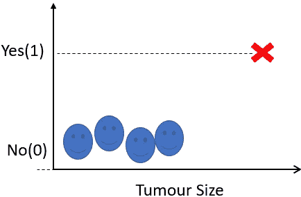
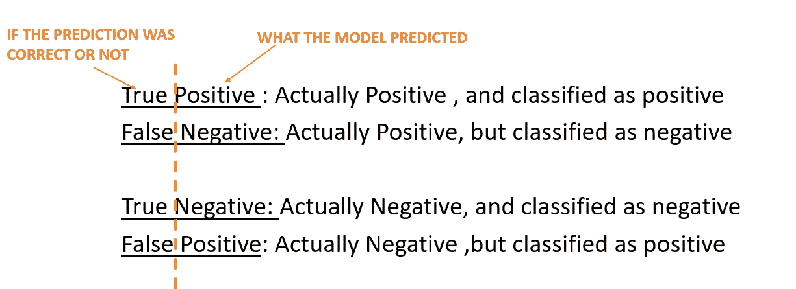
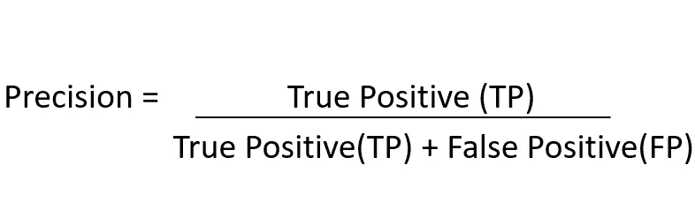
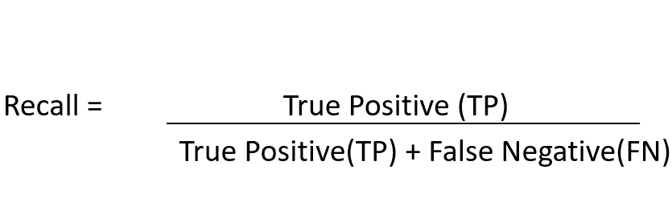
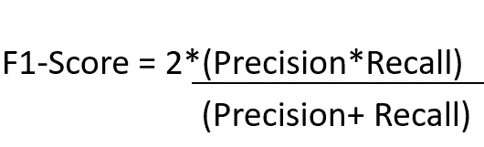

# 当 99.9%的准确率对你的 ML 模型不利时

> 原文：<https://medium.com/analytics-vidhya/when-99-9-accuracy-can-be-bad-for-your-ml-model-43d3601fec0c?source=collection_archive---------5----------------------->

## 你应该做什么

在这篇简短的博客中，我将打破准确性悖论。更高精度的模型并不总是理想的，尤其是在分类模型中。为了介绍我的情况，让我给你一个虚拟分类问题的例子。

基于肿瘤大小的癌症预测

在上图中，我们试图根据某个肿瘤的大小来预测它是否是癌性的。因此，很明显，较大的肿瘤尺寸将可能是癌性的，并且将被分类为是或 1。

## 不平衡数据带来的问题

现在，你注意到上面的数据中有什么问题吗？没错，就是高度**不平衡**。虽然我们有 5 个非癌性肿瘤的例子，但是只有 1 个癌性肿瘤的例子。现在，你应该能够识别任何机器学习模型都会遇到的主要问题。

机器学习模型基于简单的数学运算。**他们活着就是为了尽量减少损失，增加准确性**。以下是分类问题中准确度的含义:(正确分类的案例数)/(总案例数)。

假设我根据上述数据训练了一个逻辑回归模型，它给了我 66.6%的准确率。意味着 6 个例子中大约 4 个被正确分类。现在让我们把它变得更有趣。

想象一下，我让我 5 岁的侄子也来做预测。他甚至不看肿瘤的大小，就简单地预测每个肿瘤细胞都是非癌性的。但是你猜怎么着？因为不平衡的数据，6 次中他有 5 次是对的！他跑赢了机器学习模型！

# 引入替代指标

这就是为什么引入了其他一些不受阶级不平衡影响的指标。即真阳性、假阳性、真阴性和假阴性。如果你不知道这四个术语的意思，我在下图中做了说明:

这 4 个属性主要用于计算精确度、召回率和 F1 值。你将会看到使用这些度量标准是如何阻止我们依赖我侄子对哑元分类问题的预测的。

## 精确度、召回率和 F1 分数

**精度**，简单来说就是被**预测为阳性**的所有样本中，被正确分类的阳性样本的比例。在数学意义上:

精确公式

因此，如果我们采用我侄子的预测，现在考虑癌细胞，我们将得到精度为**零**。这是因为即使只有一个正面例子，它也没有被正确分类。或者我们可以说公式中的分子，真阳性是零。

**回忆**，简单来说就是所有**实际阳性**的样本中被正确分类为阳性样本的比例。在数学意义上:

回忆公式

癌细胞的召回率也将为零，因为真正的阳性率为零。使用精确度和召回率，另一个称为 F1 分数的指标也可以计算为:

F1 分数公式

像精确度和召回率一样，癌症样本的 F1 值也将为零。它帮助我们揭露了我侄子的模型有多糟糕，尽管它有很好的准确性。

## 结论

总之，在这篇博客中，我们可以看到，准确率并不总是一个好的分类标准。因为让我们现实一点，在大多数现实世界的问题中，你总是会有不平衡的数据，永远不会是 50:50 的类分布。在这种情况下，计算所有班级的 f1 分数并取平均值总是好的。

如果你喜欢这个教程，请鼓掌，并前往我的 YouTube 频道了解更多与机器学习相关的见解！

 [## Nachiketa Hebbar

### 嘿，大家好。欢迎来到我的频道。我是一名计算机视觉工程师，目前也是一名大一新生。我大部分时间都在聊天…

www.youtube.com](https://www.youtube.com/NachiketaHebbar)