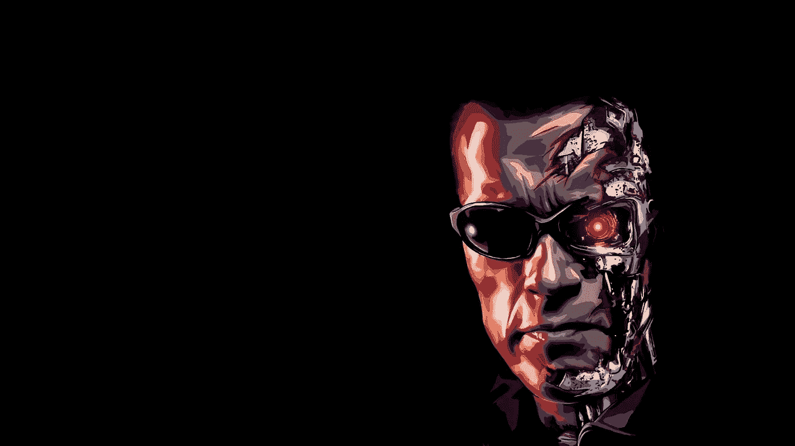
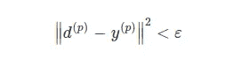
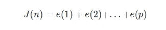
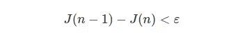
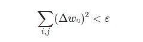
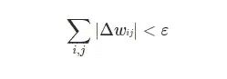

# 反向传播何时终止？

> 原文：<https://medium.com/analytics-vidhya/when-does-back-propagation-terminate-69bf00447674?source=collection_archive---------18----------------------->

它总会回来的

# 不惜一切代价避免成本。

反向传播并不是被设计成以一种永恒的方式运行，它的终止本身就是一个有趣的章节，应该引起足够的重视。一般来说，决定这种强大而有效的算法是否应该停止是一个可以通过使用两个参数来检查的问题:

-突触重量

- Loss *(J)* ，通常是最常用的。

本质上， *J* 可用于定义两个基本但有效的标准

# 标准 1.1

> 如果 loss *J* (n)，其中 n 是一个时期，被降低到低于指定的阈值，则停止。

作为一般规则，计算 *J* (n) 与保持权重固定和计算每个单个输入 *p* 的误差直接相关:

其中 **d** 分别为目标值， **y** 分别为网络输出。

然后，这些误差的总和就是我们要求的值，因此

# 标准 1.2

> 两个连续时期 n-1 和 n 之间的误差没有显著减小。

其中 *ε* 也是用户预定义的阈值。

# 如果困惑，考虑重量。

还有另一种方法来展现算法性能的真实面目，那就是利用权重本身。

# 标准#2

> 在特定时期 *n* 对权重进行的改变是微不足道的。

现在，这需要你的一点注意力。本质上，该标准被分成单个解决方案的两个变型，其中公共参数是权重和通常的用户设置阈值，而不同之处在于第一个变型将权重的平方与后者进行比较，

而第二个取它们的绝对值，

# 最后的想法

我坚信自己对理论有很好的理解，无论是关于音乐、历史还是数学。尽管我仍然有很多内容要介绍，但我强烈建议，这取决于我们个人的努力，以了解这些算法在其核心是如何工作的，以便我们可以评估性能，并对其缺点(或幸运的成功)有一个不仅仅是直觉的方法，尽管由于我们的全自动库和软件，这些过程中的许多已经处于二等位置。因此，我希望这些简短的信息能对你有所帮助。

## 参考

K.Diamantaras，人工神经网络，出版社:Kleidarithmos，2007 年