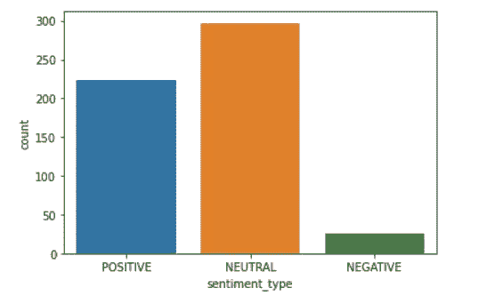

# 情感分析什么时候会失败？

> 原文：<https://medium.com/analytics-vidhya/when-does-sentiment-analysis-fail-eae9012dfa79?source=collection_archive---------6----------------------->

我在 kaggle 上偶然发现了一个由各种公司标语组成的数据集。我没有看电影，而是用这个数据集来分散注意力。我试着对标语进行情感分析，以找到一些有趣的东西。

在进行了一些数据质量检查后，我发现一个典型的口号有 3-5 个单词长。这并不奇怪，我想我们都知道。

标语中的词语范围

后来，看到最频繁出现的词，毫不奇怪，像“好”、“爱”、“更好”这样的词很常见。

因为，像好的，吃的，更好的，最好的，爱，生活这些词是常见的。人们会认为这些口号的情绪总体上是积极的。为了证实这一点，我对所有标语进行了 Vadar 情感分析。

不仅大多数口号听起来是中性的，而且算法显示很少有带有负面情绪的。为什么一个公司会批准一个带有负面情绪的口号？我自然很好奇，让我看看那些-

无论哪里出现像“不”、“蛮横”、“疯狂”等这样的词，都表示否定。至少可以说，这是一个很好的测试案例。完整笔记本的链接在这里-[https://github . com/black currents/Data-Mining/blob/master/starter _ slogan _ dataset _ FFA 80249 _ 6 . ipynb](https://github.com/BlackCurrantDS/Data-Mining/blob/master/starter_slogan_dataset_ffa80249_6.ipynb)。欢迎任何建议和意见！