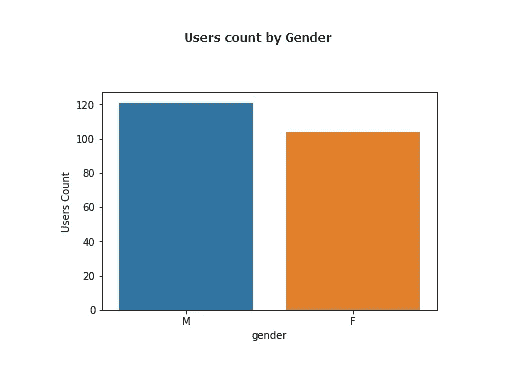

# 当音乐是你的激情时…

> 原文：<https://medium.com/analytics-vidhya/when-music-is-your-passion-9837aea155ea?source=collection_archive---------8----------------------->

使用 Spark ML 进行客户流失预测

# **项目概述**

我们都至少曾经通过流媒体应用程序听音乐，我们享受着快速找到我们最喜欢的歌手并想听多久就听多久的可能性。

至于每一个应用程序，只有当你决定支付一定的金额并成为高级会员时，才可以使用一些高级功能。

只要你对该应用程序提供的功能感到满意，你就会继续付费以保留你的优质功能，但可能会发生这样的情况，一段时间后，出于某种原因，你决定停止付费，或者更糟的是，你决定取消订阅。

**如果我们可以利用机器学习来预测用户是否会退订，会怎么样？**

在下面的段落中，我将展示我是如何处理这个提到的问题的，这是一个常见的业务问题，称为“流失预测”。我将展示如何处理可用数据，以及如何实现基于监督机器学习技术的机器学习管道。

使用机器学习模型和管道来预测用户的流失是一个很好的方法，因为我们可以实现一个模型来预测单个用户基于之前的行为会做什么。统计方法和测试可以给出有用的结果，但不像机器学习模型那样细致和详细。

最终目标是产生一个模型，可以用来对用户进行分类，并预测他们是否会流失。

# 数据探索和可视化

该项目中使用的数据集包含与注册到 Sparkify(一个虚构的音乐流媒体应用程序)的用户相关的数据子集。

数据被加载到火花数据帧中进行分析。如下所示，该模式包含每个用户和会话的 ID，以及关于用户本身的信息(性别、位置……)和完成的操作(访问的页面……)，按时间戳排序。

数据框架模式

为了开始我们的分析，我们使用了 EDA 来更好地理解数据集的内容。

数据集包含 **278154 行**和 **225 个不同的用户。**特征工程前可用的**特征**为 **17** ，不包括 userId 列。

以下是一些探索的结果(更多信息可在相关的 [Jupyter 笔记本](https://github.com/AleGuarnieri/Sparkify-Capstone)中找到):

数据框架中某些列的详细信息

在此阶段完成的最重要的数据清理是删除用户 Id 为空的行。此外，有趣的是，注意到某些列有一些空值，因为用户的操作与歌曲无关，所以对于这些行，歌曲的作者、名称和持续时间没有被填充。

# 数据预处理和实现

## 标签定义

我们分析的目标是预测用户何时会流失，所以我们添加了一个列，标签，定义用户是否决定取消订阅。

pySpark 代码定义标签列“Churn”

列“Churn”将用作我们模型的目标列，以便我们可以将它与特征列一起用于训练，然后测试机器学习模型。

## 特征工程

需要对数据集中可用的特征进行操作，以便在机器学习模型中使用。

**分类特征**

“性别”是唯一使用的分类特征。在这种情况下，有必要使用一键编码技术将特征从分类转换为数字。

**数字特征**

“page”列用于构建一些数字特性，为每个用户创建页面操作计数。除此之外，还添加了一些其他数字特征，如:“每个用户的会话数”、“每个用户听的歌曲数”、“每个用户每个会话听的歌曲平均数”

**关于数据泄露的说明**

在执行特征工程时，考虑数据泄漏是很重要的，例如，在特征中不包括“取消确认”或“取消”以避免过度拟合是必要的。

# 模型评估和验证

在这个项目中使用的 ML 模型是逻辑回归和随机森林。这种选择是考虑到问题的性质，这是一个分类问题，以及类别不平衡的事实。

对 80%的数据进行训练，而剩下的 20%专门用于验证。

## 超参数调谐

在训练集上执行交叉验证，以便我们可以调整模型的超参数并选择最佳参数。

定义管道、超参数和评估器后，定义交叉验证

以下是超参数调整后的最佳参数值

**逻辑回归:**

*   regParam: 0.1
*   弹性参数:0.0

**随机森林:**

*   数量:50
*   最大深度:15

## **指标**

交叉验证过程中使用的指标是 f1-score 和 AreaUnderPR，因为这些类别是不平衡的，预测良好的积极的一个更重要。

在最佳模型上，还计算了正类的其他指标，如下所示:

训练后测试数据集的指标(评估指标:f1-得分)

经过训练的随机森林模型也用于预测训练集的标签，如下所示，训练集的度量值较高，因此模型可能过度拟合:

## 关于评估的补充说明

**造成过拟合的参数**

有趣的是，我们注意到在随机森林模型上调整的两个参数中，对过度拟合影响最大的是 maxDepth。正确地调整它是非常重要的，因为这需要进行不同的实验。

**F1-py spark 中的分数:挑战**

F1 得分指标用作评估指标，并用于模型的微调。Spark 类 MulticlassClassificationMetrics 对类的 f1 分数进行平均，因此逻辑回归的 f1 分数为 0.58，随机森林的 f1 分数为 0.66。

尽管如此，如果我们查看阳性类别的 f1 得分(如上所示)，我们会看到逻辑回归的 f1 得分为 0。这对交叉验证过程和我们对逻辑回归模型的认知都有影响，逻辑回归模型看起来可能比实际要好。

**验证**

在交叉验证期间使用*集合子模型*，可以保留每个折叠的模型，然后对它们进行评估，以测试最佳模型的稳健性。所选的模型似乎不够健壮，并且有点过于依赖所选的数据集。这个问题可能是由于阶级不平衡，也可以解决使用更多的数据。

# 最后的反思和改进

解决我们的流失预测问题的选择模型是随机森林模型，因为如上所示，根据使用的评估指标，它优于逻辑回归模型。超参数调整后，模型的 F1 得分为 0.66，特别是正 a 类的 F1 得分为 0.28。在所有使用的特征中，预测客户流失的最重要的特征是“拇指向下”和“拇指向上”。

整个过程中最重要的部分是超参数调整:重要的是理解与要解决的业务问题相关的指标的意义，重要的是不仅要检查总体 F1 分数，还要检查积极类的分数。

我们终于准备好帮助 Sparkify 预测他们的用户是否会流失了吗？

好了，已经完成了一大步，但是还可以有许多其他步骤来改进预处理和模型调整。

例如，将这段代码运行到一个分布式集群中，以利用 Spark 的能力，看看是否能获得更好的性能。

纠正类别不平衡或添加附加特征也是令人感兴趣的，例如，分类特征，如每个用户可用的最后状态(免费或付费)或其他数字特征。

最后，使用不同的模型或创建模型集合也是有用的。

[你可以在这里找到完整的 Jupyter 笔记本](https://github.com/AleGuarnieri/Sparkify-Capstone)