# 当测量的准确性误导您时！

> 原文：<https://medium.com/analytics-vidhya/when-the-measurements-accuracy-misleads-you-a9f0f1f7bb0d?source=collection_archive---------4----------------------->

伊万·班杜拉在 [Unsplash](https://unsplash.com?utm_source=medium&utm_medium=referral) 上的照片

毫无疑问，你也听说过淘金者。在大多数情况下，个人在淘金者的帮助下发现了巨大的财富，并在一夜之间成为百万富翁。

你的朋友有一个黄金探测器。为了帮助你的伙伴，你也选择了加入淘金者的行列。所以你和一个朋友去了一个有大约 1000 块石头的矿，你猜这些石头中有 1%是金子。

鉴别黄金时，你朋友的黄金探测仪会发出哔哔声，方法如下:

*   这种设备可以检测黄金，当它接触到黄金时会不断发出蜂鸣声。
*   这种装置识别黄金和宝石的准确率高达 90%

当你和你的同伴探索矿井时，机器在一块岩石前发出嘟嘟声。如果这块石头是黄金，它的市场价值约为 1000 美元。你的朋友建议你付给他 250 美元，然后捡起石头。这笔交易看起来很有吸引力，因为如果是黄金，你可以赚三倍的钱。另一方面，黄金探测器的准确性很高，黄金是黄金的可能性也很大。这些想法最终会鼓励你支付 250 美元给你的伙伴，并为自己捡起石头。

从淘金者的世界退一步，回到美丽的数学世界，更仔细地审视这个问题，这并不是一个坏主意:

*   考虑到这个矿里大约有 1000 块石头，其中 1%是金子，这意味着这个矿里大约有 10 块金子。
*   因此，该矿约有 990 颗宝石没有独特的材料价值。
*   该设备区分黄金和石头的准确率为 90%，这意味着如果我们将 990 块石头(我们确定不是黄金)放在它面前，它会错误地发出大约 99 块石头的声音。

鉴于上述情况，如果我们在矿井中打开这个设备，它可能会发出 109 次声音，尽管只有 10 次哔哔声是真的。这意味着我们花 250 美元买的石头只有 9%的可能是黄金。这意味着我们没有做好交易，可能在一块毫无价值的石头上浪费了 250 美元。如果我们想用数学方法总结所有这些对话，我们将有:

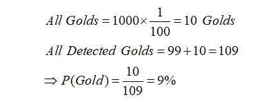

在对这一问题进行数学研究后，我们发现仅“测量精度”参数不足以获得可靠的结果，还必须考虑其他因素。“假阳性悖论”是统计学和数据科学中用来描述这一论点的概念。

当一个事件发生的概率小于用来测量该事件的仪器的误差精度时，通常会出现这种矛盾。例如，在“掘金者”的情况下，我们使用了一个准确率为 90%(误差为 10%)的设备来调查一个概率为 1%的事件，因此结果不是很可靠。

# 熟悉术语

在深入研究围绕“假阳性悖论”的问题之前，最好先回顾一些统计案例。假设已经进行了电晕测试来帮助您理解这个概念。该测试产生了四种模式:

*   **真阳性:**你感染了冠状病毒，检测呈阳性。
*   **假阳性:**你没有感染冠状病毒，但检测呈阳性。
*   **真阴性:**你没有感染冠状病毒，检测结果为阴性。
*   **假阴性:**你已经感染了冠状病毒，但是检测结果是阴性。

应该提到的是，电晕试验和一般的医学试验在这里被用作例子，并且这四个要求可以应用于存在不准确风险的任何事件。

在黄金搜索者的情况下，设备的假阳性误差百分比，即如果设备不是黄金但是设备发出嘟嘟声，是 10%，并且设备的假阴性误差百分比，即如果设备是黄金但是设备不发出嘟嘟声，是 0%。在接下来的章节中，我们将着眼于“假阳性悖论”争论的不同方面。

# 未知病毒

一种神秘的病毒感染了一个有 10，000 人的城市，影响了大约 40%的人口。作为产品经理，您致力于尽快创建病毒检测试剂盒，以便区分感染者和健康人。

[Maskmedicare Shop](https://unsplash.com/@maskmedicare?utm_source=medium&utm_medium=referral) 在 [Unsplash](https://unsplash.com?utm_source=medium&utm_medium=referral) 拍摄的照片

您的 ID 试剂盒有 5%的假阳性错误率和 0%的假阴性错误率。该试剂盒目前正用于检测城市中的病人，您的预测结果如下:

*   患有该疾病的估计人数:

*   假阳性测试结果的数量:

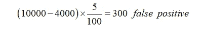

如前所述，该试剂盒的假阴性百分比为 0%，这意味着如果有人患有某种疾病，必须得到识别。最近发现，大约 300 人的测试结果被认为是不正确的。最后，可以说，4300 人的检测结果呈阳性，其中 4000 人确实患有这种疾病。因此，该套件的测量精度约为 93 %,这是一个值得信赖的数字。

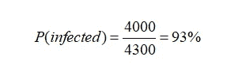

然而，这并不是故事的结尾！由于贵公司的检测试剂盒一直很有效，它现在正被用于识别其他城市的感染。其中一个城市的人口约为 1000 人，这个小村庄约有 2%的居民感染了这种病毒。

在 [Unsplash](https://unsplash.com?utm_source=medium&utm_medium=referral) 上由 [Mufid Majnun](https://unsplash.com/@mufidpwt?utm_source=medium&utm_medium=referral) 拍摄的照片

使用识别试剂盒识别受影响的人员；然而，调查结果令人失望。绝大多数检测呈阳性的人没有任何患病迹象，这让人对贵公司试剂盒的合法性和质量产生了怀疑。通过一点计算，我们可以得到以下结果:

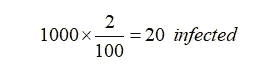

*   患有该疾病的估计人数:

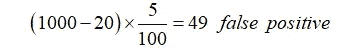

*   假阳性测试结果的数量:

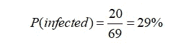

很明显，测试结果是无效的。虽然只有 20 人感染了病毒，但鉴定试剂盒对 69 人的检测呈阳性，约占 29%，这是一个非常低的医学检测数字:

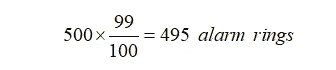

也就是说，如果一个人的检测结果在这次检测中呈阳性，那么他没有生病的可能性就超过了 70%！这里我们还面临着一个“假阳性矛盾”。如前所述，如果事件发生的可能性小于用于测量该事件的仪器的误差率，则调查结果无效。在这种情况下，检测试剂盒的假阳性错误率约为 5%，而小镇的发病率为 2%。因此，获得的发现并不特别可靠。作为产品经理，您现在必须为鉴定试剂盒创建方案和安全余量，以评估试剂盒结果的可信度。

# 警报警告

在一个拥有 100 万人口的最重要的大都市零售中心，反恐摄像头和警报器已经安装到位。这个警报有 1%的假阳性几率和 1%的假阴性几率。换句话说，我们可以说:

**假阴性:**如果闭路电视摄像头识别出恐怖分子，警报 99%都会响起。

**假阳性:**当普通人经过摄像头前时，警报响起的可能性减少了 99%，但响起的可能性增加了 1%。

现在的问题是，如果有一天警报响了，建筑群内有恐怖分子的可能性有多大？

[连浩曲](https://unsplash.com/@lianhao?utm_source=medium&utm_medium=referral)在 [Unsplash](https://unsplash.com?utm_source=medium&utm_medium=referral) 上的照片

鉴于这种摄像机的假阳性和假阴性错误率低于 1%，并且它有 99%的准确性，对这个问题最可能的回答是，如果警报响起，有 99%的概率，恐怖分子将被检测到。有一个复杂的问题。然而，处理统计概率问题并不容易！

我们估计在一个 100 万人口的大都市有 500 名恐怖分子。这一假设是可信的，并得到了人口统计数据的支持。现在我们回到最初的问题:如果警报响起，恐怖分子在建筑群内的可能性有多大？以下计算用于得出这一百分比。

鉴于侦察摄像头 99%的准确率，城市里有 500 名恐怖分子，如果他们都经过摄像头前，警笛会响 495 次:

99，900 人是普通人(城市的全部人口减去恐怖分子)。如果所有这些人都经过摄像头前面，由于识别摄像头 1%的误差，警报会响 9995 次:

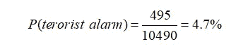

结果，如果整个城市从这个摄像头前面经过，警笛就会响 10490 次。然而，警报器只在 495 个案例中正常鸣响。现在可以评估如果警笛响起，会有多少比例的恐怖分子在场:

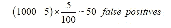

根据这些估计，如果警报响起，有超过 95%的可能性是假的，并且在建筑群内没有恐怖分子。最终结果与我们最初的想法大相径庭。当大多数人读到这款相机 99%的精确度时，他们对这种出色的精确度感到惊讶，并相信这款小工具的大部分输出都是正确的，但我们再次证明了单靠测量精确度是不够的。

马库斯·斯皮斯克在 [Unsplash](https://unsplash.com?utm_source=medium&utm_medium=referral) 上的照片

在这种情况下，城市居民中出现恐怖分子的可能性接近 0.05%。尽管这个仪器的误差只有大约 1%。因此，我们再次面临“假阳性”问题，这导致了低效率的输出。

# 意识测试

一个警报设备委托你管理产品。警方将使用这种小工具来检测饮酒或吸毒的司机。以下是您的团队生产的产品规格:

*   该设备的假阴性错误率为零，这表明它可以准确地筛查所有饮酒或吸毒的人。
*   这个小工具的假阳性错误率大约为 5%，这意味着在 95%的情况下，那些没有使用药物或酒精的人的测试结果是阴性的。尽管如此，在 5%的情况下，测试结果是积极的。

你花了一些时间思考产品发布，并要求警方为你提供一份关于司机饮酒和吸毒发生率的研究，因为你擅长数据科学，在从事产品管理之前曾是一名数据科学家。

由 [South_agency](https://www.gettyimages.com/search/photographer?family=creative&photographer=South_agency) 在 [Getty Images](https://www.gettyimages.com) 上拍摄的照片

在对数据进行检查后，你会发现，平均每 1000 名司机中有 5 人饮酒和吸毒。这是一个有点问题，因为如果警察随机测试你现有产品的驱动程序，这可能会导致一场灾难！为了更好地理解这个问题，我们进行了下面的计算。

每 1000 人中有 5 人服用过酒精和药物，由于该设备的假阴性错误率为零，所以对这 5 人的测试将是阳性的。

如前所述，该设备的假阳性错误率约为 5%。这意味着，995 名未饮酒的司机中，约有 50 人的检测结果为阳性:

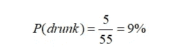

这表明，在 1000 人中公布的 55 项阳性检测中，只有 5 人得到了确认。这表明该测试的准确性约为 9%,如果有人测试呈阳性，则超过 90%的可能性是没有摄入，因此是无害的！

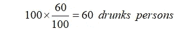

因此，很明显，随意使用这个小工具将非常容易出错，并将严重损害贵公司的声誉和警察局。为了解决这个困难，人们的圈子必须有所限制。换句话说，你应该设计一种方法，使得一个人服用酒精或药物的可能性比设备的不准确性更重要。所以你创建了一个行为准则，在其中你规定了一些行为，如果一个司机做了其中的任何一件事，他就有 60%的可能性摄入酒精或毒品。这将为设备的输出提供可信度。可以肯定的是，想象一下警察拦住了 100 名对这种方法持怀疑态度的司机。

照片由 [aranprime](https://unsplash.com/@aranprime?utm_source=medium&utm_medium=referral) 在 [Unsplash](https://unsplash.com?utm_source=medium&utm_medium=referral) 拍摄

假设在这些人中消费的机会是 60%，在 100 人的组中，大约 60 人消费过，因此这 60 人的测试将是阳性的:

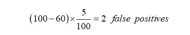

因为这个装置有 5%的错误率，剩下的 40 个人中有两个人可能测试为阳性:

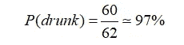

结果发现，即使是对样本空间的基本了解也会对结果产生重大影响。当然，了解您的样本空间是一个很长的问题，我们将在以后的帖子中再次讨论。

# 结论

根据研究结果，单靠设备的测量精度并不能确保输出的可靠性，所考虑的样本空间可能比仪器的精度更重要。为了避免“假阳性悖论”的影响，必须建立条件，使出现的几率超过设备的不准确性。在“意识测试”的例子中，这导致了输出准确性的显著提高。

***感谢阅读！***

***欢迎在评论中分享你的想法或阅读技巧。***

***跟我上*** [***中***](/@jalilrfie98)*[***LinkedIn***](https://www.linkedin.com/in/jalil-alizadeh-product-manager/)***和*** [***推特***](https://twitter.com/en_jalil) ***。****