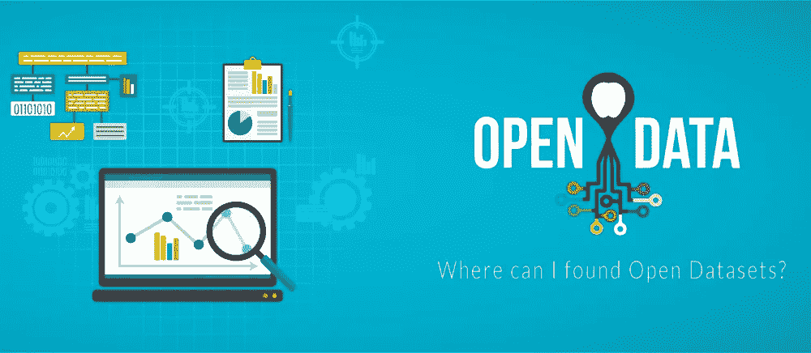

# 在哪里可以找到开放数据集？

> 原文：<https://medium.com/analytics-vidhya/where-can-i-found-open-datasets-3dee7cc319aa?source=collection_archive---------11----------------------->

由 freepik

> 所以这里有*吨牛逼* **开放数据源列表**

# 什么是开放数据/数据集？

2017 年，《经济学人》曾提到，“ ***【数据】是我们这个时代新的‘石油】*** ”。那么，对于像石油这样有价值的商品来说，“开放”意味着什么呢？

简单来说，开放数据是指**开放给所有人访问、修改、共享**和**重用**而*不收费*的那种数据。

政府、私人机构和独立组织已经开始使用数据来创建越来越多的开放数据，以供免费和方便地访问。

# 为什么开放数据很重要？

世界变得越来越由数据驱动。但是，如果对数据的访问和使用有限制和界定，就无法调查和发现数据驱动的业务和治理。

因此，开放数据对于科学和统计研究非常重要。

开放数据非常重要，因为它可以让我们更全面地了解全球问题和普遍问题。它为企业提供了巨大的好处，因为它方便了对数据的访问。

# 在哪里可以找到开放数据集？

人们对数据科学和大数据领域有着浓厚的兴趣。我想将我的数据集站点存档与洪水共享。

*可以添加自己知道的，喜欢的。*

# 打开数据源列表

数据科学家和机器学习实践者需要开放的数据网页，下面是我在浏览器中添加的书签。因此，这里有大量令人敬畏的开放数据源列表:

1.  [**世界银行开放数据**](https://data.worldbank.org/) :作为世界上最全面的关于世界不同国家发生的事情的数据库，世界银行开放数据是开放数据的重要来源。它允许您下载不同格式的数据，如 CSV、Excel 和 XML，涵盖 3000 多个数据集和 14000 个指标，包括微观数据、时间序列统计数据和地理空间数据。
2.  [**【世卫组织】(世界卫生组织)**](https://www.who.int/gho/database/en/) :世卫组织的开放数据储存库包含 194 个会员国提供的具体卫生统计数据。
3.  [**欧盟开放数据门户**](http://open-data.europa.eu/en/data/) :您可以访问欧盟机构、机关和其他组织在单一平台即欧盟开放数据门户上发布的任何开放数据。
4.  [**谷歌公共数据浏览器**](https://www.google.com/publicdata/directory) :谷歌公共数据浏览器可以帮助你探索海量的公共利益数据集。您可以可视化和交流数据，以供各自使用。
5.  [**fivethirtyeeight**](https://data.fivethirtyeight.com/)**:为政治、体育、科学、经济等多个领域提供各种数据来源。你也可以下载数据。**
6.  **[**美国人口普查局**](https://www.census.gov/data.html) :美国人口普查局是联邦政府最大的统计机构。它存储并提供关于美国人、地方和经济的可靠事实和数据。人口普查局认为其崇高的使命是作为高质量数据最可靠的提供者扩大其服务。**
7.  **[**AWS 上的开放数据**](https://registry.opendata.aws/) :这个注册中心的存在是为了帮助人们发现和共享通过 AWS 资源可获得的数据集。**
8.  **[**Data.gov**](https://www.data.gov/):Data.gov 是美国政府公开数据的宝库。直到最近才决定免费提供所有政府数据。**
9.  **[**DBpedia**](https://wiki.dbpedia.org/):DBpedia 旨在从维基百科创建的有价值的信息中获取结构化的内容。使用 DBpedia，您可以在语义上搜索和探索维基百科资源的关系和属性。这也包括到其他相关数据集的链接。**
10.  **[**freeCodeCamp 开放数据**](https://github.com/freeCodeCamp/open-data) :是一个开源社区。它之所以重要，是因为它让你能够编码，在非营利组织之后建立公益项目，并获得一份开发人员的工作。**
11.  ****:Yelp 数据集基本上是我们自己的业务、评论和用户数据的子集，用于个人、教育和学术追求。Yelp 开放数据集中包含 5，996，996 条评论、188，593 家企业、280，991 张图片和 10 个大都市地区。****
12.  ****[**儿童基金会数据集**](https://data.unicef.org/) :由于儿童基金会关注各种各样的关键问题，它汇编了关于教育、童工、儿童残疾、儿童死亡率、孕产妇死亡率、水和卫生、出生体重不足、产前保健、肺炎、疟疾、碘缺乏症、切割女性生殖器官和青少年的相关数据。****
13.  ****[**KAGGLE**](https://www.kaggle.com/datasets)**:KAGGLE 之所以伟大，是因为它提倡使用不同的数据集发布格式。然而，更好的是，它强烈建议数据集发布者以一种可访问的、非专有的格式共享他们的数据。******
14.  ******[**LODUM**](https://lodum.de/)**:是明斯特大学的开放数据倡议。根据这一倡议，任何人都有可能以机器可读的格式获取关于该大学的任何公共信息。您可以根据需要轻松访问和重用它。********
15.  ******[**UCI 机器学习知识库**](https://archive.ics.uci.edu/ml/index.php) :它是一个数据库、领域理论和数据生成器的综合知识库，由机器学习社区用于机器学习算法的实证分析。在这个库中，目前有 463 个数据集作为对机器学习社区的服务。加州大学欧文分校的机器学习和智能系统中心主持和维护它。大卫·阿哈最初是在加州大学欧文分校的研究生时发明的。******
16.  ****[**data verse**](https://dataverse.org/about)**:data verse 项目是一个开源的 web 应用程序，用于共享、保存、引用、探索和分析研究数据。它有助于将数据提供给其他人，并允许您更容易地复制其他人的工作。研究人员、期刊、数据作者、出版商、数据分销商和附属机构都获得了学术荣誉和网络知名度。******

18.  ******[**CKAN**](https://ckan.org/)**:CKAN 是一个强大的数据管理系统，通过提供简化数据发布、共享、查找和使用的工具，使数据变得可访问。********
19.  ******[**开放数据影响图**](https://opendataimpactmap.org/) :开放数据影响图是一个使用来自世界各地的开放政府数据的组织的公共数据库。开放数据是公开可用的数据，任何人都可以免费访问和重用。******

21.  ****[**Data.gov.in**](https://data.gov.in/):是印度政府开放数据的网站。****
22.  ****[**Quandl**](https://www.quandl.com/)**:API ' ler ile sürekli veri ekmek nasl fikir？quandlüzerindenücretsiz hesap olu turarak API balan TN z kurabili 实时流项目******
23.  ******[**Socrata**](https://opendata.socrata.com/)**:是一个分享 data.gov 等美国数据的网站。但是你可以访问许多不同的数据集。你可以分析一下美国白宫的员工工资。********
24.  ******[**data hack by Analyticsvidhya**](https://datahack.analyticsvidhya.com/):可以加入可以在世界范围内制作数据的黑客马拉松，回顾过去的黑客马拉松，下载到 resin 中。******
25.  ****[**学术种子**](https://academictorrents.com/browse.php) :包含学术文章中使用的数据集。你可以找到各种数据，如 5 TB 的 IHA 飞行数据或 1 TB 的照片。****
26.  ****[**数据是复数**](https://www.data-is-plural.com/) :通过订阅，它会定期将数据集直接发送到您的电子邮件地址。因此，他决定了你那一周要做什么。****
27.  ****[**Reddit 的数据集**](https://www.reddit.com/r/datasets/) :是 Reddit 中数据集共享或请求的部分。****
28.  ****[**斯坦福大学数据集**](http://snap.stanford.edu/data/) :是斯坦福大学项目和数据集在社交网络上的站点。****
29.  ****[**网络储存库**](http://networkrepository.com/) :社交网络和网络图形上有一个大型的数据集储存库。****
30.  ****[**Data Europa**](https://data.europa.eu/euodp/en/home) :是欧盟的官方网站，收集了欧盟国家多个领域的数据集、应用和图片。****
31.  ****[**IMF 的数据集**](https://www.imf.org/en/Data) :国际货币基金组织(IMF)公布了各国的财政状况、负债率、货币储备、大宗商品价格等大量数据。****
32.  ****[**狮桥 A** I](https://lionbridge.ai/datasets/) :有很多免费和付费的机器学习数据集。数据集可用于许多领域，如语音、加密货币。****
33.  ****[**Dataset by Open Intro**](https://www.openintro.org/data/):一群教育工作者用数据集和教科书上更多的东西创建的组织，虽然分类有点复杂。****
34.  ****[**BuzzFeedNews**](https://github.com/BuzzFeedNews)新闻数据集:它通过 BuzzFeedNews 的 github 提供新闻中的文章中提到的数据集。****
35.  ****[**NASA**](https://earthdata.nasa.gov/)数据集:你是太空科学爱好者吗？你可以使用美国宇航局开放数据门户的数据。****
36.  ****维基百科的文本数据集:你愿意使用维基百科的数据吗，我们新的数字百科全书？你正在为你的 NLP 项目寻找一个多语言数据集，这是你的网站。****
37.  ****[**Data World**](https://data.world/)**:Data World 将自己定义为“数据人的社交网络”，是一个数据集搜索引擎，在这里你可以搜索和下载数据集。******
38.  ******[**地下**](http://onenote:Interv%C4%B1ew.one/#https//www.wunderground.com/&section-id={BA342275-E734-43D3-BA16-EE253ADB407F}&page-id={461BBE73-560C-45F6-9C82-4FB55A91A787}&base-path=https://d.docs.live.net/93cf60957ab1b5b9/Documents/OneNote/Online_Learning) :你需要即时的天气数据吗？您可以查找 API 或 csv 格式的历史或未来(预报)天气数据。******
39.  ****[**来自 Youtube 的数据**](http://research.google.com/youtube8m/):YouTube-8M 片段数据集是 Youtube-8M 数据集的扩展，具有人工验证的片段注释。除了注释视频之外，我们还想在时间上定位视频中的实体，即找出实体何时出现。****
40.  ****[**你在脸书的个人资料**](https://www.facebook.com/dyi/?referrer=yfi_settings) :你愿意和脸书一起分析你的个人资料吗？首先，从[这里](https://www.facebook.com/dyi/?referrer=yfi_settings)下载您的数据，然后查看[这里](https://www.dataquest.io/blog/analyze-facebook-data-python)示例****

# ****结论****

****开放数据是当今的力量。世界已经逐渐开始走向开放系统。你为什么不利用他们呢？****

# ****作者****

****侯赛因·ELCI | Github|[Kaggle](https://www.kaggle.com/huseyinelci)|[Linkedin](https://www.linkedin.com/in/huseyinelci/)|****