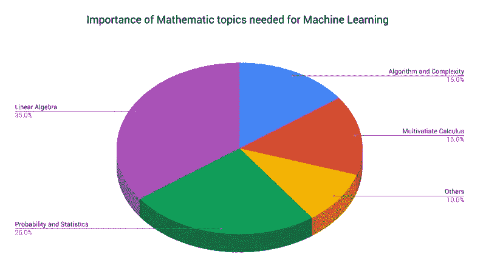

# 2021 年学机器学习的数学去哪里学？

> 原文：<https://medium.com/analytics-vidhya/where-to-learn-maths-for-machine-learning-in-2021-4e8d15a3ddd2?source=collection_archive---------24----------------------->

作为一个机器学习学习者，这是我们最常见的问题，“**从哪里学习机器学习的数学？”**

因为

为了理解机器学习及其算法如何工作，数学知识非常重要。在数学中，最重要的主题是-

*   概率与统计
*   线性代数
*   结石
*   [数]矩阵

这张来自 [**内置于**](https://builtin.com/data-science/introduction-to-machine-learning) 的图片显示了每个数学题目对于机器学习的重要性。

所以如果你有同样的疑问，那么我选择了一些**机器学习的最佳数学课程**。

所以，不浪费你的时间，让我们开始为你寻找**机器学习的最佳数学课程**。

# 1.[机器学习专用数学](https://coursera.pxf.io/qnGGxy)

**评级-** 4.4/5

**提供商-** 伦敦帝国理工学院

**完成时间-** 4 个月(每周 4 小时)

这是最好的专业化程序之一，涵盖了机器学习所需的所有数学主题。这个专业化项目的目的是填补 T21 的空白，建立对数学的直观理解。

这个专业化计划是一个 **3 道课程**系列。在第一门课程中，你将学习线性代数、向量、矩阵以及它与数据的关系。

这个专业的第二门课是**多元微积分**。在本课程中，您将更深入地了解如何优化拟合函数以更好地拟合数据。

这个专业化计划的最后一个课程是**利用主成分分析进行维度缩减。**本课程使用前两门课程的数学知识来**压缩高维数据。与此同时，你将参与不同的现实项目。**

完成这个专业化计划后，你将获得**必备的数学知识**来继续你的机器学习之旅。让我们看看课程的细节-

## 课程包括-

1.  [**机器学习的数学:线性代数**](https://coursera.pxf.io/qnGGxy)
2.  [**机器学习的数学:多元微积分**](https://coursera.pxf.io/qnGGxy)
3.  [**机器学习的数学:PCA**](https://coursera.pxf.io/qnGGxy)

现在，让我们看看完成这个项目后你会获得什么技能-

## 技能提升-

*   特征值和特征向量
*   主成分分析
*   多元微积分
*   线性代数
*   基础(线性代数)
*   变换矩阵
*   线性回归
*   向量演算
*   梯度下降
*   降维
*   Python 编程

## 额外福利-

*   完成后你将获得一张**可分享证书和**课程证书。
*   除此之外，你还会得到**课程视频&阅读材料、练习测验、有同伴反馈的评分作业、有反馈的评分测验、评分编程作业。**

现在，让我们看看您是否应该参加这个专业化计划？

## 你应该参加，如果-

*   你有高中水平的数学知识。并且**课程 3** 需要 Python 和 NumPy 的基础知识。

## 有兴趣报名吗？

如果是，那么在这里查看所有细节- [**机器学习专用数学**](https://coursera.pxf.io/qnGGxy)

# 2.[数据科学专业数学](https://coursera.pxf.io/KeY6G7)

**评级-** 4.4/5

**提供者-** 国立研究型大学高等经济学院

**完成时间-** 6 个月(每周 4 小时)

这是另一个数学专业化计划，涵盖了机器学习和数据科学的所有数学主题。在这个专业中，你将学习离散数学、微积分、线性代数和概率。这个专业涵盖了广泛的数学工具。

在这个专业中，你将从事的项目有- **分析** **社会图表，预测房地产价格，并揭示数据中隐藏的关系。**

这个专业有 4 门课程。

## 额外福利-

*   完成后您将获得**可分享证书和**课程证书。
*   除此之外，你还会得到**课程视频&阅读材料、练习测验、有同伴反馈的评分作业、有反馈的评分测验、评分编程作业。**

现在，让我们看看您是否应该参加这个专业化计划？

## 你应该参加，如果-

*   你有**高中** **级数学**，python 中的**基础编程。**

## 有兴趣报名吗？

如果是，那么在这里查看所有细节- [**数据科学专业的数学**](https://coursera.pxf.io/KeY6G7)

# 3.[数据科学数学技能](https://coursera.pxf.io/x9qqm1)

**评级-** 4.5/5

**提供商-** 杜克大学

**完成时间-** 13 小时

这门课程由杜克大学提供。在本课程中，你将掌握**词汇、符号、概念和代数规则。**在本课程中，您将学习以下主题-

*   集合论，包括文氏图
*   实数线的性质
*   区间符号与带不等式的代数
*   求和与适马符号的用途
*   笛卡尔(x，y)平面、斜率和距离公式的数学运算
*   在 x-y 平面上绘制和描述函数及其逆函数
*   瞬时变化率和曲线切线的概念
*   指数、对数和自然对数函数。
*   概率论，包括贝叶斯定理。

## 额外福利-

*   完成后您将获得一张**可共享证书**。

现在，让我们看看你是否应该参加这个课程？

## 你应该参加，如果-

*   你以前没有数学知识，想要学习机器学习和数据科学所需的数学基础。

## 有兴趣报名吗？

如果是，那么在这里查看所有细节- [**数据科学数学技能**](https://coursera.pxf.io/x9qqm1)

# 4.[微积分入门](https://coursera.pxf.io/x9qKvx)

**评级-** 4.8/5

供应商:悉尼大学

**完成时间-** 51 小时

这门完整的课程致力于**微积分**。在这门课程中，你将对微积分有一个完整的了解。这门课程将教你微积分的主要思想和历史动机，同时在理论和应用之间取得平衡。

在本课程中，您将熟悉**微积分**的关键思想，熟练掌握**切线和极限**的初步方法，并发展和练习**微积分和积分学的方法。**

## 额外福利-

*   完成后您将获得一个**可共享证书**。

现在，让我们看看你是否应该参加这个课程？

## 你应该参加，如果-

*   你只想精通微积分。

## 有兴趣报名吗？

如果是，那么在这里查看所有详情- [**微积分入门**](https://coursera.pxf.io/x9qKvx)

# [5。概率图形模型特殊化](https://coursera.pxf.io/QOx9Xa)

**评级-** 4.6/5

**供应商-** 斯坦福大学

**完成时间-** 4 个月(11 小时/周)

这个专业将让你掌握**概率图形模型**的基础知识。概率图形模型(PGM)是一个丰富的框架，用于编码复杂域上的概率分布。

在这个专业化计划中，您将学习以下概念-

*   推理
*   贝叶斯网络
*   信念传播
*   图形模型
*   马尔可夫随机场
*   吉布斯采样
*   马尔可夫链蒙特卡罗(MCMC)
*   算法
*   期望最大化算法

这个专业化计划有 3 个课程系列。

## 额外福利-

*   完成后，您将获得**可分享证书和**课程证书。
*   除此之外，你还会得到**课程视频&阅读材料、练习测验、有同伴反馈的评分作业、有反馈的评分测验、评分编程作业。**

现在，让我们看看您是否应该参加这个专业化计划？

## 你应该参加，如果-

*   你有一些数学技能，并且你能够用至少一种编程语言编程。
*   之前接触过离散概率论中的**基本概念(独立性、条件独立性和贝叶斯法则)也会有所帮助。**

## 有兴趣报名吗？

如果是，那么在这里查看所有细节- [**概率图形模型特殊化**](https://coursera.pxf.io/QOx9Xa)

# 6.[R 专业化统计](https://coursera.pxf.io/EaY6Gn)

**评级-** 4.6/5

**供应商-** 杜克大学

**完成时间-** 7 个月(每周 3 小时)

该专业化计划将在 R 的帮助下为您提供更多**深入的统计知识。**在该计划中，您将学习**如何在 R** 中分析和可视化数据，以及创建可再现的数据分析报告，等等。

对于执行**统计操作**，r 比 Python 好得多。所以，如果你想掌握统计学，那么我会推荐这个专业化项目。这个专业项目包含 **5 门课程**。让我们看看课程详情-

## 课程包括-

1.  [**概率与数据简介带 R**](https://coursera.pxf.io/EaY6Gn)
2.  [**推断统计**](https://coursera.pxf.io/EaY6Gn)
3.  [**线性回归与建模**](https://coursera.pxf.io/EaY6Gn)
4.  [**贝叶斯统计**](https://coursera.pxf.io/EaY6Gn)
5.  [**统计用 R 顶点**](https://coursera.pxf.io/EaY6Gn)

现在，让我们看看在完成这个专业化计划后，你将获得哪些统计技能-

## 技能提升-

*   贝叶斯统计
*   线性回归
*   统计推断
*   r 编程
*   统计数字
*   Rstudio
*   探索性数据分析
*   统计假设检验
*   回归分析
*   贝叶斯线性回归
*   贝叶斯推理
*   型号选择

## 额外福利-

*   完成后你将获得一张**可分享证书和**课程证书。
*   除此之外，你还会得到**课程视频&阅读材料、练习测验、有同伴反馈的评分作业、有反馈的评分测验、评分编程作业。**

现在，让我们看看您是否应该参加这个专业化计划？

## 你应该参加，如果-

*   你有**基础数学知识**。本课程不需要以前的编程知识。

## 有兴趣报名吗？

如果是，那么在这里查看所有细节- [**统计与 R 专精**](https://coursera.pxf.io/EaY6Gn)

# 7.[概率与统计](https://coursera.pxf.io/P0qQdj)

**评级-** 4.6/5

**提供商-** 伦敦大学

**完成时间-** 18 小时

这门课程特别致力于概率和统计。在这门课程中，你将学到许多处理不确定性的有用工具。

本课程的主要主题是**用概率量化不确定性、描述性统计、均值和比例的点估计和区间估计、假设检验的基础知识以及一系列多元应用**。

## 额外福利-

*   完成后您将获得一张**可分享证书**。

现在，让我们看看你是否应该参加这个课程？

## 你应该参加，如果-

*   你是初学者，想学概率统计。

## 有兴趣报名吗？

如果是，那么在这里查看所有细节-

# **8.[机器学习和 AI 的数学基础](https://click.linksynergy.com/deeplink?id=Vrr1tRSwXGM&mid=39197&murl=https%3A%2F%2Fwww.udemy.com%2Fcourse%2Fmathematical-foundation-for-machine-learning-and-ai%2F)**

****评级-** 4.0/5**

****提供商-** Eduonix 学习解决方案**

****完成时间-** 4.5 小时**

**本课程涵盖三个主要的数学理论:**线性代数，多元微积分，概率论。**本课程将刷新你对人工智能和机器学习的数学概念。**

**在本课程中，您将学习以下主题-**

****线性代数—****

*   **标量、向量、矩阵、张量**
*   **矩阵范数**
*   **特殊矩阵和向量**
*   **特征值和特征向量**

****多元微积分—****

*   **派生物**
*   **积分**
*   **梯度**
*   **微分算子**
*   **凸规划**

****概率论—****

*   **概率元素**
*   **随机变量**
*   **分布**
*   **方差和期望**
*   **特殊随机变量**

## **额外福利-**

*   **你将获得一张**结业证书**和 **6 个可下载资源**。**

**现在，让我们看看你是否应该参加这个课程？**

## **你应该参加，如果-**

*   **你想**刷新或者学习 AI 和机器学习所需的数学工具。****

## **有兴趣报名吗？**

**如果是，那么就在这里查看所有细节——[**机器学习的数学基础和 AI**](https://click.linksynergy.com/deeplink?id=Vrr1tRSwXGM&mid=39197&murl=https%3A%2F%2Fwww.udemy.com%2Fcourse%2Fmathematical-foundation-for-machine-learning-and-ai%2F)**

**所以，就这些了。这是机器学习的 8 门**最佳数学课程**。现在是总结的时候了。**

## **结论**

**希望这些课程能让你对数学概念有很强的理解。我的目标是为你提供最好的学习资源。如果你有任何疑问或问题，欢迎在评论区问我。**

****注-** *帖子中的部分链接为附属链接。这意味着，如果你点击链接并购买课程，我将收到一个附属委员会，没有额外的费用给你😊。***

**如果你觉得这些资源有帮助，请👏**