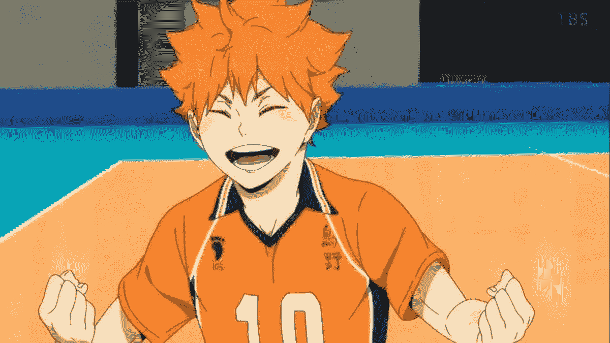
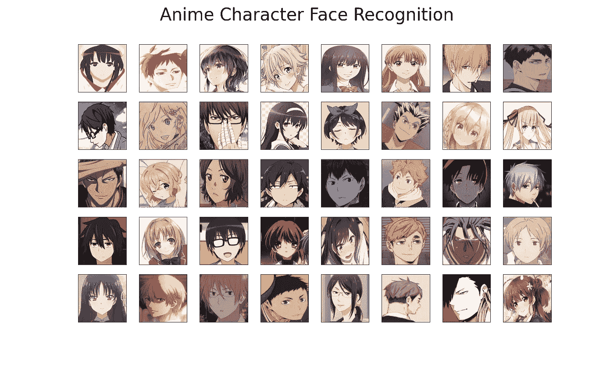
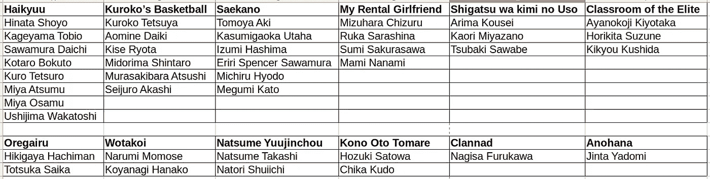
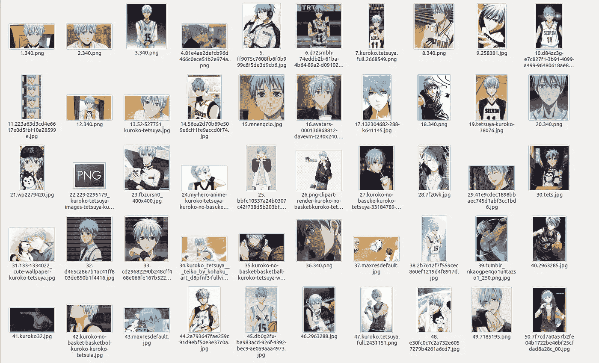
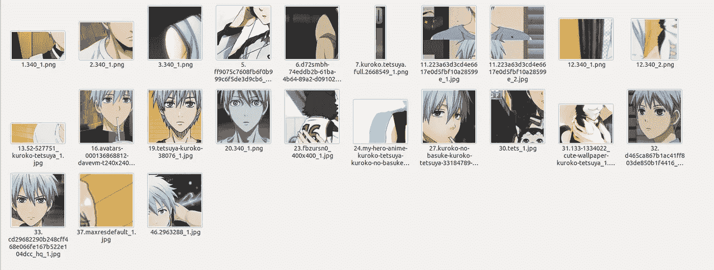

# 我是谁？

> 原文：<https://medium.com/analytics-vidhya/who-am-i-511d4146d035?source=collection_archive---------8----------------------->

## 深度学习的动漫人脸识别

# 动机

我一直想研究深度学习的一个领域，称为度量学习，我发现了一个很好的学习用例，激起了我的兴趣，让我直接钻研下去。就是**人脸识别问题**。

但是等等，这里有一个小小的转折。我们不做普通的人脸识别，因为它只是*嗯，非常普通！*。作为宅男文化的支持者，我觉得还是用动漫人物做面部识别吧！！



这将是一个由三篇文章组成的系列，将讨论项目的每个方面，从问题定义到模型评估和部署。这三个员额的结构如下:

1.  第一篇文章，也就是这篇文章将会讨论问题陈述、数据收集和适当地预处理/管理我们的图像。
2.  第二个帖子会讲模型建立和训练部分。
3.  最后一篇文章将包括对我们的模型的评估，在这里我们将角色区分开来，并使用 streamlit 部署模型。

事不宜迟，让我们开始吧！

# 但是什么是度量学习呢？

许多机器学习问题通常分为两类

*   **分类** —给定一组特征(X)，我们需要产生一个离散输出(y)。判断给定图像是猫还是狗。
*   **回归** —给定一组特征(X)，我们需要产生一个连续的输出(y)。给定人们的人口统计信息，预测他们赚了多少钱。

虽然这两个是一些最常见的用例，但是还有其他用例，其中之一叫做**检索任务。**

在这项任务中，给定一个数据点，我们应该找出以某种严格定义的方式接近或远离该数据点的其他数据点。*人脸识别、推荐系统等。是通常归入这一任务的一类问题。*

这里，一种称为相似性学习/度量学习的方法被证明是有用的。

维基百科将其定义为

> *度量学习是学习对象的距离函数的任务。*

它也可以不严格地称为相似性学习，因为距离函数可以用于根据最终应用将对象从最相似到最不相似进行排序，反之亦然。这里，使用深度学习，在损失函数中使用像欧几里德距离或曼哈顿距离或甚至余弦相似度的距离/相似度函数来确定两个或更多图像彼此相似/不同的程度。

在我们的动漫人脸识别问题中，我们将使用一个称为三重损失函数的损失函数，并如本文中所述对其进行修改[。](https://arxiv.org/abs/1703.07737)

# 数据收集

现在，这里没有特别的规定，因为这是一个自由流动的项目，所以我从一些我特别喜欢的动漫中选择了一些角色。

我已经选择了 40 个角色，每个角色，我们将有大约 32 个图像，使其成为一个完整的 1280 图像数据集。所有这些角色的角色精灵(后期收集)可以在下面看到。我精心制作了这个数据集，使其包含了一些有着非常相似面孔的人物形象(例如夏目漱石和名取秀一，桥本智哉阿基和有马公生等)。)来看看我们可以建立一个多好的系统来区分人们。



下面列出了上面所有的角色以及他们所属的动漫



既然我们已经弄清楚了我们的特征和估计，让我们实际上从网络上获取数据。

> *质量数据是任何预测模型的支柱。没有模型/算法可以保护你免受偏见的危险&数据泄露引发的其他问题。明智地收集您的数据！*

有许多搜索引擎和网站，我们可以从那里手动下载数据(仅用于训练模型的目的，而不是用于再共享、再分发、修改和再共享等。)但那会持续几个小时；这不是一个有效的数据收集过程。这就是 web-scrapers 的用武之地，web-scrapers 是一种自动抓取网络数据的程序。这是一个非常复杂的过程，超出了本文的范围；在这篇文章中，我们将看看另一个叫做`google_images_download`的流行包，它可以用来抓取谷歌图片并保存在本地。

## 装置

您可以简单地 pip 安装这个库，因为它在 python 包索引(PyPI)上可用。

在您的终端/powershell/命令提示符下，创建一个虚拟环境(可选，我观察到保持环境分离确实有助于在将来避免潜在的依赖冲突)，并安装库，如下所示:

```
*# https://pypi.org/project/google_images_download/*
pip install google_images_download
```

## 下载图像

这个库真的很容易使用并且[在这里有很好的记录](https://google-images-download.readthedocs.io/en/latest/index.html)。它提供了一个命令行选项来下载图像，还提供了一个脚本选项，我们可以在其中编写自己的 python 代码，并以特定的方式定制下载。

我们现在将使用脚本选项来下载图像。该脚本如下所示

与上面的脚本一样，下载图像主要只有两步。

1.  实例化 googleimagesdownload 类的一个对象。
2.  定义下载数据的参数。你可以传递许多参数来定制你的下载过程；其中一些是

*   关键词:谷歌图片搜索时需要查找的关键词。
*   限制:需要下载多少张图片
*   print_urls:是否在每次图像下载后内联打印下载图像的 url
*   output_directory:存储图像的位置

其中，只有关键字和限制是必需的，其他都是可选的。如果没有指定目录，脚本会在运行脚本的目录所在的位置创建一个下载文件夹，其中包含一个带有关键字 name 的文件夹，并在其中存储下载的图像。

## 使用此库时的一些故障排除提示

使用这个库的一些技巧如下:

*   如果您正在下载超过 99 个图像，此脚本模式将不起作用。您必须使用 CLI 来下载图像，并下载适当的 web 驱动程序来抓取图像。查看您的浏览器版本(Chrome ),从官方网站下载相应版本的浏览器驱动程序，并通过 CLI 提供一个路径

```
googleimagesdownload **--**keywords "INSERT KEYWORD HERE" **--**limit NUMBER_OF_IMAGES **--**chromedriver PATH_TO_CHROMEDRIVER
```

关于上面命令的更多信息，[看这里](https://google-images-download.readthedocs.io/en/latest/troubleshooting.html#installing-the-chromedriver-with-selenium)。

*   有时，你可能需要下载另一个`webdriver_manager`的依赖项来让这个库工作。这可以通过简单的 pip 安装来实现，如下所示。

```
pip install webdriver_manager
```

更多的故障排除选项，你可以[参考这个网站](https://google-images-download.readthedocs.io/en/latest/troubleshooting.html#installing-the-chromedriver-with-selenium)。

# 图像预处理

由于我们想要建立一个人脸识别系统，我们对人脸比对整个角色的身体更感兴趣。所以，我们想把整个图像裁剪下来，只包括我们角色的脸。这是至关重要的一步，因为我们将陆续建立的模型很大程度上取决于我们现在整理数据的方式。

有几种不同的方法可以做到这一点，其中我们将主要讨论两种。一种是使用 LBP 级联来构建人脸检测系统；在最初的日子里(前 DL 的日子)，这或哈尔级联被广泛采用的标准，特别是在我们的手机等。

Nagadomi 已经建立了一个 lbp 级联，许多人已经在他们的项目中使用了它，并且它在许多情况下也工作得很好。让我们用它来裁剪我们的图像，并衡量它的性能。

## 装置

repo 托管在 github 上，任何人都可以使用。让我们先从那里获得代码库。

从这里克隆这个库或者下载 zip 格式的代码[。在克隆了 repo 和/或解压缩了 repo 的内容后，导航到该文件夹并从该位置打开终端/命令提示符/powershell。接下来运行以下命令来获取 xml 文件，该文件包含从 LBP 级联进行推断所需的参数。](https://github.com/nagadomi/lbpcascade_animeface)

```
wget [https://raw.githubusercontent.com/nagadomi/lbpcascade_animeface/master/lbpcascade_animeface.xml](https://raw.githubusercontent.com/nagadomi/lbpcascade_animeface/master/lbpcascade_animeface.xml)
```

接下来，如果您没有安装 opencv 库，请将其安装到您的环境中。它也可以通过简单的 pip 安装从 pypi 获取

```
pip install opencv-python
```

现在你已经准备好使用 nagadomi 的面部提取级联如下。

总结一下上面的代码，我们基本上是读入图像，将其转换为灰度，然后通过 lbp 级联，提取感兴趣的区域，即人脸；对于每个图像，对于从该图像中提取的每个人脸，我们以与原始文件名相同的名称保存图像，只是在生成的人脸的末尾附加一个索引。例如，如果我们的源图像是 Kuroko.jpg，并且它包含黑子哲也的三个人物，我们将得到的提取分别保存为黑子 _1.jpg、黑子 _2.jpg 和黑子 _3.jpg。

## 结果

虽然在高层次上，这些 lbpcascades 工作得很好，但是它们对于我们的用例来说工作得不是很好。让我们以黑子哲也的图像文件夹为例。我最初为每个角色和黑子提取了 50 张图片，这是片段的样子。



黑子哲也—所有图像

当我使用[永田美的面部提取器](https://github.com/nagadomi/lbpcascade_animeface)时，我最终得到的结果如下:



黑子哲也— LBP 级联

所以从上面两张图片，我们可以看到，对于一些图像，这种技术取得了不错的结果，但对于大多数图像，它的工作不是很好。所有图像中的大多数人物都是如此。所以，我借助这种裁剪方法来获得面部图像，但我也手动通过其他图像来裁剪不同角色的面部。尽管如此，仍有一些字符没有达到图像数量的 32 个标志(主要是因为收集的数据包含小雕像、钥匙链等图像)。对于那些角色而不是实际的角色图像)。

# 平衡数据

在裁剪相关图像后，我们可以看到不同角色的可用图像数量差异很大，有些角色的图像没有达到我们预先设定的 32 个图像的标准。

在这种情况下，我们可以继续收集更多的数据，或者简单地在每个角色的可用图像中随机复制一些图像，这也有助于缓解这个问题。

我们定义了一个 N，即每个类必须至少存在的图像数量。接下来，我们迭代字符，并为每个字符找出图像的赤字数量(如果有的话)。如果存在一些图像不足，我们会从我们收集和裁剪的数据中随机抽取这些图像(即不足数量的图像),并在图像名称后添加后缀`_balancing`,以表明该图像是为了平衡数据集而创建的副本。

尽管这是一种处理阶级不平衡的天真方法，但与一开始就保持数据不平衡相比，这种方法有着惊人的效果。我们也可以使用一些增强技术，如旋转、翻转、对比度/亮度变化等。创造另一个新的独特形象。在这篇文章中，我采取了简单的复制图片的方式，这对我很有效。

一旦我们准备好了这些步骤，我们就可以进入下一步，这实际上是训练一个深度学习模型来执行面部识别程序。

这就是现在，我们将涵盖模型训练方面的后续职位。敬请期待！:)

# 参考

1.  [Github 回购与这个帖子的所有代码](https://github.com/ElisonSherton/anime_face_recognition/tree/master/data_prep)
2.  [Google _ images _ 下载图书馆文档](https://google-images-download.readthedocs.io/en/latest/installation.html)
3.  [nagadomi 的用于动漫人脸检测的 lbpcascade】](https://github.com/nagadomi/lbpcascade_animeface)
4.  [维基百科上的相似性学习](https://en.wikipedia.org/wiki/Similarity_learning)
5.  [关于度量学习的更多信息](http://contrib.scikit-learn.org/metric-learn/introduction.html)