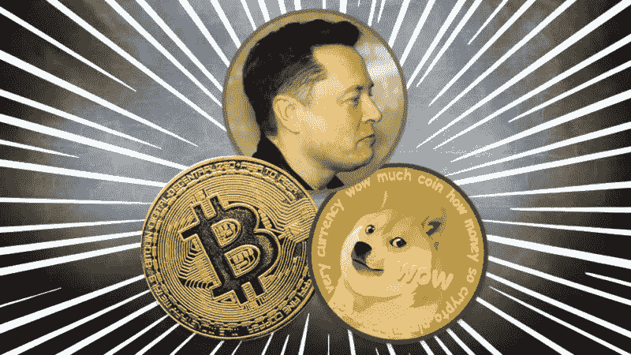
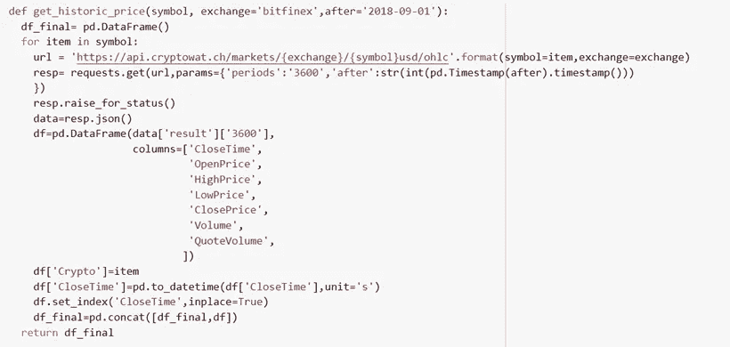
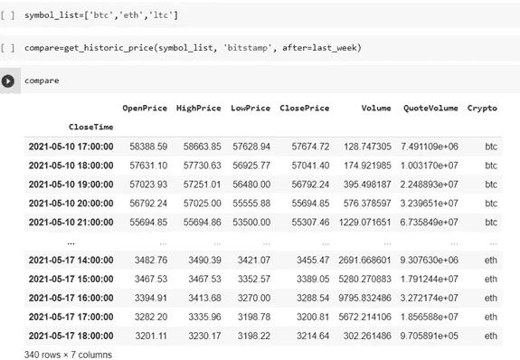
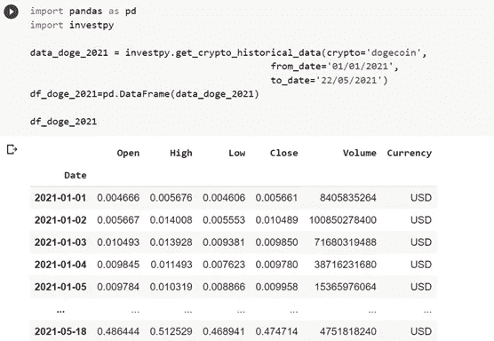
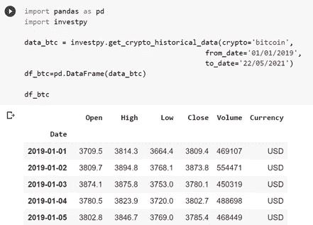
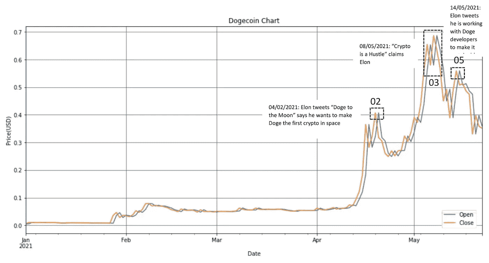
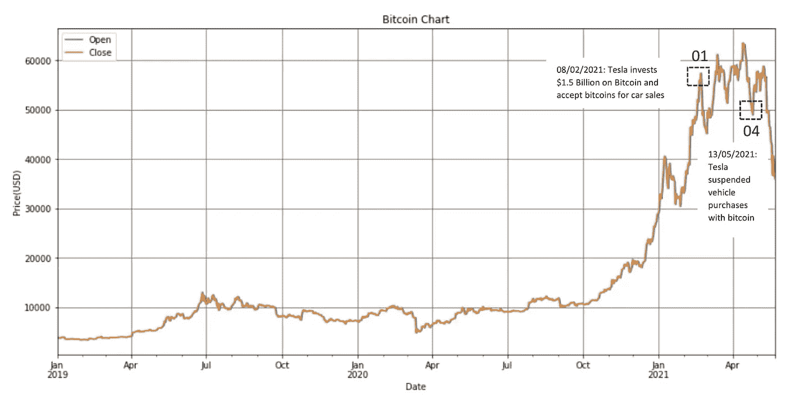
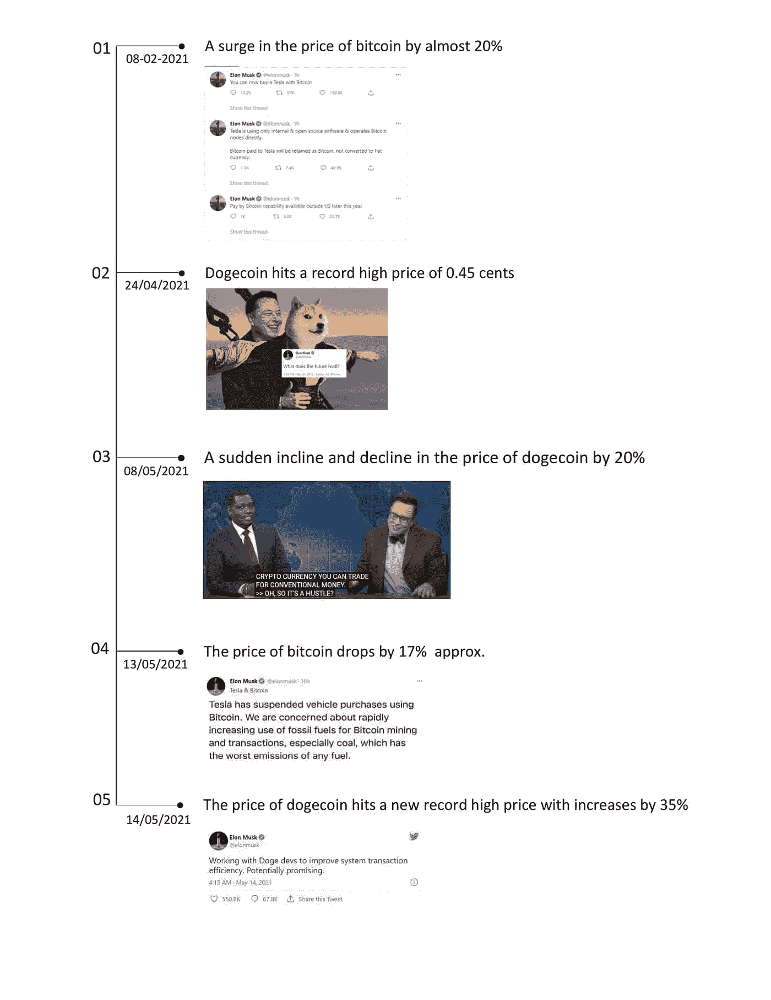
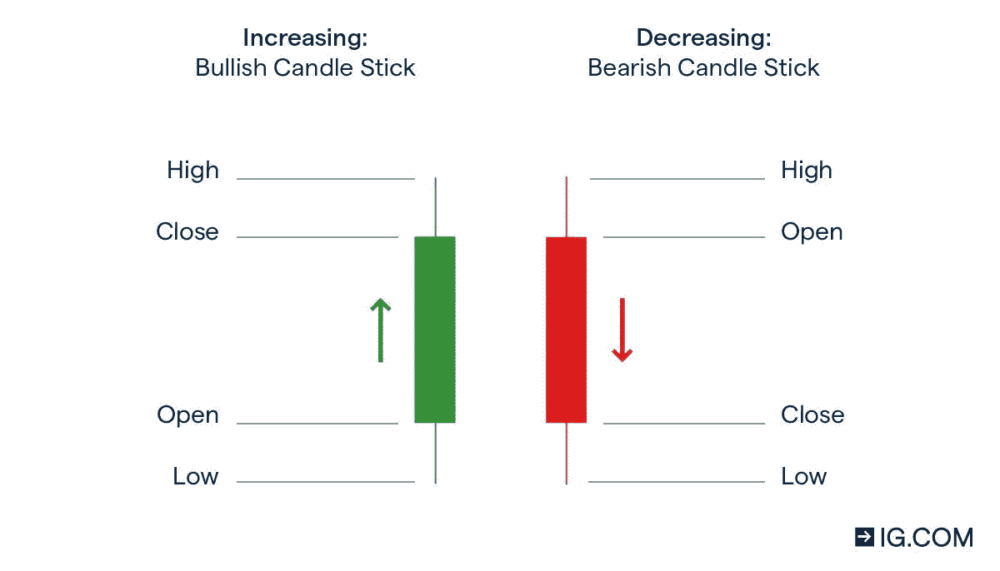
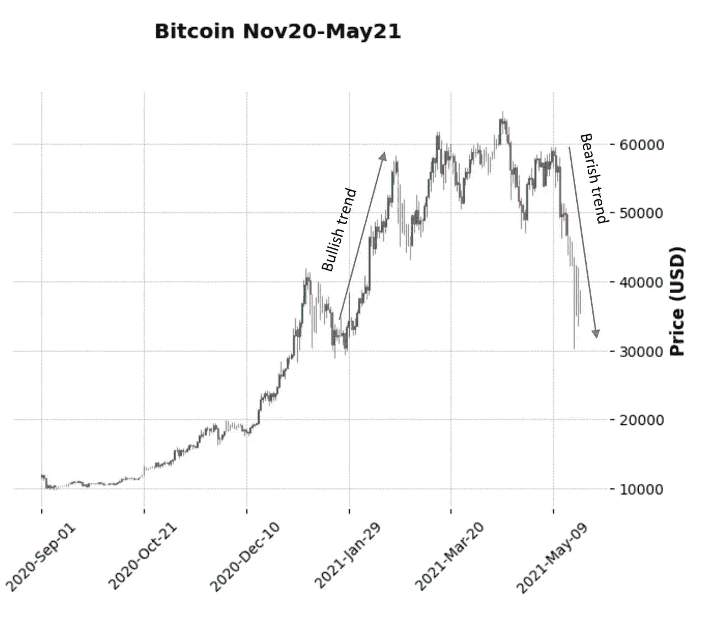

# “谁把‘总督’放出来了？”

> 原文：<https://medium.com/analytics-vidhya/who-let-the-doge-out-8145d7c392a8?source=collection_archive---------12----------------------->

来源:arstechnica.com

不久前(2021 年 2 月 8 日)，我们已经看到亿万富翁埃隆·马斯克(Elon Musk)制造了关于他在比特币上投资 15 亿美元特斯拉的新闻，当时比特币也创下了 43，000 美元的历史新高。

大约在同一时间，特斯拉也宣布将允许使用比特币购买车辆。

*抛开数据不谈，这个人似乎可以通过推特或谈论比特币和 Doge 来推动和降低它们的价格。*

**分析马斯克对比特币的影响& Doge**

让我们深入分析一下为什么埃隆·马斯克下了如此大的赌注，以及*“多吉如何在 24 小时内暴涨 20%，在他和迈克尔·彻一起出现在**周六夜现场**前后又下跌 20%* 。

现在我们有了一个时间段，让我们来看一些数据。

# **数据提取&探索**

这些数据可以从 cryptowat.ch(实时市场数据的 REST API 文档:[https://docs.cryptowat.ch/rest-api/](https://docs.cryptowat.ch/rest-api/))等公共 API 中提取，如下所示:

OHLC 价格数据的 API 请求(参考上述 API 文件)

创建一个字符串列表，用于检索所需加密货币的 OHLC 值

这里提取的数据是 OHLC 价格数据(开盘价、最高价、最低价和收盘价)。

我们也可以使用 rapidapi.com([https://rapidapi . com/API Dojo/API/investing-cryptocurrency-markets](https://rapidapi.com/apidojo/api/investing-cryptocurrency-markets))。这需要注册 API 密钥、密钥和代码生成。

对于我们的分析，让我们使用一个名为 investpy 的 python 包从[Investing.com](https://www.investing.com/)检索数据。

执行**pip install investy**来安装软件包。提取“Dogecoin”和“比特币”OHLC 数据，如下所示:

df_doge 存储 2021 年 1 月至 2021 年 5 月的“doge coin”OHLC 值

df_btc 存储 2019 年 1 月至 2021 年 5 月的“比特币”OHLC 值

让我们看看 dogecoin 和比特币的公开和收盘价格的一些折线图，以及埃隆·马斯克的推文如何影响它们的价格:

狗粮价格的“狗粮父亲”效应

比特币价格的“狗爸爸”效应

**根据上述图表进行分析，并将其与他的推文联系起来**

以上 doge 和比特币图表的价格趋势分析摘要

# **技术分析**

让我们分析一下影响埃隆·马斯克快速决策的因素，这些因素导致了 doge 和比特币价格的疯狂上涨。

既然我们在谈论加密价格的下跌和上涨，我们肯定应该谈论牛市和熊市。*我们大多数人可能都在利奥·D 的《华尔街之狼》中遇到过这些术语“公牛”或“熊”。“牛市”的特征是积极的市场上涨，“熊市”的特征是下跌。*

为了这个目的，让我们看看蜡烛图，它们显示了价格方向和动力的迹象。烛台图表的特点是*有一个上升和下降的趋势，导致熊市或牛市吞没模式*。

如上所述，绿色蜡烛线显示收盘价>开盘价，红色蜡烛线显示收盘价< open price

Visit [https://www . investopedia . com/trading/烛台-图表-是什么/](https://www.investopedia.com/trading/candlestick-charting-what-is-it/) 了解更多关于这些模式的信息。

这里查看的数据来自 2020 年 11 月至 2021 年 5 月:

比特币价格蜡烛图 9 月 20 日至 5 月 21 日

埃隆·马斯克(Elon Musk)是比特币上涨趋势背后的唯一原因，当时他宣布了 15 亿美元的投资，甚至在他退出用比特币购买特斯拉汽车时，引发了价格低至 3 万美元的看跌趋势。

但我们不要忘记，他帮助激起了一场围绕比特币沉重碳足迹的对话。***【cnbc.com***引用剑桥大学研究人员的话“比特币消耗的电力比荷兰全年的能源消耗还要多”

考虑用比特币购买特斯拉的电动汽车是否会以任何方式抵消损害是一回事。

## **加密货币是可再生能源的最佳利用吗？**

> **关注我的媒体，获取更多关于加密货币的文章以及与数据分析、人工智能、机器学习、设计和技术相关的主题**
> 
> **请随时分享您的想法、意见和反馈**

**在**[**Medium**](/@matha.tejeswini)**上关注我，或者在**[**LinkedIn**](https://www.linkedin.com/in/tejeswinimatha/)**上与我联系，进行协作和分享想法。**