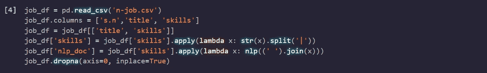
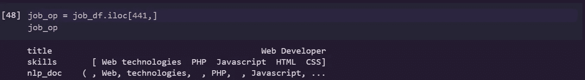
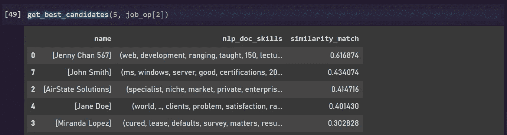
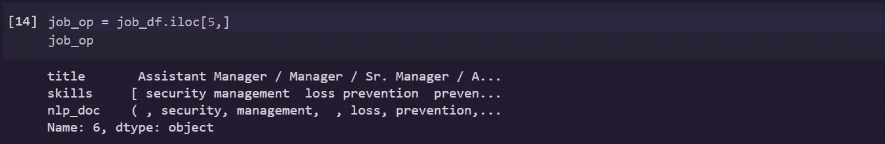
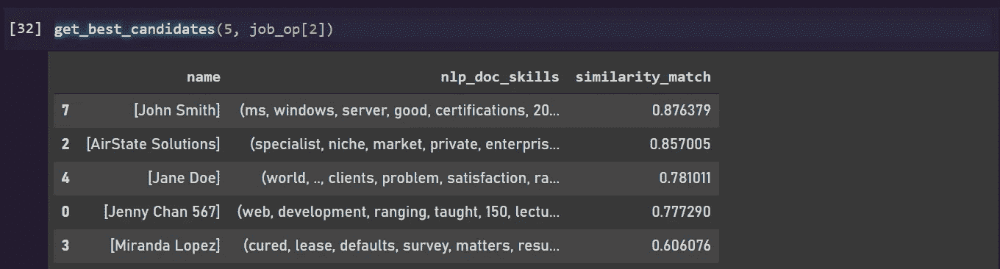
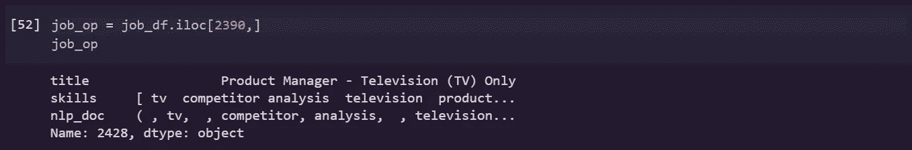
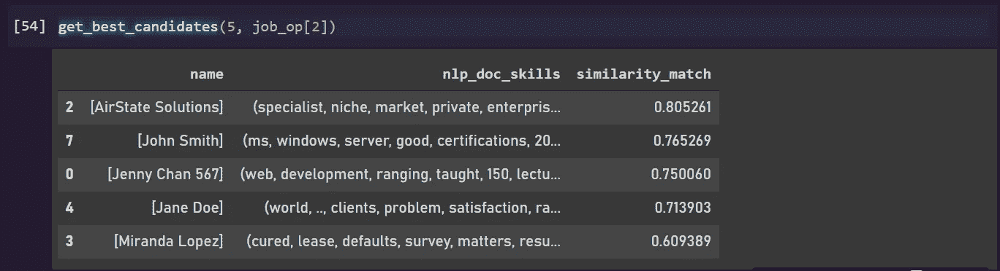

# 你应该雇用谁？让我们问问人工智能

> 原文：<https://medium.com/analytics-vidhya/who-should-you-hire-lets-ask-the-ai-808a45b75e09?source=collection_archive---------20----------------------->

让我们假设你在一家大公司工作，你每天都会在邮箱中收到大量简历，你对看到的简历数量感到沮丧，你无法通读所有内容并过滤掉它们，更让你沮丧的是，你收到的是图像而不是 pdf。由于图片是不可搜索的，你甚至不能尝试在图片中搜索与你公司招聘职位相关的关键词。因此，让我们使用 OCR 和 NLTK 构建一个简单的工具，它可以帮助您解决问题，并使您的工作更省时。

作为第一步，让我们从 OCR 开始，它从您收到的图像文档中获取文本信息。为此，让我们使用一个名为[“easy-ocr”](https://github.com/JaidedAI/EasyOCR)的 python 库。这个库为不同的任务使用两种不同的模型。CRAFT 在后端用于文本检测，而顺序模型用于文本识别。序列模型是具有三个重要组成部分的 CRNN 模型。ResNet 获取特征，LSTM 进行顺序映射，而 CTC 负责将特征解码成可识别的字符。下面是 easy-ocr 在简历图像样本上的实现:

上面的脚本完成了我们的分析所需的处理，以筛选出合格的候选人。所以让我们浏览一下，看看里面到底发生了什么。

*   第一步是让 easy-ocr 运行图像并从中获取文本信息。然后，我们将字符串连接成一个单独的段落，以便进一步处理
*   接下来，我们使用 spacy 获得可能的命名实体，尤其是候选实体的名称。这里我假设候选人的名字首先出现在简历上
*   然后，我们使用 NLTK 制作的 python 包装器作为后端来获取摘要，并使用关键字 post 检索内容摘要。

为了分析候选人的技能并将其与工作匹配，我使用了从 Kaggle 获得的数据集，以下数据集包含各种工作和要求，如经验年限、技能、地点等。这些工作被发布在 Naukri 网站上，并由 [Promptcloud](https://www.kaggle.com/promptcloud) 整合到[这里](https://www.kaggle.com/promptcloud/jobs-on-naukricom)。本次练习只使用了 ***栏目*** 和 ***关键技能*** 。关键技能被进一步处理成 NLP 的可用格式，如下所示

在下面的脚本中，我们得到了从候选人简历中检索到的关键词与数据集中每份工作中提到的技能之间的相似性。我使用了 spacy 库中的相似性评分方法。它基本上是从语义上计算每个单词之间的相似度。使用 spacy，它还通过考虑上下文来计算这些张量之间的相似性。下面定义的函数接受查询的工作和我们需要的候选人的数量。我使用了大约 10 份谷歌简历样本。

让我们来看看一些结果:

查询工作:网络开发人员

结果:

你可以从上面的结果中看到，最上面的候选人是 Jenny chan，她有相关的关键字，如 web、development 等

让我们不要停止，一个结果不能一概而论让我们再做一个，

查询职位:经理/助理经理

结果:

我认为这看起来令人满意，因为我们可以看到两个具有相似技能的候选人有很强的相似性匹配分数。

不…不…让我们再做一次来开心一点。

查询的职务:产品经理

结果:

是的，就目前的结果而言，我们可以很高兴，我们可以看到最上面的候选人有必要的词，如利基，市场，企业等。但是 AirState solutions 不是一个人，因为我的假设(第一个是人的实体)在这里悲惨地失败了。同样，我们可以通过使用 NLP 技术改进处理来改善这一点。

伙计们，这又是一个非常基本的过滤方法，通过它我们可以筛选出候选人，但我们可以从这里扩展，建立一个监督分类模型。我们可以将我们在这里获得的 similarity_match 分数与其他特征(如首选位置、CTC、经验、认证等)结合起来，以建立一个二元分类器模型。

我希望你会喜欢这篇文章，请与你的朋友分享。谢谢，请继续关注更多…:)