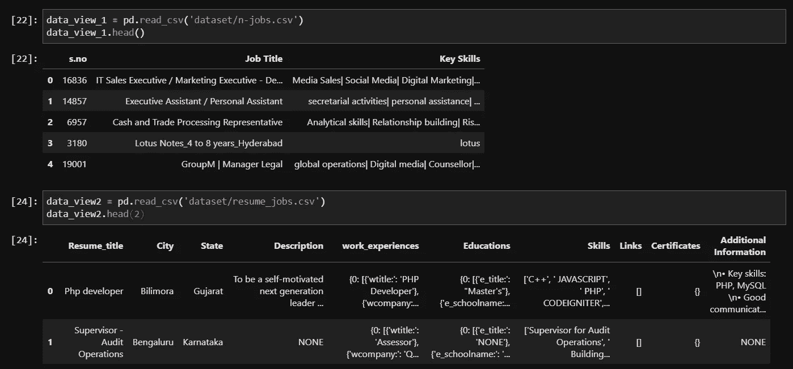
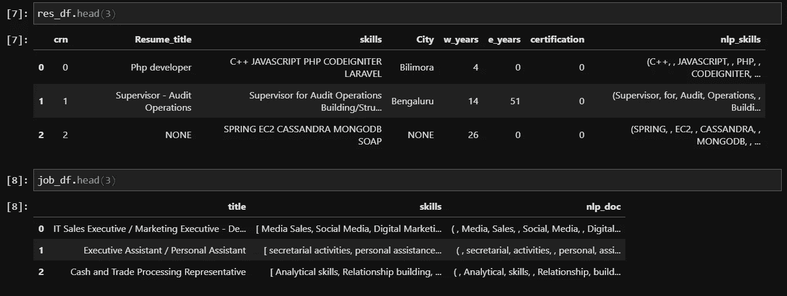
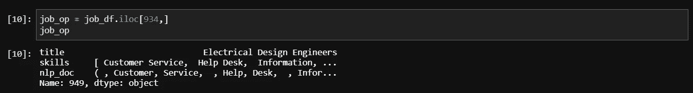
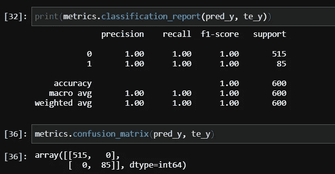
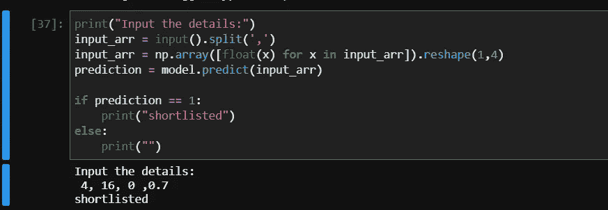
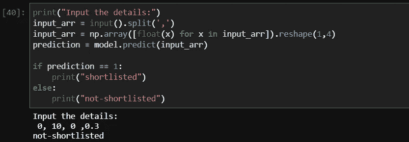
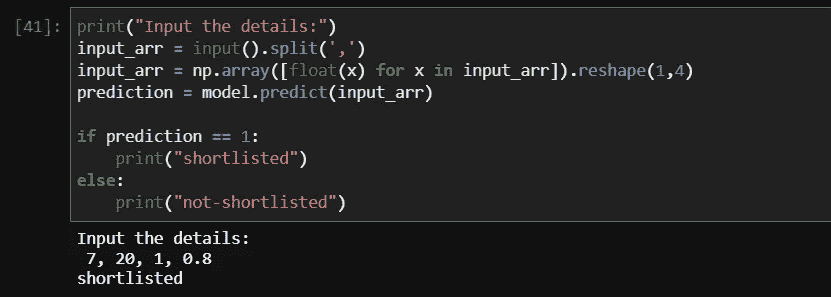
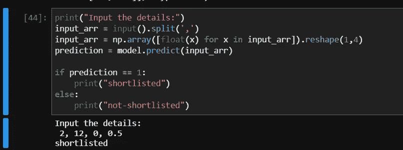

# 你应该雇用谁？让我们问问人工智能——第二部分

> 原文：<https://medium.com/analytics-vidhya/who-should-you-hire-lets-ask-the-ai-part-2-b9182205dcca?source=collection_archive---------14----------------------->

在我之前的帖子中，我已经写了我们如何根据简历技能改进候选人入围流程，以及无监督学习算法如何帮助人力资源团队。现在让我们看看如何创建一个二元分类器模型来预测候选人入围的可能性。为此，我们使用了以下数据集，其中包含简历中的详细信息。我们将纳入非常重要的功能，如工作经验，教育细节，认证，相关技能等。请在下面找到我之前的帖子的链接，关于我们如何使用无监督学习方法筛选候选人。

 [## 你应该雇用谁？让我们问问人工智能

### 让我们假设你在一家大公司工作，你每天都会在邮箱里收到很多简历…

medium.com](/analytics-vidhya/who-should-you-hire-lets-ask-the-ai-808a45b75e09) 

# 数据处理:

首先，我们需要将数据集中的信息转换为数字，以便机器学习模型可以使用它们。当前数据集由字符串格式的所有数据组成，它们需要在用于建模之前进行处理。让我们来看看我们将在本帖中使用的两个不同的数据集。第一个包含职位名称和职位所需的必要技能，而第二个包含个人候选人的详细信息。

正如你所看到的，第一个数据集由不同的工作及其相关技能组成，而第二个数据集由每份个人简历中的内容组成。现在，我们将把第二个表中的字符串格式的数据转换到字典中，使其可用于我们的计算。

上面的代码片段将第一个数据集中的文本数据转换为 spacy 库的 doc 格式，这使我们能够进行基本的 NLP 计算。

这里，我们仅从第二个数据集中提取了相关要素，并将相关列从字符串格式转换为字典格式，这将由 spacy 库进一步处理。

使用下面的函数，我们将把处理过的数据集中的信息编码成简单的数字，也就是说，我已经提取了候选人拥有相关工作经验的年数、他接受教育的年数以及他是否有证书等等，这样我们就可以在创建机器学习模型时利用这些数字。

最后，我们现在拥有的数据集可用于建模方法。

正如我们从上图中看到的，第一个数据集包含个人候选人概况，而第二个数据集包含个人工作的技能组合。现在，对于这篇文章，我们可以继续从第二个数据集中选择一个特定的工作，并计算每个候选人的技能集与我们选择的相应工作之间的相似性得分。让我们为我们的问题陈述取一个职位名称样本。

# 建模:

使用上面的代码片段，我们得到了将用于创建模型的最终数据框。在数据处理之后，我已经手动将数据标记为“0”和“1 ”,用于创建二元分类模型。现在，让我们使用二元分类算法来拟合模型，并分析模型的工作原理。这里，我们的目标变量是候选人的状态，如果他被选中或没有。剩余的列是我们的训练数据集的特征。

在用分类器模型拟合数据集时，我们可以在测试数据集上查看从它导出的度量。

正如我们从上面的图像中看到的，我们似乎已经完美地拟合了模型，因为测试数据集上的结果非常好，值得注意。让我们用随机样本数据问人工智能自己:

案例 1:

假设我们有一个候选人，他有 4 年的工作经验，16 年的教育背景，没有通过认证，但是他的技能与我们的工作要求非常匹配。

案例二:

现在让我们尝试一些其他的组合，它们有非常糟糕的数字:0，10，0，0.3

案例三:

{7，20，1，0.8}的又一个组合

案例 4

我们将在中间地带进行检查:{2，12，0，0.5}。

因此，从上述结果中，我们可以看到，该模型在四肢上表现得非常好，而对于即使是对人来说也是欺骗的数据点可能会失败。但据我所知，就效率和时间而言，这是入围过程的一次升级。

感谢所有花宝贵时间通读这篇文章的人，让我们很快赶上一些有趣的事情。在那之前，再见伙计们。如果你喜欢这篇文章，请分享给你的朋友。