# 《老友记》中最有趣的角色是谁？《老友记》剧集中的喜剧分析

> 原文：<https://medium.com/analytics-vidhya/who-was-the-funniest-character-on-friends-analyzing-comedy-in-all-friends-episodes-4b1ac8d21ca7?source=collection_archive---------7----------------------->

不管你喜不喜欢，《老友记》是有史以来最受欢迎的情景喜剧之一。

演员们的刻画多种多样，足以让你在每个角色身上看到一点你自己和你朋友的影子，他们在生活中磕磕绊绊，做出了错误的决定。这就难怪，在巅峰时期，这部电视剧有超过 5000 万的观众。

粉丝们至今最大的争论之一是:*谁是这部剧最有趣的角色？是钱德勒自嘲式的讽刺吗？举止怪异的罗斯？菲比和她的嬉皮士波希米亚氛围？乔伊？瑞秋？莫妮卡？*

取决于你问谁，答案可能会有所不同。首先，我觉得罗斯很搞笑，而其他人觉得他很讨厌(这是可以理解的)。

作为一个数据爱好者和《老友记》的忠实粉丝，我断断续续尝试了两年(说真的，我已经在这方面努力了两年)用数据来回答这个问题。

谁是最有趣的角色？是什么让他们变得有趣？他们最有趣的时候是什么时候？

通过分析《老友记》200 多集的音频文件中的笑声，并将其与每集的剧本相结合，我在这里回答了我们一直在问的问题。

# 怎么做

这是迄今为止，我参与过的最具挑战性的项目。我在 2019 年初开始从事这方面的工作。我需要做的工作超出了我当时的技术能力，所以需要进行大量的反复试验，这意味着要多次放弃和重新开始这个项目。

在没有过多进入细节的情况下，我建立了一个机器学习模型，可以检测音频文件中的笑声。幸运的是，大多数 90 年代的情景喜剧都有现场观众或预先录制的笑声。该模型具有大约 95%的准确度和 98%的[精度](https://developers.google.com/machine-learning/crash-course/classification/precision-and-recall#precision)。

简而言之，我所做的是，使用 Python 的 [librosa](https://github.com/librosa/librosa) 库，我将每集的音频文件转换成一个数据集，其中每一行都是一秒钟声音的声波的数字表示。然后，该模型根据声波来检测哪些时间是笑声。它看起来是这样的:

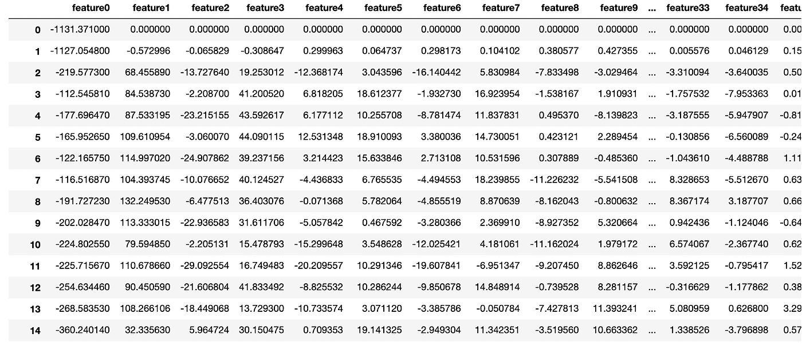

下一步是将带有模型检测到的笑声的新数据集与剧本和字幕数据进行匹配，以确定谁引起了笑声以及说了什么。

大部分代码是用 R 编写的，但是我用 Python 做了大部分的音频分析，使用 mfcc 函数，该函数将每秒钟转换成 40 个 mfcc 波形:

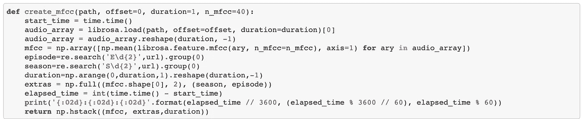

我不擅长 Python，所以向 Allen 大喊，他通过加速我的 Python 代码拯救了我。去看看他的数据科学博客: [http://allenkunle.me](http://allenkunle.me) 。

我通常不分享我工作中的很多技术细节。尽管如此，我还是特别为这一个感到骄傲(并且试图给你们提供过多的书呆子信息，但是我的编辑拒绝了)。

如果你想了解更多关于该项目的技术细节，你可以查看[这里](https://www.notion.so/rosebud/Methodology-for-Analyzing-Comedy-in-Friends-dfc1ae66a7134f99bcf6722bdccb16bd)。

数据集和代码样本可以在我的 GitHub [这里](https://github.com/RosebudAnwuri/TheArtandScienceofData/tree/master/Friends%20Analysis%20Laughter%20Prediction)找到。

让我们直入主题吧！

# 谁是《老友记》中最有趣的角色？

# 就笑声总数而言，钱德勒是剧中最搞笑的角色，其次是两位男主角乔伊和罗斯

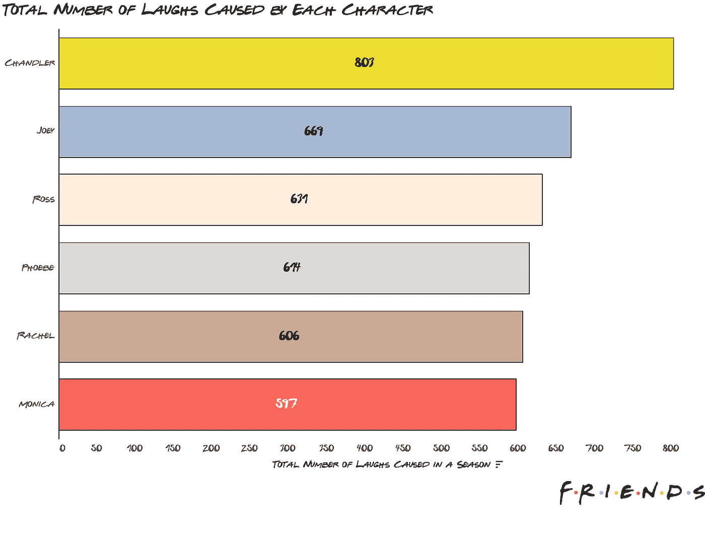

我们先有三个男主角，然后是女主角:菲比、瑞秋和莫妮卡，按这个顺序。

然而，这可能会产生误导。如果一个角色有更多的台词，他们更有可能引起更多的笑声，但这并不一定意味着他们比台词少的人更有趣，对吗？

# 如果我们看看他们的台词中有多少是搞笑的，每个人都保持了同样的排名，除了罗斯掉到了最后

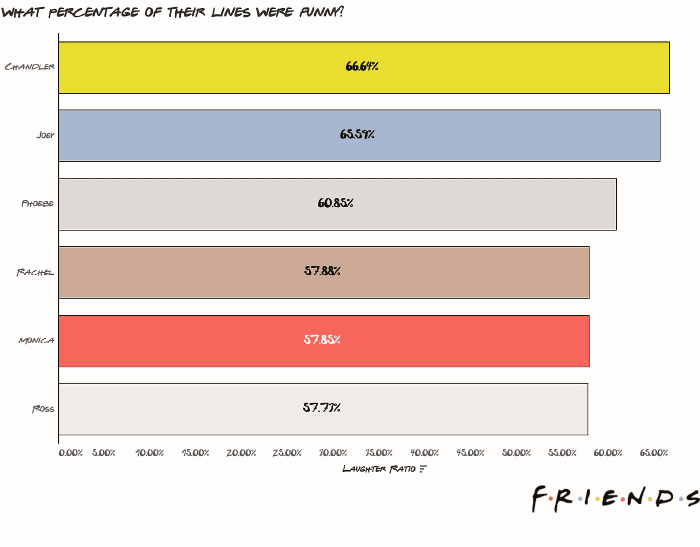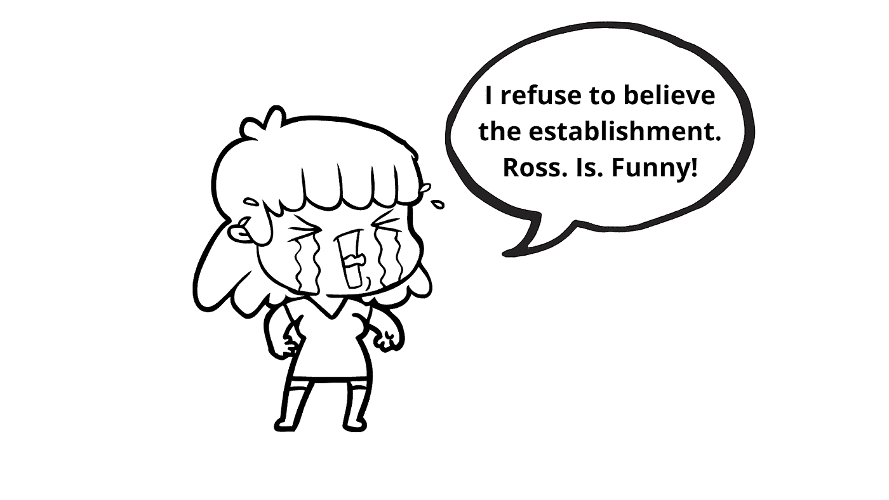

钱德勒保持着第一的位置，他 67%的台词都很搞笑。不幸的是，罗斯似乎有更多有趣的台词，只是因为他有更多的台词。更可耻的是，其他人都保留了他们的排名。

我很喜欢罗斯，所以这让我有点失望。

这是另一种看待它的方式:

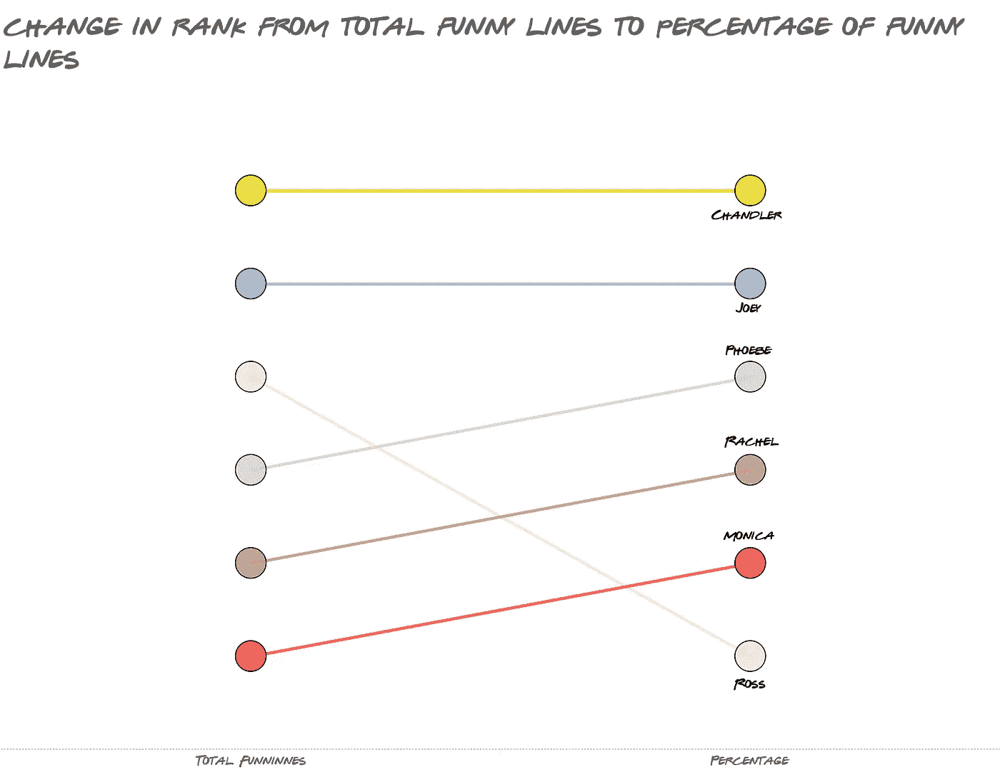

# 在主要演员之外，贾尼斯是最有趣的，其余的也是主要演员的爱好

珍妮丝是钱德勒分分合合的长期女友，是除了主要演员之外最有趣的，也是最有趣的。这是有道理的，因为她滑稽的配音让她说的每一句话都有趣十倍。

这里唯一一个不算是恋人的角色是根特，尽管他大部分有趣的时刻都是因为他迷恋上了瑞秋。

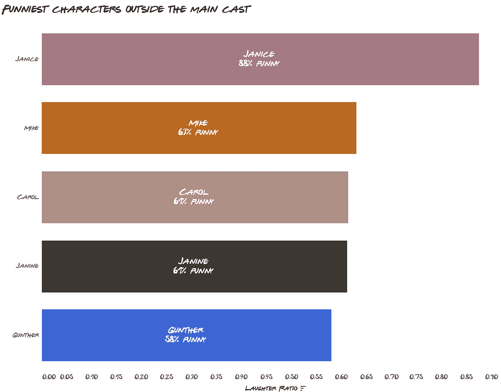

# 为什么罗斯如此“无趣”？

# 与其他人相比，罗斯的角色围绕着爱情问题。他说的前七个单词中有四个不是“爱”就是女朋友的名字

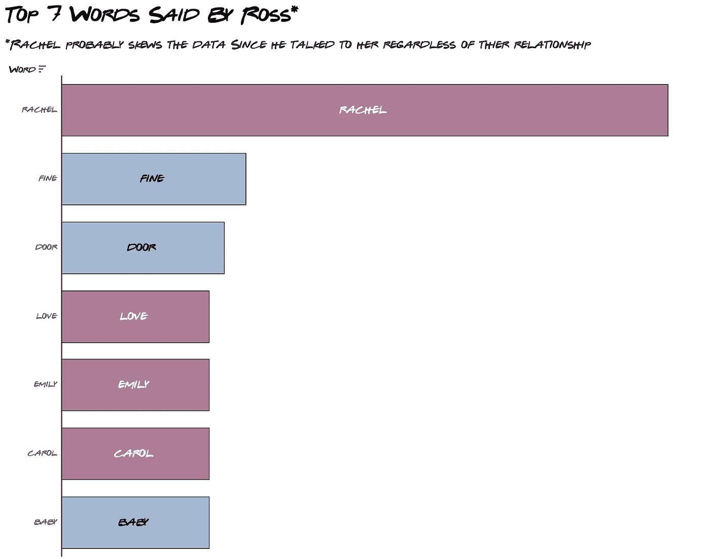

我在这里使用前 7 个，因为有些词的出现次数是固定的。

你可以看到，他的大部分讨论都围绕着他的爱情生活，这可能影响了他的幽默，因为他的爱情生活是最混乱和最痛苦的事情。

他的一些最大的爱情弧线是:

*   他的第一任妻子卡罗尔原来是同性恋
*   他与艾米丽的第二次婚姻结束了，因为他仍然爱着瑞秋
*   他和雷切尔之间持续不断、有时令人痛苦的分分合合的关系

如果你把罗斯的名言和其他角色相比，其他人谈论他们的爱情生活要少得多。

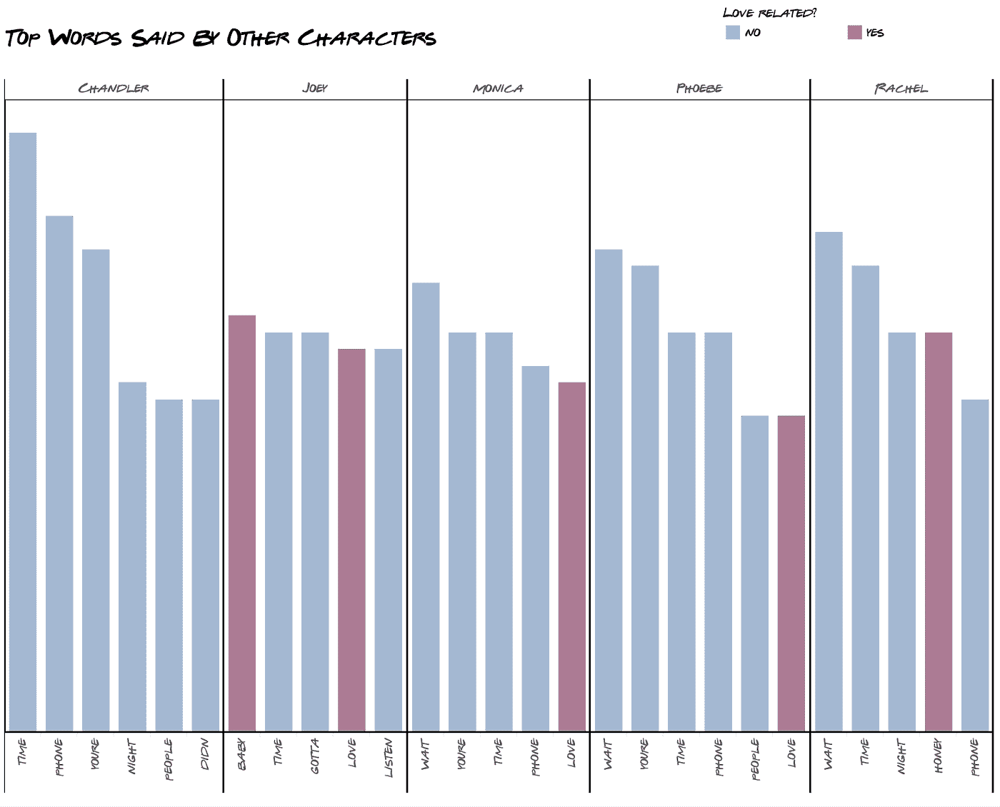

# 他们一对一的互动有多有趣？

# 最有趣的互动发生在钱德勒和乔伊之间，前 5 名中有 4 名是钱德勒

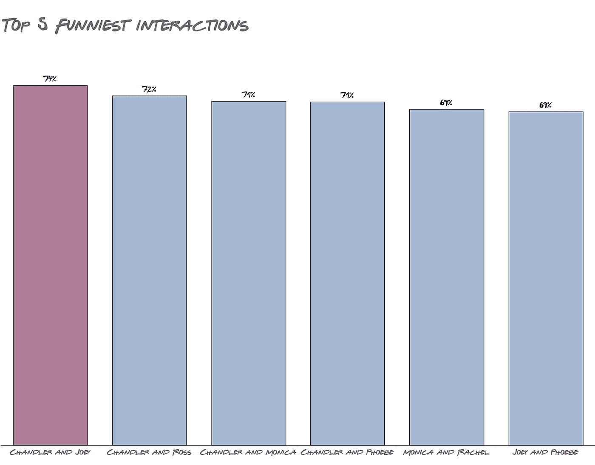

# 另一方面，瑞秋和乔伊的互动最不有趣。倒数五个互动中有三个涉及莫妮卡

这可能也解释了为什么他们短暂的关系看起来很尴尬。另一方面，钱德勒的妻子莫妮卡在一对一的互动中处于最底层。这让我怀疑节目主持人是否故意把它们放在一起。

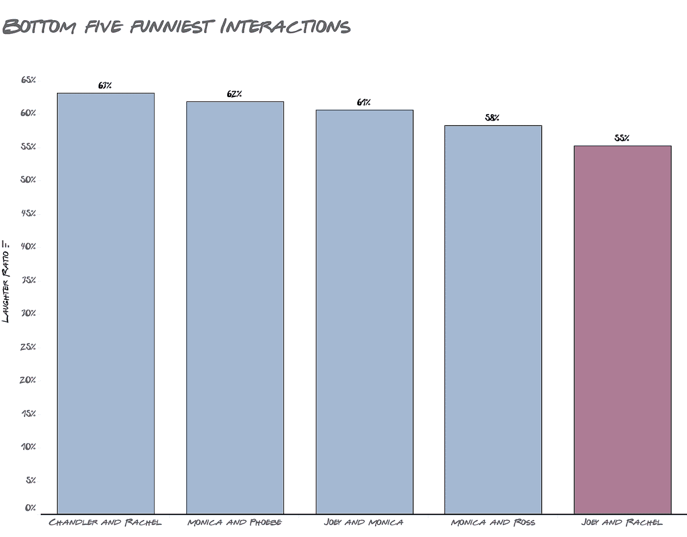

# 除了罗斯和瑞秋，第十季是所有角色中最无趣的一季，因为他们在第三季分手了

我们都同意，第十季更少关注喜剧，而是更多地关注戏剧来总结这部剧。所有角色都一致认为第十季最不好笑。

唯一的例外是罗斯和瑞秋，这可能是因为该剧关注的是他们最终获得了自第一季以来一直被嘲笑的幸福结局。

对于这两个角色来说，第三季是他们最不搞笑的一季，这也是他们在关系中有很多冲突的地方，这导致了他们的分手。

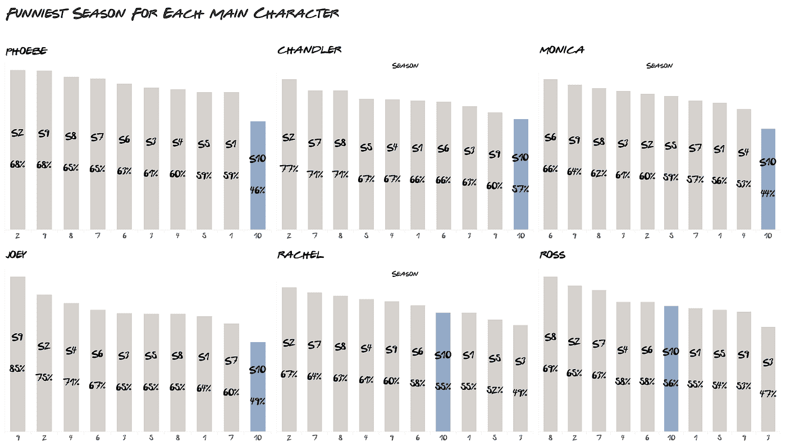

# 有一点要记住

这整个分析很好地提醒了我们:**数据驱动并不总是意味着客观**。这种分析的前提是，预先录制的笑声是滑稽的基础。那根本不是真的。

虽然大多数人可能会同意钱德勒是最有趣的，但不是每个人都会，这没关系，因为有时，数据的作用不是客观的，而是作为主观的代理，例如一个人有多有趣。请不要对排名有异议。

# 下一步是什么？

我知道，我知道。距离我上一篇帖子已经快三年了。总而言之，搬家对我影响很大。两年后我才刚刚恢复。

3 月到 4 月间有 70%的可能性会有新的帖子，另外我今年计划了大约 5-6 个帖子，但请不要让我坚持下去，以防生活发生变化。

我真的很喜欢像以前一样工作！谢谢你们留下来，我希望能很快见到你们！

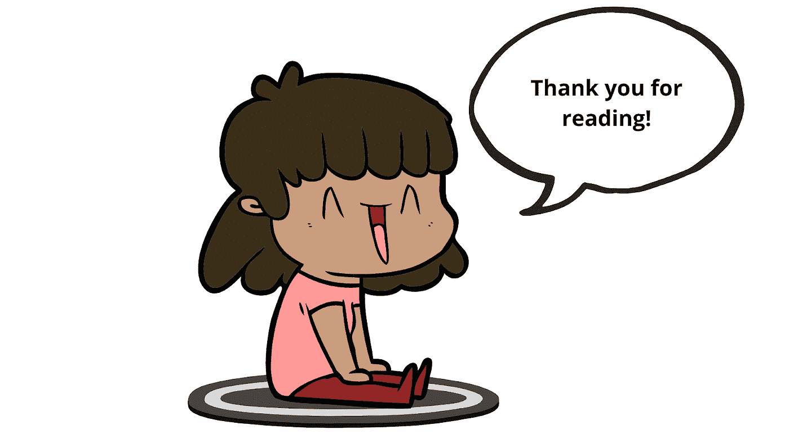

*原载于 2021 年 2 月 20 日*[*【http://theartandscienceofdata.wordpress.com】*](https://theartandscienceofdata.wordpress.com/2021/02/20/funniest-friends/)*。*