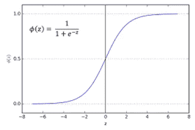

# 为什么要激活函数？

> 原文：<https://medium.com/analytics-vidhya/why-activation-functions-8328f3f21120?source=collection_archive---------19----------------------->


在本文中，我们将讨论以下主题:

*   为什么我们需要激活函数
*   不同种类的激活功能
*   不同激活功能的优缺点

为什么我们需要激活功能？

让我们以单个神经元为例。每个神经元执行两种功能:

*   计算所有输入要素的加权和
*   将它传递给一个激活函数。

```
z = w1*x1 + w2*x2 + w3*x3 - (Eq.1)(where x1,x2,x3 are input features and w1,w2,w3 are weights)
a = f(z) where f is the activation function.
```

所以激活函数基本上提供了 z 的非线性，这有助于学习复杂函数。如果我们移除所有的激活函数，我们的网络将只学习线性函数，这不会有任何帮助。为了更清楚地了解这一点，你可以参考我关于[神经网络](/analytics-vidhya/neural-networks-and-the-power-of-universal-approximation-theorem-9b8790508af2)的文章。

当我们讨论不同的激活函数时，你会对此有更好的理解。

# **不同种类的激活功能**

有各种各样的激活函数，我们可以根据我们要解决的问题的类型，为我们的模型选择其中任何一个

## Sigmoid 函数



*   sigmoid 函数由上述等式给出，有点像 S 形图。
*   对于任何输入 Z，它将转换 0 和 1 之间的值。由于 sigmoid 函数的这种性质，它们被用作二进制分类问题中输出层的激活函数。因为它给出了特定类别出现的概率。

**sigmoid 函数的问题**

*   **消失梯度问题**:假设我们的网络变得很深，我们计算梯度来更新我们网络的权重。在 sigmoid 中，我们可以获得的梯度的最大值约为 0.25，现在如果将太多的梯度相乘(使用链式法则)，最终梯度将变得非常小，并且由于梯度非常小，权重更新将变得可以忽略不计(因为 w = w-**α**δw)。因此，我们的初始层停止更新(想想吧！).
*   **sigmoid 不在零中心**:通过查看 Sigmoid 的图形，我们可以看到 Sigmoid 函数只能给出正值作为输出。因此，每当我们在 sigmoid 中传递 z (z = w*x + b)时，我们都会得到一组有限的正值，这限制了 sigmoid 函数输出的可能值范围。
*   指数函数的计算成本很高。

# 双曲正切


Tanh 激活函数

*   Tanh 函数最初用于 LeNet，它的性能比 sigmoid 函数好得多。
*   它以零为中心，因此双曲正切函数的输出值范围很广，即 1

## 双曲正切函数的问题

*   **饱和问题:**类似于对于 z 的大值的 sigmoid 函数，梯度变为零，因此一些神经元可能表现为死的，并且对预测输出没有贡献。看上面这张图，想一想为什么会这样。
*   指数函数的计算成本很高。

**热卢**


ReLu 激活功能

*   ReLU 代表整流线性单元，是业内使用最广泛的激活功能之一。
*   relu 解决了梯度消失的问题，因为 ReLu 函数的梯度最大值是 1。
*   它还解决了神经元饱和的问题，因为 relu 函数的斜率从不为零。

【ReLU 的问题

*   假设我们给我们的 relu 函数以下输入，z = w*x + b，并且在训练过程中“b”变成非常大的负值，现在这反过来将使“z”的值为负。在我们的 relu 函数中，我们可以看到，对于负值，它给出的输出为零，这又导致了我们网络中神经元死亡的问题。
*   大的学习率可能导致这个问题，因为大的 L.R .将导致 b 中更大的更新，因此更有可能变成负值。

**泄漏继电器**


泄漏 ReLU 激活功能

*   漏 ReLU 是 Relu 函数的一个微小修改。
*   它通过为 x<0 设置 0.01x 解决了我们面临的 ReLU(负值作为输入)问题。

这就是本文的全部内容。您还可以探索其他激活功能，其中一些是

*   Softmax 激活功能
*   格鲁
*   ELU