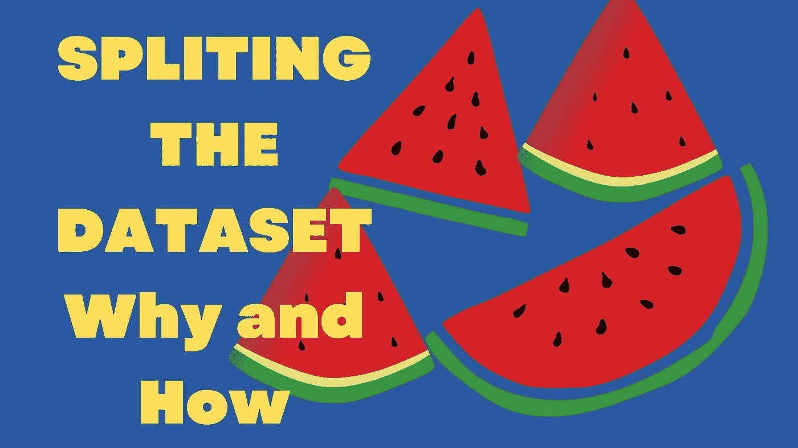
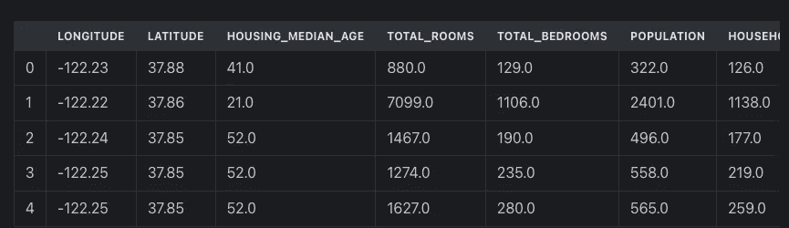
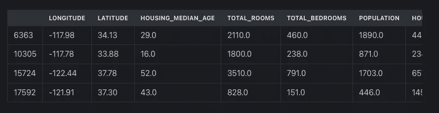
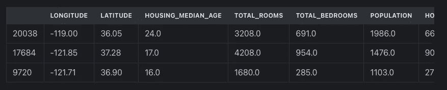
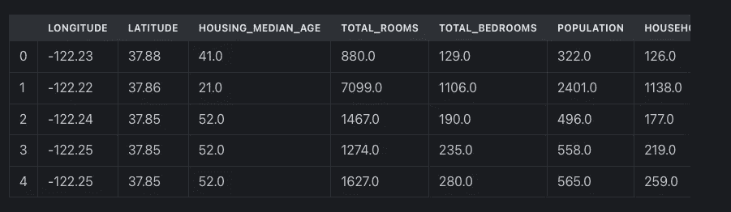

# 我们为什么以及如何分割数据集？

> 原文：<https://medium.com/analytics-vidhya/why-and-how-do-we-split-the-dataset-fcbcb86c7dce?source=collection_archive---------0----------------------->



数据集是机器学习项目的重要组成部分。没有数据，机器学习就只是机器，学习是从题目中剥离出来的。这是机器和深度学习的人无法忍受的，他们会抗议这些数据😅。

# 介绍

由于数据如此重要，当我们的数据集包含几百或更少的数据行时，我们必须保留一些数据用于测试目的。一旦软件准备好了，我们必须在把它投入市场之前对它进行测试，在市场上它将做出决定并影响人们的生活。因此，该模型预计不会出错，或者至少不会出错。

因此，测试成为开发和机器学习中的一个重要部分，因为我们正在处理数据，所以我们也必须有一些用于测试的数据。

测试数据的目的是这样的，一旦被放在一边，在训练完成之前，该数据永远不应该对机器学习模型可用，然后并且只有在那时，我们才应该将测试数据引入到机器学习模型，该机器学习模型是在一些数据上训练的，该测试数据是这些数据的一部分。

既然我们已经了解了`why`测试数据，那么让我们看看`How`我们是否将这些数据放在一边用于测试？

我们将使用来自 [Kaggle](https://kaggle.com) 的`california dataset`，我们将使用`pandas`加载数据集，然后制作`spliting`。我们可以通过两种方式进行拆分:

1.  通过选择索引范围进行手动操作
2.  使用`Sklearn`中的功能。

```
import pandas as pd dataset = pd.read_csv(housing.csv) dataset.head()
```



加州数据集

数据加载后，我们可以看到使用`head()`，数据集的前 5 行，以获得数据集的一瞥。
现在，我们在数据集变量中有了完整的数据集，我们准备好进行分割了。但是首先，让我们看看数据集的长度，这样我们可以在执行`split`后再次看到这个长度，并验证分割是否成功。

```
len(dataset)
```

20640

这个简单的函数`len()`给出了数据集`20640`中的行数

现在我们将看到如何使分裂`manually using the indexing`。

# 使用手动索引

在这个方法中，我们想要指定我们想要哪个索引的`training`以及我们想要哪个索引的`testing set`，反之亦然。

语法简单明了:`dataset_variable[strat:end]`

```
train = dataset[:16000] test = dataset[16000:]
```

在上面的例子中，我们简单地说了以下内容:

1.  从开始，即 0 索引到 16000 索引，获取数据行并将其放入训练变量中，即我们正在制作包含前 16000 行的训练集
2.  从 16000 到结尾，将行放入测试集中。

运行这行代码后，如果我们现在看到`train`和`test`的长度，我们将得到`16000`和`4640`。

这里的问题是，我们必须知道我们希望拆分到哪个索引，或者从哪个索引开始拆分，还有一个缺点是，我们不能在这里打乱数据行。如果我们必须洗牌，我们必须在流程中增加另一个步骤。
也就是说，在进行拆分之前，我们必须手动混洗数据集，然后进行基于索引的拆分。

现在，当我们使用 sklearn 时，这些步骤只需要一个参数，我们不需要担心索引和其他东西。

现在让我们看看如何使用 Sklarn 的`train_test_split`函数执行同样的操作。

# 来自 Sklearn 的 train_test_split

```
from sklearn.model_selection import train_test_split
```

所以，这个牛逼又上天的函数是从 sklearn 的`model_selection`模块导入的，简单如蛋糕。
导入后，我们需要做的就是传递数据集和我们想要的`test set`大小，这样就完成了。

需要记住的是，如果我们以`DataFrame`的形式给出数据集，我们会得到两个`dataframes`，一个用于`training`，一个用于`testing`。

```
training, testing = train_test_split(dataset, test_size=0.3, shuffle=True, random_state=32)
```

我们为此函数提供了以下参数:

1.  `Dataset` -我们拥有的整个数据集。
2.  `test_size` -我们想要测试集的数据百分比
3.  `shuffle=True`，我们是否希望我们的数据集在分割前被打乱。如果`True`，索引将被打乱，然后进行拆分。
4.  `random_state=any_number` -如果设置，那么无论我们进行多少次拆分，每次都会得到相同的拆分。

通过使用这一点，我们确保了测试集总是安全的，不受模型的影响。

让我们看看这个函数返回的训练和测试变量是什么。training 包含数据集的一部分，有 14448 行，索引也是混洗的。

```
training
```



训练集

14448 行× 10 列

以类似的方式，testing 包含 6192 行和混排索引。如果我们计算这个数据集的`30%`，就会得到 6192。因此，我们的数据的`30%`在测试集中。

```
testing
```



6192 行× 10 列

# 当我们分离输入和输出变量时

现在如果我们把输入和输出变量分成 x 作为输入，y 作为输出。
然后在这个数据集中，我们将在 y 中有 median_house_value，因为它是输出变量，其余的列将在`x`中作为模型的输入。

这个`x`将作为模型的输入，在此基础上模型将与`y`一起被训练。但是在将来，当这个模型进行预测时，它会根据`x`来预测`y`。让我们将数据集分成`x`和`y`。

```
x = dataset.drop(median_house_value, axis=1)
```

这里我们说的是，沿着`axis=1`放下`median_house_value`，即整个列或列的方向。

注:`axis=0`表示行，`axis=1`表示列。

因此，我们将有`x`，其中没有`median_house_value`，所有其他列都将存在。

```
x
```



20640 行× 9 列

事实的确如此。

现在让我们通过编写下面的代码来创建我们的`y`。

```
y = dataset[median_house_value]
```

我们在这里说，获取名为`median_house_value`的列，并将其放入`y`中。听起来很简单。

```
y
```

0 452600.0 1 358500.0 2 352100.0 3 341300.0 4 342200.0 `Name: median_house_value, Length: 20640, dtype: float64`

现在，如果我们传递`train_test_split`中的`x`和`y`而不是整个数据集，我们将获得 4 个变量作为回报。训练集的两个变量是训练的输入和训练的输出，同样，测试集的两个变量是测试的输入和测试的输出。

下面的代码显示了函数 x 和 y 的输出

```
train_x, test_x, train_y, test_y = train_test_split(x, y, test_size=0.3, shuffle=True, random_state=32)
```

让我们看看`train_x`的`len`和`train_y`以及`test_x`和`test_y`。

```
print(fThe length of Train_x: {len(train_x)} and length of train_y: {len(train_y)})
```

`The length of Train_x: 14448 and length of train_y: 14448`

```
print(fThe length of Test_x: {len(test_x)} and length of test_y: {len(test_y)})
```

`The length of Test_x: 6192 and length of test_y: 6192`

实际上和上面的一样，当我们给出整个数据集时。

# 结论

在这篇文章中，我们试图理解拆分数据的必要性，以及我们如何以一种有效的方式执行这种拆分。

我们学习手册以及现代的 sklearn 的方法，大多数机器学习从业者都这样做。我希望你理解了这个过程，现在也能理解这个过程的原因和方式。

就这些了，谢谢。
请留下评论，也分享一下。

*原载于 2022 年 2 月 28 日*[*https://mlforlazy . in*](https://mlforlazy.in/why-and-how-do-we-split-the-dataset/)*。*