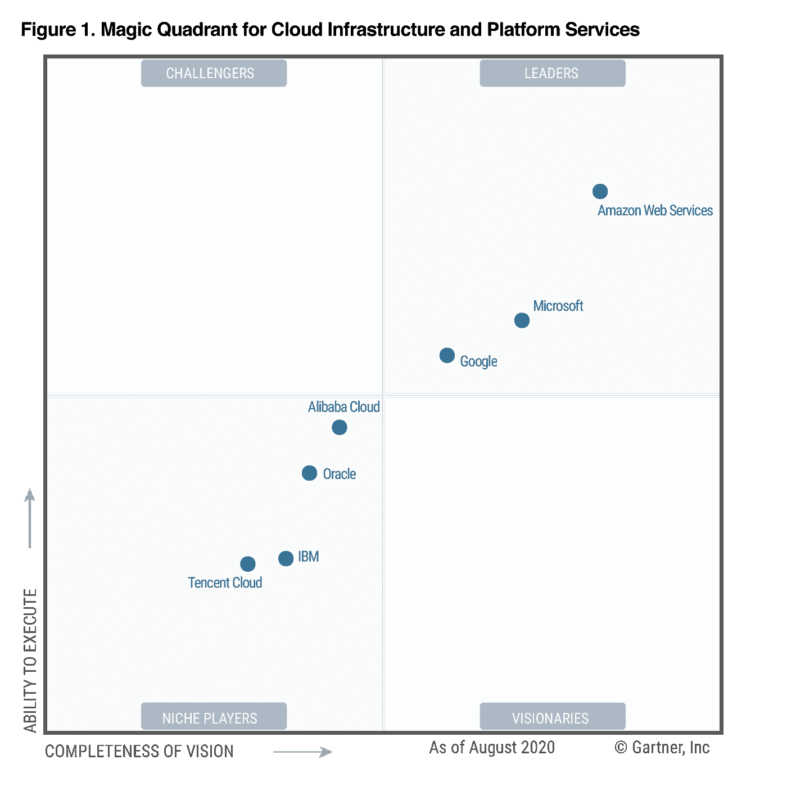

# 为什么是 AWS？？….优点和缺点。

> 原文：<https://medium.com/analytics-vidhya/why-aws-advantages-and-disadvantages-f0e666b869b3?source=collection_archive---------0----------------------->

AWS 有五大支柱，其中五大支柱来自 AWS 架构良好的框架。

> **卓越运营**
> 
> **安全**
> 
> **可靠性**
> 
> **性能效率&**
> 
> **成本优化**

Christian Wiediger 在 [Unsplash](https://unsplash.com?utm_source=medium&utm_medium=referral) 上拍摄的照片

*   Amazon Web Service 是一个云计算平台，提供灵活、可靠、可扩展、易于使用且经济高效的云计算解决方案。
*   该平台结合了基础设施即服务(IaaS)、平台即服务(PaaS)和打包软件即服务(SaaS)产品。
*   AWS 提供各种不同用途的基于全球云的产品。这些产品包括存储、数据库、分析、网络、移动、开发工具、企业应用、内容交付服务、采用现收现付定价模式的远程计算。AWS 拥有 200 多项功能齐全的服务，涵盖广泛的技术、行业和使用案例。
*   AWS 是首批引入[现收现付](https://searchstorage.techtarget.com/definition/pay-as-you-go-cloud-computing-PAYG-cloud-computing)云计算模式的公司之一，该模式能够[扩展](https://searchdatacenter.techtarget.com/definition/scalability)为用户提供所需的计算、存储或吞吐量。
*   亚马逊网络服务比一家公司托管自己的网站或存储要安全得多。AWS 目前在全球拥有数十个数据中心，这些数据中心受到持续监控和严格维护。数据中心的多样化确保了袭击一个地区的灾难不会在全球范围内造成永久性的数据丢失。
*   AWS 的成本会根据客户的使用情况进行调整，初创企业和小型企业可以看到使用亚马逊满足其计算需求的明显好处。事实上，AWS 非常适合从底层建立业务，因为它为公司提供了启动云所需的所有工具。对于现有的公司，亚马逊提供低成本的迁移服务，以便您现有的基础设施可以无缝地迁移到 AWS。
*   AWS 拥有最广泛的全球云基础设施。AWS 在全球 25 个地理区域内拥有 81 个可用区，并宣布计划在澳大利亚、印度、印度尼西亚、以色列、西班牙、瑞士和阿拉伯联合酋长国(UAE)再建立 21 个可用区和 7 个 AWS 区域，为 245 个国家和地区提供服务。
*   在 [2020 年 Gartner 云基础设施和平台服务魔力象限](https://pages.awscloud.com/GLOBAL-multi-DL-gartner-mq-cips-2020-learn.html)中，AWS 排名第一，并被评为最佳领导者。

[https://pages . AWS cloud . com/GLOBAL-multi-DL-Gartner-MQ-CIPS-2020-learn . html](https://pages.awscloud.com/GLOBAL-multi-DL-gartner-mq-cips-2020-learn.html)

*   借助 AWS，我们可以利用最新技术更快地进行实验和创新。他们不断加快创新步伐，以发明全新的技术来转变您的业务。

# 自动气象站的历史

*   2002-自动气象站服务启动
*   2006 年-推出云产品
*   2012 年-举办首次客户活动
*   2015 年-显示收入达到 46 亿美元
*   2016 年-超过 100 亿美元的收入目标
*   2016-发布雪球和雪地摩托
*   2019-提供近 100 种云服务

## 为什么云基础设施很重要

【https://tinyurl.com/5mvf87jv 

AWS 全球云基础设施是最安全、最广泛、最可靠的云平台，提供来自全球数据中心的 200 多种全功能服务。无论您需要通过单击鼠标在全球范围内部署应用程序工作负载，还是希望构建和部署更接近终端用户的特定应用程序，并且延迟只有一位数毫秒，AWS 都能随时随地为您提供所需的云基础架构。

凭借全球数百万活跃客户和数万合作伙伴，AWS 拥有最大、最具活力的生态系统。几乎所有行业和规模的客户，包括初创企业、企业和公共部门组织，都在 AWS 上运行所有可以想象的用例。

# 自动气象站服务的应用

Amazon Web 服务广泛用于各种计算目的，例如:

[https://rb.gy/fj45bf](https://rb.gy/fj45bf)

*   网站托管
*   应用托管/SaaS 托管
*   媒体共享(图像/视频)
*   移动和社交应用
*   内容交付和媒体分发
*   存储、备份和灾难恢复
*   开发和测试环境
*   学术计算
*   搜索引擎
*   网络社交

# 使用 AWS 的公司

[https://tinyurl.com/3pa7tudm](https://tinyurl.com/3pa7tudm)

*   照片墙
*   拼趣
*   网飞
*   Dropbox
*   [**Paytm**](https://aws.amazon.com/solutions/case-studies/paytm/) **(亚马逊在印度的竞争对手)。**
*   美国国家航空航天局
*   爱彼迎（美国短租平台）
*   索尼
*   塔塔汽车
*   飞利浦
*   三星电子
*   脸谱网
*   迈恩特拉
*   Hotstar 和更多。

[https://data-flair.training/blogs/aws-advantages/](https://data-flair.training/blogs/aws-advantages/)

# AWS 的优势

以下是使用 AWS 服务的优点:

*   AWS 允许组织使用已经熟悉的编程模型、操作系统、数据库和架构。
*   这是一项经济高效的服务，允许您只为所使用的内容付费，无需任何前期或长期承诺。
*   您不需要在运行和维护数据中心上花钱。
*   提供快速部署
*   您可以轻松添加或删除容量。
*   您可以快速访问无限容量的云。
*   与任何私有/专用服务器相比，总拥有成本非常低。
*   提供集中计费和管理
*   提供混合功能
*   只需点击几下鼠标，即可在全球多个地区部署您的应用程序
*   创新:在价格方面，AWS 可能有像微软和谷歌这样的竞争对手，但在奉献和创新方面，市场上没有其他云服务提供商可以有效地与亚马逊网络服务竞争。

# AWS 的缺点

*   如果您需要更直接或更深入的帮助，您必须在以下三种付费支持包中进行选择-

> 开发者:29 美元/月。
> 
> 商务:100 美元以上——或—(勾选选项)。
> 
> 企业:15，000 美元以上，或(勾选选项)。

*   当您迁移到云时，Amazon Web Services 可能会遇到一些常见的云计算问题。例如，停机时间、有限控制和备份保护。
*   AWS 对资源设置了默认限制，这些限制因地区而异。这些资源包括映像、卷和快照。您可以在每个区域启动有限数量的实例。
*   您的应用程序发生了硬件级别的变化，这可能无法为您的应用程序提供最佳的性能和利用率。
*   安全限制:因为安全是主要特性之一，所以 AWS 限制了一些不能改变的特性

> EC-2 classic-每个实例最多 500 个权限，每个安全组最多可以有 100 个权限。
> 
> EC2-VPC-每个 VPC 最多 100 个安全组。

# AWS 的最佳实践

*   你需要为失败而设计，但没有什么会失败。
*   在使用 AWS 服务之前，对所有组件进行解耦是非常重要的。
*   您需要让动态数据更接近计算，让静态数据更接近用户。
*   了解安全性和性能的权衡很重要。
*   按小时付费方式支付计算能力费用。
*   养成一次性付款的习惯，这样你就可以预定每个实例，并在每小时的费用上获得很大的折扣。

# 获得

随着时间的推移，AWS 收购了多个组织，更加关注它希望进一步整合的技术。这些收购并没有增加 AWS，而是增强了它的核心服务。比如 AWS 已经收购了 TSO Logic，Sqrrl，cloud bearing。

谈到 AWS，你不应该期待一个设置简单的完美系统，在这个系统中，所有的事情和所有的人都在等着你。AWS 是一个复杂的基础设施，有自己的规则和法律，您应该尊重和了解。一旦你意识到这些，你的云之旅将会比你想象的更加舒适。

参考资料:

*   【https://d1.awsstatic.com/whitepapers/aws-overview.pdf 
*   [https://data-flair.training/blogs/aws-advantages/](https://data-flair.training/blogs/aws-advantages/)
*   [https://pages . AWS cloud . com/GLOBAL-multi-DL-Gartner-MQ-CIPS-2020-learn . html](https://pages.awscloud.com/GLOBAL-multi-DL-gartner-mq-cips-2020-learn.html)
*   图片来源:请点击图片下方的链接。

 [## 安装 OPENCV 的 5 个简单步骤

### 在这个有趣的教程中，我们将学习在 Ubuntu 系统中设置 OpenCV-Python。以下步骤针对 Ubuntu 16.04 进行了测试…

medium.com](/analytics-vidhya/installation-of-opencv-in-simple-and-easy-way-15556edca7a4)  [## 从 JSON 文件中提取有用数据用于机器学习

### 如何从一个 JSON 文件中提取数据用于 Python 中的机器学习模型

medium.com](/analytics-vidhya/extract-the-useful-data-from-jason-file-for-data-sceince-34ed5ae0b350) 

**感谢您的阅读，如果您喜欢请点击拍手按钮。**

**关注我们了解更多内容。**

***更多内容请看***[***AnalyticsVidhya***](https://medium.com/analytics-vidhya)***。***

合十礼…..🙏。