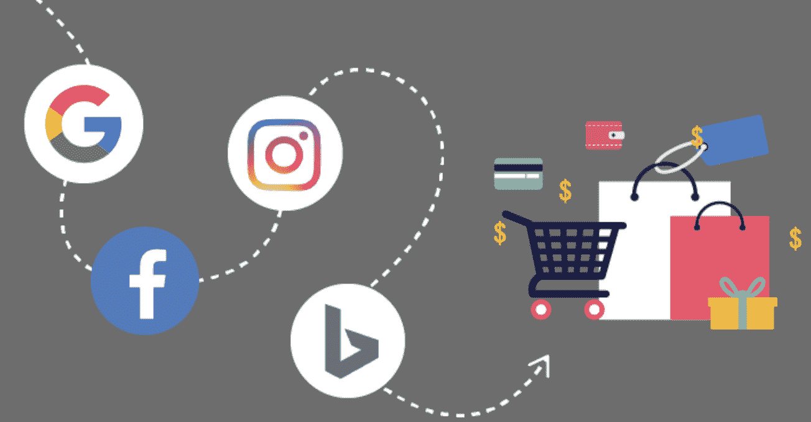
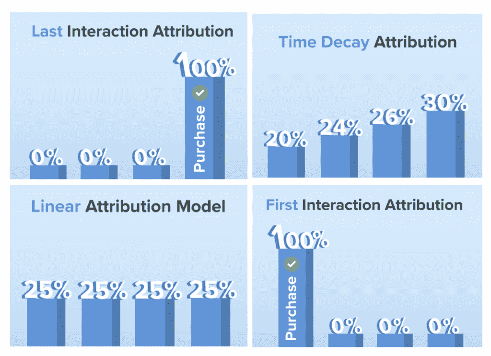
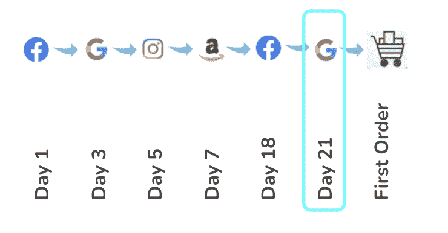
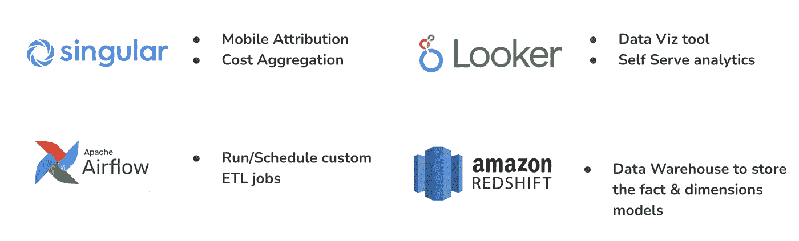
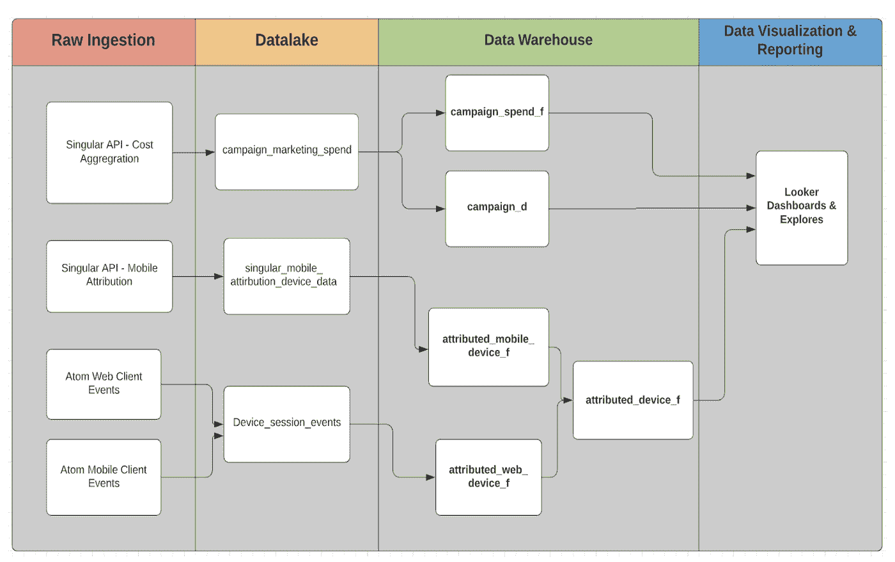
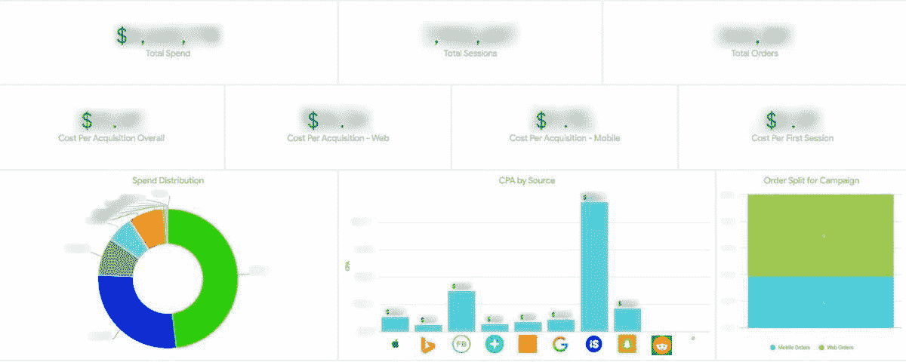
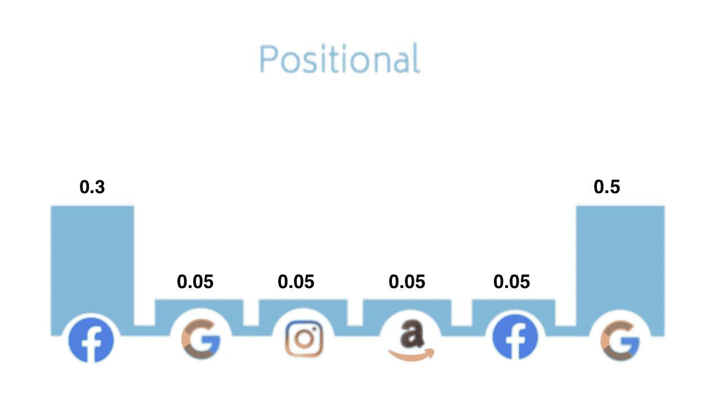

# 为什么要为你的数字营销团队建立一个营销归因模型？

> 原文：<https://medium.com/analytics-vidhya/why-build-a-marketing-attribution-model-for-your-digital-marketing-team-a9a9c6d72178?source=collection_archive---------19----------------------->

# 典型的客户旅程

*   在整个**购买**生命周期中，每位顾客都会受到**多个渠道**的影响
*   这些不同广告平台的投资回报可能是最重要的跟踪指标，即**【每笔收购成本】**
*   通常，成长型营销人员登录广告平台，获得一个针对注册会计师的**预先计算的**数字，或者有时不得不计算总支出和总转换，然后就到此为止

# 成长型营销团队面临以下问题

*   我的 **CPA 对于各个广告平台的**是什么？
*   为什么我的营销 CPAs **膨胀了？**
*   我在哪些方面**花费更多**？
*   这些数据是否有一个**单一的真实来源**？

# 如何解决 ROI 膨胀/不准确的问题

## 归因建模

据谷歌称

> 归因模型是确定如何将销售和转化的信用分配给转化路径中的接触点的规则或规则集。

这里有一些常用的归因模型技术。

在 [Atom Tickets](https://www.atomtickets.com/) 我们选择了最后一个交互模型，其**回顾**窗口为 **28 天**

*   客户在第一份订单前有**多个接触点**
*   该模型**将**获取归因于提示用户购买的**最后一个渠道**
*   用户旅程中的任何其他渠道都不会因为收购而获得任何信用
*   如果客户在过去 28 天内**没有受到**任何渠道的影响，则归因将记入**有机/直接**

# 用于构建归因模型的工具

# 数据建模框架

# 最终交付成果:

*   Looker 仪表板
*   旁观者探索
*   供其他分析师查询的数据集

这是一个示例仪表板，增长营销团队可以使用它来跟踪他们的 CPA

# 知识和见解

*   **实际感兴趣区域**与单个广告平台呈现的感兴趣区域**非常不同**
*   **脸书**投资回报率大大**膨胀**表明**不是最后接触**驱动程序，而是**传递**，在用户的旅程中传播用户到最终的收购
*   由于脸书广告是我们最重要的营销渠道之一，我们决定调整这个归因模型的下一个版本，将更多的收购归因于 Facebook

# 我们如何迭代使这个模型变得更好？

*   从最后一次交互移动到基于方法的**位置**
*   这个模型给第一个和最后一个交互**更大的固定权重**
*   在其他接触点上平均分配**剩余积分**

*   上次交互: **50%权重**
*   第一次交互: **30%权重**
*   其余的**平均分配**
*   这使我们能够将顺序的**部分归属于不是最后或第一次交互的通道**
*   将这些数据与客户的**预测 LTV** 相结合，以获得对用户获取漏斗的更多**洞察**

# 结论:

在现实世界中，没有一个完美的归因模型可以每次都适用。但是，投入时间建立自己的归因模型，而不是依赖于个人营销平台，可以让你的数字营销团队有效地花费营销费用。它提供了更好的投资回报率**清晰度**，并允许更好的**多平台**活动。