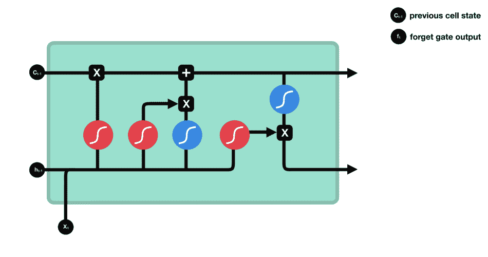
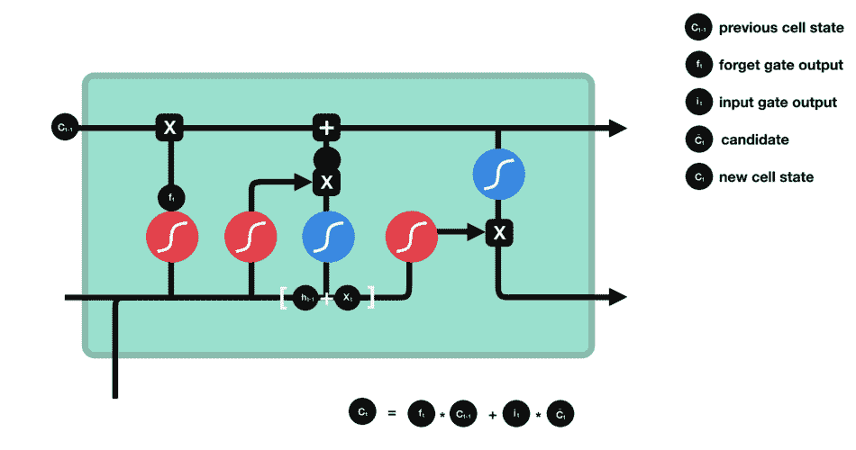

# 为什么我们不能都像 LSTMs 一样？

> 原文：<https://medium.com/analytics-vidhya/why-cant-we-all-be-more-like-lstms-53fe99d2cf60?source=collection_archive---------5----------------------->

是的，我知道，伊斯特姆死了。变形金刚万岁！！诸如此类。所有这些可能都是真的，但我仍然认为 LSTM 的逻辑很迷人，也是我一直试图应用到日常生活中的东西。对于那些阅读这篇文章却不知道 LSTM 是什么的人来说，你很幸运，因为我们将要深入探究 LSTM 的含义。

LSTM 或长短期记忆是一种用于深度学习的人工递归神经网络架构。不像标准的前馈神经网络。LSTM 有反馈关系。它不仅可以处理单个数据点，还可以处理整个数据点序列。

但首先，要理解长短期记忆(LSTM)，你必须理解*循环神经网络* ( *RNN* )，一种特殊的 RNN 氏症。

RNNs 的概念是利用序列信息。通常，当使用神经网络时，我们假设所有的输入(和输出)都是相互独立的。但是对于许多任务来说，这是一个可怕的想法。例如，如果你想预测一个句子中的下一个单词，你最好知道它前面有哪些单词。RNN 在本质上是递归的，因为它对每个数据输入执行相同的功能，而当前信息的输出取决于过去的计算。因此，rnn 最适合于顺序数据。它可以处理任意的输入/输出长度。RNN 使用它的内存来处理随机的输入序列。这使得 RNNs 最适合预测单词序列中的下一个单词。就像人类的大脑一样，特别是在对话中，人们更看重信息的新近性来预测句子。

**RNNs 的缺点**

rnn 的一个吸引力在于，它们可能能够将先前的信息与当前的任务联系起来，例如使用先前的视频帧来通知对当前帧的理解。如果 rnn 能做到这一点，它们将非常有用。但是他们能吗？看情况。

有时，我们只需要查看最近的信息来执行当前的任务。例如，假设一个语言模型试图根据前面的单词预测下一个单词。如果我们试图预测“云在*天空*中”的最后一个词，我们不需要任何进一步的上下文——很明显下一个词将是天空。在这种情况下，相关信息和需要它的地方之间的差距很小，RNNs 可以学习使用过去的信息。

但是也有我们需要更多上下文的情况。考虑尝试预测文本中的最后一个单词“我在法国长大……我说一口流利的法语”最近的信息表明，下一个单词可能是一种语言的名称，但如果我们想缩小语言的范围，我们需要更早的法国的背景。相关信息和需要信息的地方之间的差距很有可能变得非常大。不幸的是，随着这种差距的扩大，rnn 变得无法学习连接信息。

理论上，rnn 有能力处理这样的“长期依赖”人类可以仔细挑选参数来解决这种形式的玩具问题。可悲的是，在实践中，rnn 似乎无法学习它们。这个问题由 [Hochreiter (1991)【德国】](http://people.idsia.ch/~juergen/SeppHochreiter1991ThesisAdvisorSchmidhuber.pdf)和 [Bengio 等人(1994)](http://www-dsi.ing.unifi.it/~paolo/ps/tnn-94-gradient.pdf) 进行了深入的探讨，他们发现了一些可能很难的基本原因。谢天谢地，LSTMs 没有这个问题。

# LSTMS 的核心概念

长短期记忆网络——通常简称为“lstm”——是一种特殊的 RNN，能够学习长期依赖性。它们在各种各样的问题上表现得非常好，现在被广泛使用。LSTM 具有与递归神经网络相似的控制流。当信息向前传播时，它处理传递信息的数据。不同之处在于 LSTM 细胞内的操作。LSTMs 的明确设计是为了避免长期依赖问题。长时间记住信息实际上是他们的默认行为，而不是他们努力学习的东西！

LSTM 的核心概念是细胞状态及其各种门。细胞状态就像一条传输高速公路，沿着序列链向下传输相关信息。你可以把它想象成网络的“记忆”。理论上，细胞状态可以在整个序列处理过程中携带相关信息。因此，即使是来自较早时间步骤的信息也可以传递到较晚的时间步骤，从而减少短期记忆的影响。当细胞状态继续它的旅程时，信息通过门被添加到细胞状态或从细胞状态移除。这些门是不同的神经网络，决定细胞状态允许哪些信息。盖茨夫妇可以在训练中了解哪些信息是应该保留或忘记的。

让我们更深入地了解一下各个门在做什么，好吗？所以我们有三个不同的门来调节 LSTM 细胞中的信息流动。遗忘门、输入门和输出门。

# 忘记大门

这个门决定哪些信息是必不可少的，应该存储哪些信息，哪些信息应该忘记。这个门选择哪些信息应该被丢弃或保留。它从神经元细胞中去除不重要的信息。这导致了性能的优化。这个门有两个输入，一个是前一个单元产生的输出，另一个是当前单元的输入。来自先前隐藏状态的信息和来自当前输入的信息通过 sigmoid 函数传递。值介于 0 和 1 之间。越接近 0 表示忘记，越接近 1 表示保留。

忘记星门操作

# 输入门

这个门用来给神经元细胞增加信息。它负责使用类似 sigmoid 的激活函数将哪些值添加到单元格中。它创建了一个必须添加的信息数组。它决定通过在 0 和 1 之间转换值来更新哪些值。0 表示不重要，1 表示重要。您还可以将隐藏状态和当前输入传递给 tanh 函数，以挤压-1 和 1 之间的值，从而帮助调节网络。然后将双曲正切输出乘以 sigmoid 输出。sigmoid 输出将决定哪些信息对 tanh 输出很重要。

输入门操作

# 细胞状态

现在我们应该有足够的信息来计算细胞状态。首先，单元格状态逐点乘以遗忘向量。如果乘以接近 0 的值，这可能会降低单元格状态中的值。然后，我们从输入门获取输出，进行逐点加法，将细胞状态更新为神经网络认为相关的新值。这给了我们新的细胞状态。

计算单元状态

# 输出门

该门负责从当前单元中选择重要信息，并将其显示为输出。它使用 tanh 函数创建一个值向量，范围从-1 到 1。输出门决定下一个隐藏状态应该是什么。请记住，隐藏状态包含以前输入的信息。隐藏状态也用于预测。首先，我们将先前的隐藏状态和当前输入传递给一个 sigmoid 函数。然后，我们将新修改的单元格状态传递给 tanh 函数。最后，我们将双曲正切输出与 sigmoid 输出相乘，以决定隐藏状态应该携带什么信息。输出是隐藏状态。然后，新的单元状态和新的隐藏状态被带入下一个时间步骤。

回顾一下,“遗忘之门”决定了哪些内容与之前的步骤相关。接下来，输入门决定从当前步骤添加什么相关信息。最后，输出门决定下一个隐藏状态应该是什么。

# 这一切意味着什么？

现在，你可能想知道这一切与你有什么关系。如果您想一想 LSTMs 的独特之处，它可以使用它长期记忆的信息中有价值的部分，而不会被目前不需要的过去数据的重量所拖累。本质上，LSTMs 从过去的数据中提取背景(洞察力和经验教训),用于当前的任务。如果你想一想，如果我们训练我们的大脑像那样工作，难道我们不会变得更好吗？我的意思是，我们总是让我们过去的行为玷污或模糊了我们对自己的反思，而不是从中吸取教训并继续前进。

假设你批判性地思考遗忘之门在 LSTMs 中的作用。它决定了哪些信息是重要的，应该存储哪些信息，如果我们渴望获得高情商，从而获得职业成功和生活满足感，应该摒弃哪些信息。我们必须学会如何消除来自我们过去错误的消极想法，并专注于确保我们现在不会重复这样的错误。我们是自己最糟糕的批评者，对自己过去的决定如此武断。这就好像我们必须对自己更严格，对我们人类的错误和情感的容忍度要低于对他人的容忍度。

沉思是自怜的小偷。有很多次，我发现自己沉浸在过去犯下的错误中，听着自己消极的想法喋喋不休。不知不觉中，我可能会在某些日子感到情绪低落，结果是我让这种消极的喋喋不休开始在我的潜意识中酝酿，让我处于抑郁的心理状态。所以，我们往往不会“忘记”过去犯下的错误，而只是沉思并沉溺于自怜之中。

# 如何变得更像 LSTMs

首先，我们必须学会忘记并真正原谅自己过去的行为，并且只利用从过去中获得的教训或见解来改善我们的现在，并确保我们不会重复同样的错误。我们都会犯错。我们都有缺点。我们都能在过去找到让我们恨自己的东西。这非常简单。

困难的是，尽管我们做错了，我们还是要爱自己。但是，正如[圣雄甘地曾经说过的](http://www.gandhifoundation.ca/day-29---february-27th---forgiveness.html)，宽恕需要力量——有时并不比我们对自己的宽恕更强大。

*“你可以永远坐在那里，哀叹自己有多糟糕，一直感到内疚，直到你死去，那种内疚的一丁点儿都不会改变过去的任何事情。原谅自己，然后继续前进！”—韦恩·戴尔*。

[尼克拉斯·戈克](https://medium.com/u/e4d971c7eba7?source=post_page-----7babd6f2d3d3--------------------------------)写道，[真正成功的部分原因](/@ngoeke/the-only-way-to-find-success-is-to-relentlessly-forgive-yourself-db7f962bf3bc)。

*   宽恕让我们从那些会压垮我们的痛苦中得到一些释放。
*   宽恕让我们治愈自己造成的创伤。
*   宽恕让我们有空间再次成长，成为更高层次的自我表达。

痛苦不会永远消失，记忆也不会，但我们都可以选择放手。除了向前看，还有一些极其重要的东西。**在自我原谅中，你** [**迎来了人生中最重要的关系**](https://www.psychologytoday.com/ca/blog/emotional-nourishment/201704/forgiving-yourself)

***你和自己的关系。***

****

**所以，无论你踏上什么样的旅程，都要像 LSTM 一样记住，要想真正实现目标，你必须放下你的内疚，因为我不认为生活是寻找通往成功的最直的道路。还是最简单的。甚至是最光滑的。也许，这是关于找到一个，仅仅是*一个*，允许你到达那里。**

**请注意，原谅自己并不是让自己摆脱困境。这不是不从错误中吸取教训的借口。这也不能保证，但是没有宽恕，你*不能*学到任何东西。因为后悔挡路了。你必须说:“好了，就这么定了；我将如何继续前进，我将改变什么？”**

**参考**

**[https://colah.github.io/posts/2015-08-Understanding-LSTMs/](https://colah.github.io/posts/2015-08-Understanding-LSTMs/)**

** [## 为什么我们对自己这么苛刻？

### 自我同情不是自我放纵或自私。这是必要的。

medium.com](/mind-cafe/why-are-we-so-hard-on-ourselves-619e417478b7)  [## 为什么你应该原谅自己——即使这会伤害到你

### 有时候最重要的宽恕行为是你对自己的宽恕。

medium.com](/mind-cafe/please-forgive-yourself-even-when-it-hurts-7babd6f2d3d3)  [## 使用张量流的 LSTM 示例

### 在深度学习中，递归神经网络(RNN)是一个神经网络家族，擅长从…

towardsdatascience.com](https://towardsdatascience.com/lstm-by-example-using-tensorflow-feb0c1968537)  [## 简而言之，长短期记忆(LSTM)网络

### 为了理解长短期记忆(LSTM)，需要理解循环神经网络(RNN)，这是一种神经网络

ahmetozlu93.medium.com](https://ahmetozlu93.medium.com/long-short-term-memory-lstm-networks-in-a-nutshell-363cd470ccac)  [## 递归神经网络和 LSTM 解释

### 在这篇文章中，我们将探索 RNN 和 LSTM

purnasaigudikandula.medium.com](https://purnasaigudikandula.medium.com/recurrent-neural-networks-and-lstm-explained-7f51c7f6bbb9)**