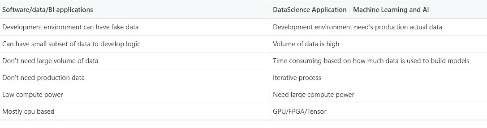
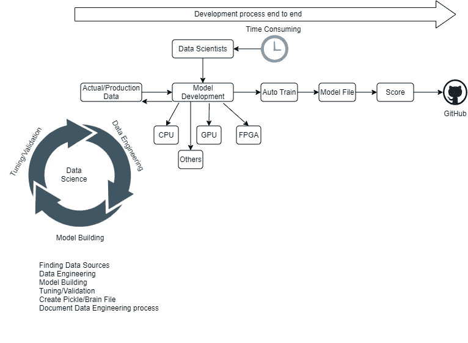
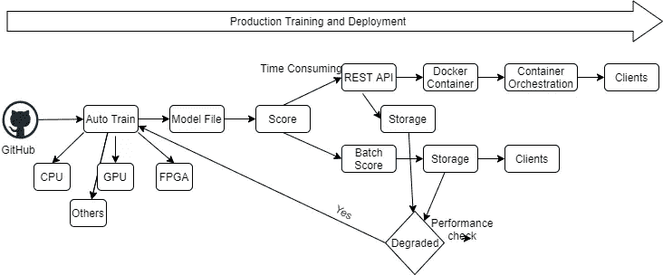

# 为什么数据科学开发不同于软件或数据/BI 开发

> 原文：<https://medium.com/analytics-vidhya/why-data-science-development-is-different-from-software-or-data-bi-development-526724c76f15?source=collection_archive---------31----------------------->

# 差异

*   从各种来源获取生产或实际数据
*   数据工程用例的数据集
*   为建模建立一个工作数据集
*   通过各种算法运行数据集
*   根据使用情况，需要大型计算
*   比较模型的性能
*   迭代整个过程以找到最佳的模型结果
*   找到算法后，创建训练脚本
*   创建模型文件
*   用新数据集验证模型，以测试性能
*   如果性能是可接受的，继续前进，否则就回到模型开发
*   一旦可接受的性能是好的，创建实时或批量推理的分数脚本
*   根据上次运行创建评估或模型比较脚本
*   用于检查模型性能以触发新模型构建的评分脚本
*   将所有脚本保存在 Github 或某个代码库中
*   创建关于用例、模型及其用法的文档

# 质量保证和生产

*   从代码库中获取代码
*   创建 Azure DevOps 或其他管道工具来构建部署流程
*   使用生产数据运行培训流程
*   根据使用情况，需要大型计算
*   运行模型测试
*   如果模型性能优于先前运行，则创建模型大脑文件
*   使用分数文件创建 REST Api
*   创建 Docker 容器来运行微服务
*   创建容器编排引擎(如果是新的)，否则使用现有的
*   部署新的 Rest API 并停用旧的(如果存在的话)
*   当使用评分模型时，如果性能下降，则创建模型训练运行和部署

*最初发表于*[*【https://github.com】*](https://github.com/balakreshnan/Samples2021/blob/main/DataScience/mldevops.md)*。*