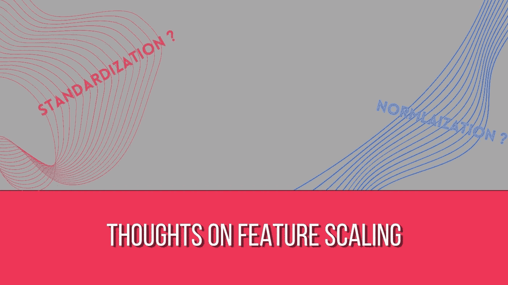
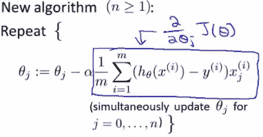
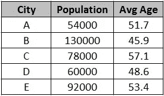
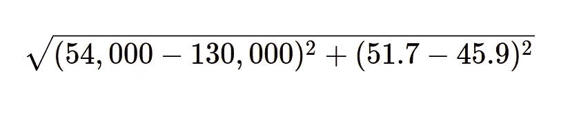
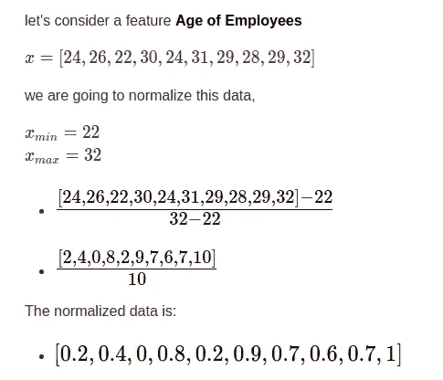
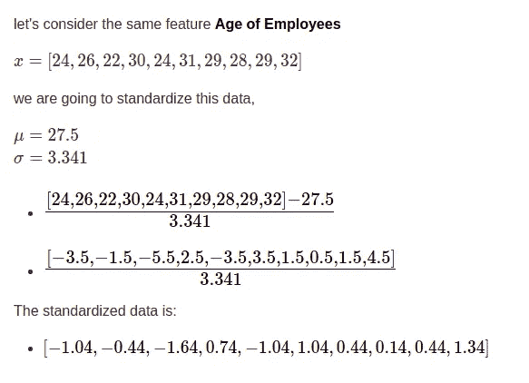

# 为什么要进行特征缩放？标准化和规范化概述|机器学习

> 原文：<https://medium.com/analytics-vidhya/why-do-feature-scaling-overview-of-standardization-and-normalization-machine-learning-3e99d16eeca8?source=collection_archive---------7----------------------->

## 为什么我们需要特性缩放？何时使用特征缩放，使用什么特征缩放方法？

要素缩放是一种预处理技术，用于将数据的所有列或要素缩放到相同的比例。这样做有各种原因。
对于涉及梯度下降的算法，以及像[K-均值聚类](/analytics-vidhya/k-means-clustering-explained-419ee66d095e)和[K-最近邻](/analytics-vidhya/machine-learing-k-nearest-neighbors-theory-explained-3dfe2fdcdc5d)这样的算法，都是这样做的。

# 为什么梯度下降需要特征缩放？

让我们考虑一个[线性回归](/analytics-vidhya/linear-regression-with-gradient-descent-derivation-c10685ddf0f4)的例子来理解为什么梯度下降算法需要特征缩放。

图 1.1:线性回归中的梯度下降

图 1.1 表示线性回归中梯度下降算法的工作原理。
这里，对于与要更新的特定特征相关联的权重，原始权重减去乘以该特征本身的所有行的总和的一些值。
更清楚地说， **theta(j)** 的更新需要我们减去 **J(th)** 列中所有值的总和乘以一些其他项(*原始值-本例中的预测值*)。

图 1.2:缩放与未缩放。

在大多数课程和博客中，你可能会遇到类似于图 1.2 的对比图，当不缩放时，它是如何瘦的，因此过度到另一边，并远离全局最小值。但是，我发现用这种瘦瘦的对比圆轮廓的绘图技术很难理解它。所以，下面是我对为什么会出现这个问题的解释。

> 注意:所谓过冲，我的意思是，图 1.2 中的瘦轮廓图中的 w1 值预计会到达一个点，这个点给出了损失函数的全局最小值。但是相反，在每次迭代中，它都是从左到右，从右到左的之字形运动，而不是从中间的点开始。

B 由于在具有相同 alpha 值的同时从第 j 列中减去用于更新**θ(j)**的值的总和，一些**θ(s)**的值将会溢出到另一侧，而不是面向并直接到达全局最小值。这是因为有些列的值范围是 0-10，而其他列的值范围可能是 10，000-20，000。
因此，很明显，具有较高范围值的列或特征将具有较高的总和。因此，当减去列的总和时，与该列相关联的权重溢出到另一侧。
因此，梯度下降需要更多的时间来收敛到全局最小值，或者在某些情况下，可能仍然围绕全局最小值旋转。

图 1.3:样本数据

让我们以图 1.3 所示的数据集为例。人口列的值在 50，000-130，000 的范围内，而平均年龄列的值在 40-55 的范围内。让我们假设与**人口**相关联的权重是 *w1* ，而与**平均年龄**相关联的权重是 *w2。* 当梯度下降如图 1.1 所示时，人口列的总和将远远高于平均年龄列的总和。因为我们对这两个权重更新使用相同的 alpha，所以人口的梯度也将具有高值，并且在更新时，这将把 *w1* 急剧地抛向另一侧，而不是给出损失函数的全局最小值的最优 *w1* 值。

但是，在执行要素缩放并将数据集中的所有要素缩放到相同的比例时，我们可以防止这种**过冲。**当所有列的比例相同时，在梯度更新期间减去列项的总和，具有良好 alpha 值的不会导致与任何特定特征相关的任何权重项的过冲，我们会得到图 1.2 右侧所示的情况。稍微思考一下，就不难理解这个问题是因为特性缩放而解决的。

总之，通过在所有迭代中防止特定权重的这种之字形超调，特征缩放有助于梯度下降算法的更快收敛。

# 为什么像 K 近邻这样的算法需要特征缩放？

[**K 近邻**](/analytics-vidhya/machine-learing-k-nearest-neighbors-theory-explained-3dfe2fdcdc5d) 是一种用于分类和回归的算法。
[**K-Means 聚类**](/analytics-vidhya/k-means-clustering-explained-419ee66d095e) 是一种聚类算法。但是，不管它们的目的如何，这两种算法都使用**欧几里德距离**来实现它们的目标。
在 KNN 和 K-means 中，我们希望对数据集中的所有变量或特征给予同等的重视。至少，就重要性而言，我们不想根据它们所取值的范围来区分特性。但是，当要素的比例不同时，就会发生这种情况。

这个最好用一个例子来说明。因此，让我们考虑来自图 1.3 的同样的样本数据。让我们来看两列**人口**和**平均年龄。**当我们想要找出城市 A 和城市 B 之间的欧几里德距离时，人口列支配着结果，以至于平均年龄列的存在对于结果没有任何意义。

图 2.1

正如我们从图 2.1 中看到的，特征平均年龄在欧几里德距离方面变得非常不重要，并且对结果没有太大贡献。可以看出，发生这种情况只是因为特征没有被缩放到相同的比例。因此，毫无疑问，应用特征尺度也可以解决这个问题。

# 规范化与标准化

**正常化:**正常化是将特性的值重新缩放到 0 和 1 之间的过程。
这是通过从值数组中减去最小值，然后除以特征的最大值和最小值之间的差来完成的。
**X _ changed =(X _ I-X _ min)/(X _ max-X _ min)**
例如

在预测建模的情况下，会记录 **x_min** 和 **x_max** 。当一个新数据作为输入给出时，该数据的属性(员工年龄)将与已经存储的 **x_min** 和 **x_max** 经历相同的过程。

**标准化:**是将特征重新定标为 0 均值和 1 标准差的过程。
这是通过减去特征数据的平均值，然后除以特征的标准偏差来完成的。
**X _ changed =(X _ I-mean(X))/STD(X)** 例如，

与归一化类似，在标准化中，我们存储特征的均值和标准差，当新的实例或数据点用于预测时，它会以相同的均值和标准差经历相同的标准化过程。

尽管这两种定标器有所不同，但什么时候使用对一些人来说一直是个问号，而且我们很多人也在交替使用。即使没有完美的限制或约束来告诉你何时使用什么定标器，也有一些事情需要考虑。

当您知道数据遵循高斯分布时，标准化更为可取。当您没有数据分布的详细信息，并且不确定它是否形成正态分布时，最好使用归一化。专家数据科学家[克里斯·纳伊克](https://medium.com/u/d67809141db2?source=post_page-----3e99d16eeca8--------------------------------)表示，根据他的经验，标准化已被证明对线性回归、K-means 等机器学习算法更有用，而标准化则有助于将卷积神经网络和人工神经网络中的值带入特定范围。*(他还说这完全是基于他的经验，而不是理论证明)*

# 结论

总之，特征缩放对于使用梯度下降的算法非常重要，如线性回归、逻辑回归、神经网络..等等。以及使用欧几里德距离的算法，如 K-最近邻和 K-均值聚类。然而，像决策树、回归树、随机森林和 boosting 这样的基于树的算法不需要特征缩放。但是对于需要特征缩放的算法，它大大提高了性能，并且是完全推荐使用的预处理步骤。