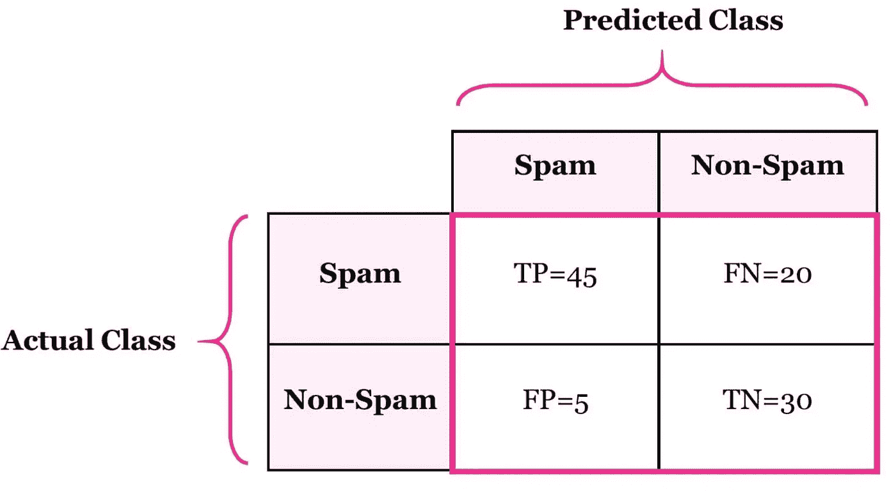
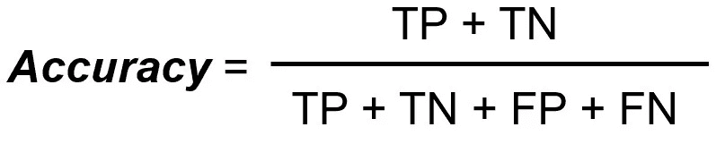

# 混淆矩阵的准确性和错误率？

> 原文：<https://medium.com/analytics-vidhya/why-do-we-need-a-confusion-matrix-73bf8a2acf09?source=collection_archive---------2----------------------->

你好啊！欢迎回来。今天我们将了解什么是混淆矩阵，为什么我们需要它？

如果你以前处理过任何分类问题，那么你的脑海中可能会有一个问题，即如何检查我的模型是否符合标准。

但是，你如何决定你的模型是一个好模型，或者它只是没有任何意义的分类。所以，这里**混乱矩阵**来拯救。

让我们举一个二元分类问题的例子。二进制分类问题是我们试图只对两个元素/对象进行分类的问题。

让我们借助一个例子来理解这一点。

示例案例:我们试图预测某个单词是否是垃圾单词。这里的 4 种情况是:

1.  实际值是垃圾，预测值是垃圾。
2.  实际值是垃圾邮件，预测值是非垃圾邮件。
3.  实际值是非垃圾邮件，预测值是非垃圾邮件。
4.  实际值是非垃圾邮件，预测值是垃圾邮件。

因此，为了将这些信息写入我们计算机的易读格式，我们将其转换为 2*2 矩阵(因为这是一个二进制分类问题)。

这是混淆矩阵，左边是实际值，上边是预测值，这些值也可以互换。

只要看一眼这个矩阵，你就能理解我们正在试图理解我们的预测有多少是正确的，有多少是错误的。

在单元格 **(1，1)或(实际垃圾邮件，预测垃圾邮件)**—TP 的值为 45。首先，我们说的 TP 是什么意思。TP 代表真阳性。

**真正的积极**——你预测某事是积极的，它确实是积极的。

> **此处，正指垃圾邮件，负指非垃圾邮件。**

在单元格 **(1，2)** 或**(实际垃圾邮件，预测非垃圾邮件)**—FN 的值为 20。现在的 FN 是什么？FN 代表假阴性。

**假阴性** —你预测某事是阴性的，你的预测是假的。

在单元格 **(2，1)** 或**(实际非垃圾邮件，预测垃圾邮件)**—FP 的值为 5。现在 FP 是什么？FN 代表假阳性。

**假阳性** —你预测了某个阳性的东西，而你的预测是假的。

在单元格 **(2，2)** 或**(实际非垃圾邮件，预测非垃圾邮件)**—TN 的值为 30。现在 TN 是什么？TN 代表真阴性。

**真否定** —你预测了一些否定的东西，你的预测是真的。

> 假阳性是第一类错误，假阴性是第二类错误。为了理解什么是类型 1 错误和类型 2 错误，我们需要进入数学领域，我们将在另一篇统计学文章中讨论。

这都是关于混淆矩阵的。现在我们将明白，我们为什么需要它。

有几个指标可以用混淆矩阵来计算。即

1.  出错率
2.  准确(性)
3.  精确
4.  回忆(敏感度)
5.  特征
6.  f 分数等。

让我们关注前两个指标。

> 错误率——我们的预测有百分之多少是错误的。
> 
> 准确性——我们的预测有多少是正确的。

这里，

TP = 45

TN = 30

FP = 5

FN = 20

**精度=(45+30)/(45+30+5+20)= 75/100 = 0.75**

**错误率= 1-准确率= 1-0.75 = 0.25**

我认为其他指标值得写一篇新文章。所以，这篇文章到此为止。我希望你喜欢阅读这篇文章:)