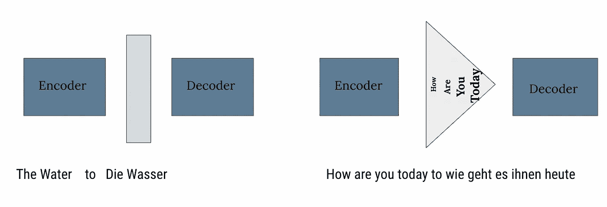

# “你所需要的只是关注，”第一部分但是为什么？

> 原文：<https://medium.com/analytics-vidhya/why-do-we-need-attention-42bb99fe938d?source=collection_archive---------1----------------------->

尽管这个标题看起来令人困惑，但是如果我们想要理解这个标题的意思，我们需要做一些挖掘工作。系好安全带，这是时光倒流。

当谷歌在 2014 年推出 Seq2Seq 模型时，就像为 NLP 找到了圣杯。这种基于深度学习的简单编码器-解码器模型，在最初引入时，主要用于机器翻译。简而言之，序列到序列学习是关于在机器翻译上下文中将来自一个领域(例如英语句子)的序列转换成另一个领域(例如翻译成法语的相同句子)的序列的训练模型。渐渐地，它成为所有以文本生成为主要目标的 NLP 任务中最受欢迎的架构设置。

编码器/解码器模型的典型描述及相关瓶颈

递归神经网络(RNN)具有输入之间依赖的特性，无疑成为 seq2seq 模型采用的 goto 技术。但是通常的训练障碍仍然产生了固有的问题[消失梯度](https://www.superdatascience.com/blogs/recurrent-neural-networks-rnn-the-vanishing-gradient-problem)。一如既往的 LSTM 和 GRU，RNN 最成功的扩展原来是这里的弥赛亚。LSTMs 具有保留句子中最相关信息的能力，证明了它在生成输出文本序列时提供了上下文信息考虑。因此，seq2seq 凭借架构和算法的正确结合而大受欢迎。或者是？

Seq2seq 模型一次处理一步，它收集输入并通过编码器、隐藏状态和解码器向前移动。但是它收集的输入是固定长度的。因此，每当输入超过这个固定长度的内存，隐藏的状态就会在它们与数据一起到达解码器的途中遇到瓶颈。在这个问题上，模型开始给予序列中后面的单词更多的相关性，这导致输出文本片段的上下文生成。因此，对于普通 seq2seq 来说，较长的序列变得难以处理。因此，为了解决这个困难，引入了“每个单词一个向量”而不是一个向量句子的概念。这个想法有助于克服固定长度输入的缺点。但是隐藏状态仍然会因为处理所有这些向量的额外责任而被抑制，从而导致内存耗尽。

现在我们有两个主要的挑战要克服，记忆问题和较长序列的上下文信息掌握。语境对预测提出了新的要求，模型应该考虑句子的对齐。现在，我们有了所有这些代表序列中每个单词的向量，所以我们必须以某种方式找到上下文，避免处理整个向量集。这正是注意力的作用。在注意力的帮助下，我们能够研究在新产出预测中起作用的特定单词。最后，选择的单词有助于理解上下文，记忆问题只需要处理这些单词向量就可以解决。

现在我们知道了为什么我们需要注意力，是时候解释一下注意力是如何工作的了。请继续关注第二部分。