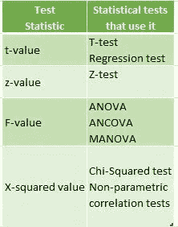
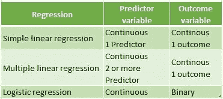
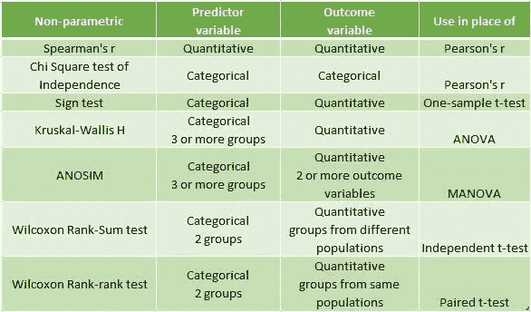
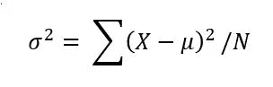
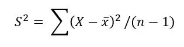

# 为什么方差很重要？🤔

> 原文：<https://medium.com/analytics-vidhya/why-does-variance-matter-8485aa97bbe5?source=collection_archive---------4----------------------->

差异很重要，有两个主要原因:

1.  用于参数统计检验，因为它们对方差很敏感。
2.  样本的方差，用于评估样本所来自的群体是否彼此不同。

等等，你在用我们不认识的词！！！😒

好的。我将从头开始。🙂

我们都知道“假设检验”。

一个**假设**是一个受过教育的**对你周围世界的猜测**。

**统计学中的假设检验**是一种让你检验调查或实验结果的方法，看看你是否有有意义的结果。

你基本上是通过计算你的结果偶然发生的几率来测试你的结果是否有效。如果你的结果可能是偶然发生的，那么这个实验就不会是可重复的，也没有什么用处。

所以，我们有一个**零假设**预测你感兴趣的变量之间没有关系，而**替代假设**通常是你预测变量之间关系的初始假设。

我们使用假设中的**统计测试**来确定预测值是否与结果变量有统计上的**显著关系**，并估计两组或多组之间的**差异**。

统计测试的工作原理是计算一个**测试统计量**——一个描述测试中变量之间的关系与没有关系的零假设有多大不同的数字。

对于样本大小和许多预测变量的任意组合，统计检验将产生检验统计量的预测分布。这显示了如果您的数据遵循统计测试的零假设，最有可能出现的值的范围。

您可以对以统计上有效的方式收集的数据执行统计测试，无论是通过实验还是通过使用概率抽样方法进行的观察。

为了确定使用哪种统计检验，我们需要知道我们的数据是否满足假设和我们正在处理的变量类型。

## **假设**:

1.  观察值的独立性，即没有自相关
2.  **方差的同质性:**被比较的每组内的方差在所有组中是相似的。
3.  **数据的正态性**:数据服从正态分布。

这些假设适用于参数统计检验。如果数据不符合上述假设，我们可以应用非参数统计检验。

## 变量类型:

1.  **数量变量:**代表事物的数量。定量变量包括连续变量和离散变量。
2.  **分类变量**代表事物的分组。范畴变量包括顺序变量、名词变量和二元变量。

统计信息太多，从方差重要性原因我们想知道**参数**和**非参数检验**🙄

哦，没关系，因为以上信息是基本理解测试所必需的。😎

## **参数测试:**

参数检验是一种统计检验，它对感兴趣的未知参数的分布做出某些假设，因此检验统计在这些假设下是有效的。

1.  **回归测试**:回归测试用于测试因果关系。他们寻找一个或多个连续变量对另一个变量的影响。

2.**比较测试**:比较测试寻找组均值之间的差异。它们可以用来测试分类变量对平均值的影响。

3.**相关性测试**:相关性测试检查两个变量是否相关，但不假设因果关系。

## 非参数测试:

非参数统计是统计学的一个分支，它不仅仅基于概率分布的参数化家族。

现在，我们只讨论方差。😉

**方差**是可变性的度量。它的计算方法是从平均值中取偏差平方的平均值。

方差告诉你数据集中的分散程度。数据越分散，方差相对于平均值就越大。

标准差来源于方差，它告诉你，平均起来，每个值离平均值有多远。它是方差的平方根。

## 人口差异:

当您从一组数据中收集到数据时。我们会得到人口方差。

其中，σ =总体方差，X =每个值，μ =总体均值，N =总体中值的数量。

## 样本方差:

从总体样本中收集数据时，样本方差用于估计总体方差。

其中 S =样本方差，X =每个值，x ̅ =样本均值，n =样本中值的数量

因此，样本之间不均匀的差异会导致有偏差的测试结果。这就是为什么我们在比较样本时需要同质性或相似的方差。

## **总结**:

在本文中，我们理解了方差的重要性。此外，我们看到了标准差和方差之间的差异，接触总体和样本方差。下次我们将借助 Python 模块来更好地理解这些概念。

**请随意填写以提出改进**😊

## 参考资料:

[https://www.scribbr.com/statistics/variance](https://www.scribbr.com/statistics/variance)

[https://www . statistics show to . com/probability-and-statistics/hypothesis-testing/](https://www.statisticshowto.com/probability-and-statistics/hypothesis-testing/)