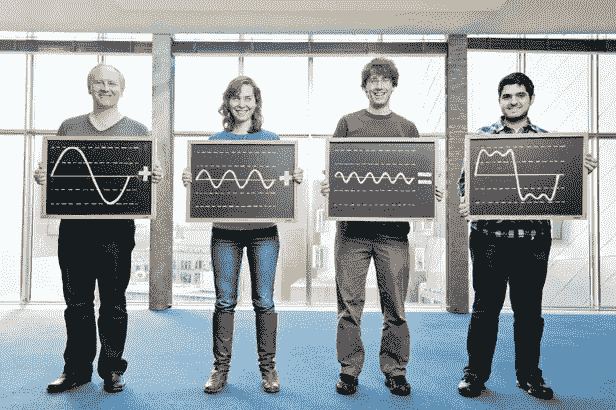
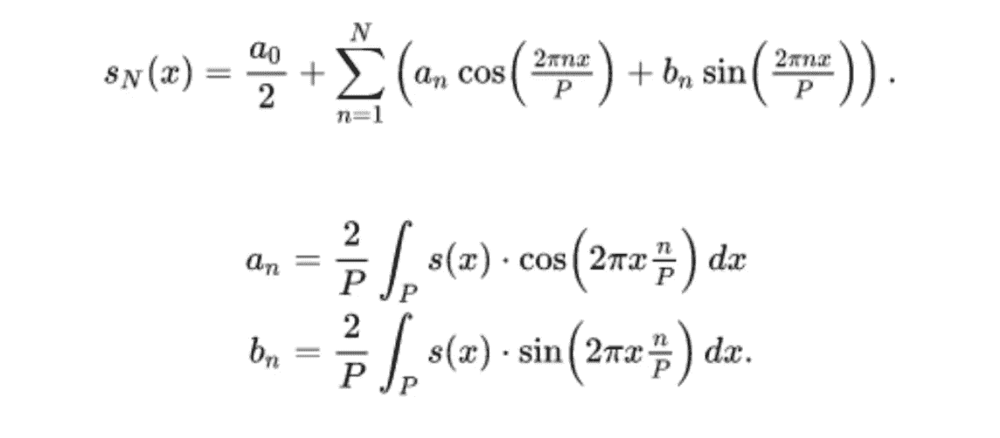

# 为什么傅立叶变换如此重要？

> 原文：<https://medium.com/analytics-vidhya/why-fourier-transform-is-so-important-cb7841733bb8?source=collection_archive---------3----------------------->

[Image—https://www . aska mathematics . com/WP-content/uploads/2012/09/indykkatabpricehassanieh . jpg](https://www.askamathematician.com/wp-content/uploads/2012/09/IndykKatabiPriceHassanieh.jpg)

傅立叶变换是一种非常强大的数学工具，它允许您在不同的领域中查看信号，在这个领域中，几个困难的问题变得非常容易分析。

在高层次上，傅立叶变换将允许我们将数据转换为不同的形式，这样我们就可以轻松地挑选最重要的成分，并消除所有的噪声。

## 历史

约瑟夫·傅立叶发现，给定一些周期函数 s(x)和一个区间 P，我们可以说

傅立叶级数表达式

这意味着给定区间上的任意函数可以近似为适当加权的正弦函数之和，并且频率越来越高。这里的主要思想是，我们能够在不同的坐标系中表达相同的函数 s(x)。

现在，傅立叶变换可以看作是上述傅立叶级数对非周期函数的扩展。

傅立叶变换表达式

**其中ω**是频率。以上函数是针对连续函数的，对于离散函数我们用离散傅里叶变换。

## 应用程序

傅立叶变换可以回答用其他方法很难或不可能回答的声音问题。它让难题变得简单。

一张唱片包含一组三个音符。有哪些注意事项？如果你把记录作为一组随时间变化的振幅，这不是一个简单的问题。如果你随着时间的推移把录音转换成一组频率，那真的很简单。

我想改变录音的音高，但不改变其持续时间。我该怎么做？仅仅通过操纵输入信号的幅度是可能的，但不容易做到。但是如果你知道组成信号的频率，这就很容易了。

这个录音是包含语音还是包含音乐？仅使用基于振幅的方法非常困难。但是，基于傅立叶变换及其家族，有一些好的解决方案几乎总是能猜出正确的答案。

几乎所有你想问的关于数码声音的问题都可以通过傅立叶变换的离散版本来转换录音。
实际上，每一种现代数字音频处理设备都非常依赖于与傅立叶变换非常相似的功能。

在图像处理中，傅立叶变换根据这些正弦曲线的频率告诉你图像中发生了什么。例如，消除高频会使图像模糊。消除低频给你优势。并且在保持低频的同时增强高频使图像变得清晰。

快速傅立叶变换广泛应用于图像处理和计算机视觉。例如，卷积是一种基本的图像处理操作，使用快速傅立叶变换可以更快地完成。用于图像去模糊的维纳滤波器是根据傅立叶变换定义的。但更重要的是，即使不直接使用傅立叶变换，它也为图像处理操作的推理提供了非常有用的框架。