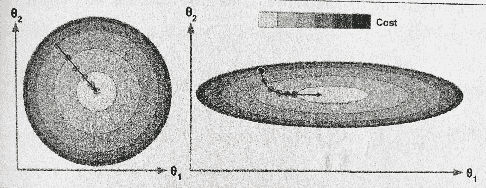

# 为什么梯度下降不收敛于未缩放的特征？

> 原文：<https://medium.com/analytics-vidhya/why-gradient-descent-doesnt-converge-with-unscaled-features-8b7ed0c8cab6?source=collection_archive---------9----------------------->

有没有对这个众所周知的公理感到好奇:“*总是缩放你的特征”？*好吧，请继续阅读，获得快速的图形和直观的解释！

# 动机

我相信我们所有人都见过机器学习中的这条流行的公理:*在训练之前，永远要缩放你的特征！*
虽然我们大多数人都知道它的实际重要性，但却没有多少人意识到潜在的数学原因。

在这篇超级短的博客中，我解释了在我们最喜欢的梯度下降算法中，当输入的特征具有非常不同的量级时会发生什么。

# 通过示例了解

假设我们试图使用两个数字预测变量/特征来预测一个人的预期寿命(以年为单位):x1 和 x2，其中 x1 是这个人的年龄，x2 是他/她的工资。Cleary，x1 << x2.

This is a regression problem where we aim to learn the weights theta1 and theta2 for x1 and x2 respectively by minimizing the cost function — Mean Squared Error (MSE).

If we plot theta1, theta2, and cost:

**左:**具有缩放特征的成本函数**右:**具有未缩放特征的成本函数(在较小幅度特征的方向上拉长)

*左图:* **带特征缩放**
代价函数为正圆(在 2D)或半球(在 3D)。梯度下降能够在更短的时间内容易地达到最小值(中心)。

*右图:* **无特征缩放**
代价函数变成一个椭圆，向较小幅度特征方向**拉伸/延伸。**

**️Extended 方向➡坡度越小➡到达最小值所需的步数越多**

由于 x1(年龄)在数量级上小于 x2(薪水)，所以θ1 需要更大的变化来影响成本函数。为了使θ1 的值发生甚至很小的变化，梯度下降需要在水平方向上行进更长的距离，即在这种情况下 x1 的方向。

> 理想情况下，我们希望:
> -在小梯度方向上快速移动，而
> -在大梯度方向上缓慢移动

⭐️ *因此，梯度下降需要特征缩放以易于收敛。*

注意**不是所有的 ML 算法都需要特征缩放。**例如，在训练决策树或随机森林模型之前，不强制缩放特征。这是因为他们的成本函数(基尼指数，熵等。)不是基于距离的(即不需要梯度下降)，因此它不受特征比例的影响。你可以在这里阅读更多关于这个[的内容。](https://www.analyticsvidhya.com/blog/2020/04/feature-scaling-machine-learning-normalization-standardization/)

# 摘要

没有特征缩放，梯度下降将需要更多的*步骤*来达到最小值。换句话说，梯度下降将花费大量时间来收敛，从而增加模型训练时间。
为了避免这种情况，**使用基于距离的成本函数(如 MSE、KMeans、SVM 等)时，建议使用特征缩放。).**

如果您已经阅读了这么多，并且发现这篇文章很有用，那么请点击👏。这对我保持动力大有帮助，谢谢！