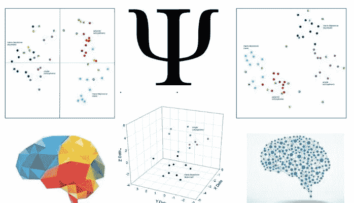

# 为什么我在我的分析项目中使用心理测量学，你也应该这样做

> 原文：<https://medium.com/analytics-vidhya/why-i-use-psychometrics-in-my-analytics-projects-and-you-should-too-369b1233ff91?source=collection_archive---------13----------------------->

在过去的几年里，数据分析一直在发展。自从谷歌、Twitter、Airbnb 和脸书等强大的公司开始使用数据以来，其他所有行业都在试图进入分析领域。

其中一些公司成功地做到了这一点，而另一些则不那么成功。尽管发生这种情况有各种各样的原因，但我将重点关注分析的日常使用。

所以，这篇文章的目标是那些每天都在做分析的人(作为一份工作，为了好玩，在内部或在云上)，以及为什么你应该在你的项目中使用心理测量学。答案非常简单:你将得到更好的输入，并可能得到更好的结果。这是为什么呢？让我们来了解一下！

首先，“心理测量学”究竟是什么？心理测量学是一门专注于社会科学和教育的定量测量实践的学科。或者，正如高尔顿在一个多世纪前提到的:心理测量学是“将测量和数字强加于大脑运作的艺术”(高尔顿，1879，p149)。简而言之:心理测量学试图用问卷和其他工具来测量思想。

心理测量学主要用于学术和教育领域，如大型标准化评估测试。但它也在企业中被营销团队使用，他们通过问卷调查来收集有关客户的信息。随着数字世界和电子商务的飞速发展，纸质问卷越来越少，而网络问卷越来越多。我们现在使用的工具有 Survey Monkey 和 Google Docs 等等。所以，如果你认为心理测量学只适用于教育环境，你可能错了！我会说，这是对心理测量工具潜力的误判。

为什么要使用它？

1.  一:这很简单:许多分析模型倾向于使用关于人们的思想、感知和感受的信息。好的，我知道有许多技术也可以用于此——比如情感分析甚至是推文挖掘……但是制作调查问卷的好处是你可以准确地控制你想要收集的信息。
2.  第二:这一点非常重要，你可以处理垃圾进出的问题。如果您在将问卷结果插入模型之前测试测试结构和可靠性，您可以进一步了解人们给你的答案是否有用，是否真正衡量了你的问题。在这种情况下，您可以先检查测量值是否可靠，然后再将它们放入模型(统计或机器学习模型)。如果测量不可靠，就不要在模型中添加噪声。也就是说:更小的噪音意味着更好的预测或者模型更精确。
3.  你减少了对模型中人们的感知效果做出错误假设的危险。

**让我们举一个简单的例子**

你可以根据 10 个关于客户对网页体验满意度的问题来做一个指数。也许在你的问卷中，有 3 个问题是关于字体类型的，还有一些问题是关于网页的外观和感觉的，你可以很容易地在上面导航并找到你要找的东西。

你用这 10 个问题创建索引，并假设字体类型与客户满意度有关。你开始做你的探索性数据分析，你做一些相关性，并意识到客户满意度和收入之间有关系，但不是那么强。所以你感到快乐，但在我之后，你开始怀疑…为什么关系这么低？

你回到你的问卷做一些因素分析，并意识到你的 3 个关于字体类型的问题与客户满意度的整体测量没有关系。因此，您删除这些项目并重新计算您的指数，再次执行相同的相关性，效果变得更强。然后你可以更有信心将你的指数引入到一个更复杂的模型中来预测网站的销售。

**有没有可用的工具来做这件事？**

在 R 和 Python(仅举几个例子)等语言的开源社区中，有许多包和库可以帮助你做到这一点。例如，在 R 中可以使用 Mirt 或 Lavaan。在 Python 中，可以使用围长或心理测量学。因此，你使用的语言不应该成为执行心理测量分析的问题。

**好的，非常好，但是我是一家强大的企业，生产模型，我不玩游戏，这对我有帮助吗？**

当然啦！您甚至可以通过有序、可扩展且非硬编码的管道，将心理测量分析作为数据准备的一部分。你甚至可以自动设定问卷需要应用的次数，这些答案可以上传到你的云端，或者如果你愿意，你甚至可以手动将其放入你的云存储中。你可以用数字方式提取信息，对其进行清理，使其成为数据准备的一部分，然后将其放入生产中的最终模型中。

**简单回顾一下！**

*   在这篇文章中，我建议作为一个好的实践，你应该使用心理测量工具来检查你的问卷结果是否可靠。
*   使用问卷可以让你知道你可以问什么，处理垃圾输入和垃圾输出的问题，减少错误假设的危险。
*   有很多开源工具可以帮你做到这一点，比如 R 中的 mirt 和 lavaan 以及 Python 中的 weather 和 psychometrics。
*   心理测量可以被放入模型生产的管道中，而你的数据工程师不会在这个过程中遭受极度的痛苦。

就这样吧！希望你喜欢！编码快乐！

**参考**

f .高尔顿(1879 年)。心理测量实验。*大脑:神经病学杂志，11* ，149–162 页。