# 为什么巴基斯坦比印度幸福？(以及其他类似问题)——第一部分

> 原文：<https://medium.com/analytics-vidhya/why-is-pakistan-happier-than-india-and-other-such-questions-part-1-5fa5c0e18371?source=collection_archive---------0----------------------->

《世界幸福报告》是一份年度出版物，根据生活在 150 多个国家的 T2 公民的幸福程度对这些国家进行排名。

但是，*快乐*意味着什么呢？你甚至如何开始量化这样一个抽象的概念，希腊人和荒谬主义者多年来一直在努力定义它？

即使人们能够量化幸福，如何解释普通巴基斯坦人(排名第 67 位)比普通印度人(排名第 140 位)幸福 33%？

快乐的秘密是什么？北欧人知道一些我们不知道的事吗？

贫穷的国家更幸福吗？还是那句谚语是假的——金钱能买到幸福？

在接下来的两部分博客中，我采用数据驱动的方法来回答这些问题以及更多问题。

# #1 快乐意味着什么？

荷兰社会学家 Ruut Veenhoven 将幸福定义为“从整体上欣赏生活”，而亚里士多德称之为一种活动而不是一种状态。加缪认为这是不可避免的——我们必须“想象西西弗斯是幸福的！”—但是，快乐到底意味着什么呢？

根据《世界幸福报告》,幸福是一个可以分解为以下六个特征的量:

1.  **人均国内生产总值**，根据购买力平价(PPP)定义，并调整为 2011 年不变国际美元。

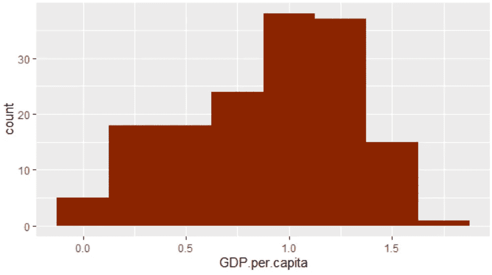

2.**社会支持**，这是二元(是/否)问题答案的全国平均水平:
“*如果你遇到了麻烦，你有没有亲戚或朋友可以在你需要的时候帮你，或者没有？*”

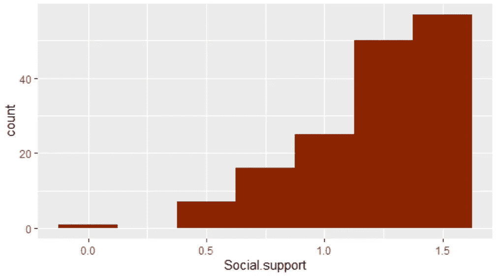

3.**预期寿命**，这是一个基于世卫组织全球健康观察数据库信息的数值，有 2005 年、2010 年、2015 年和 2016 年的数据。

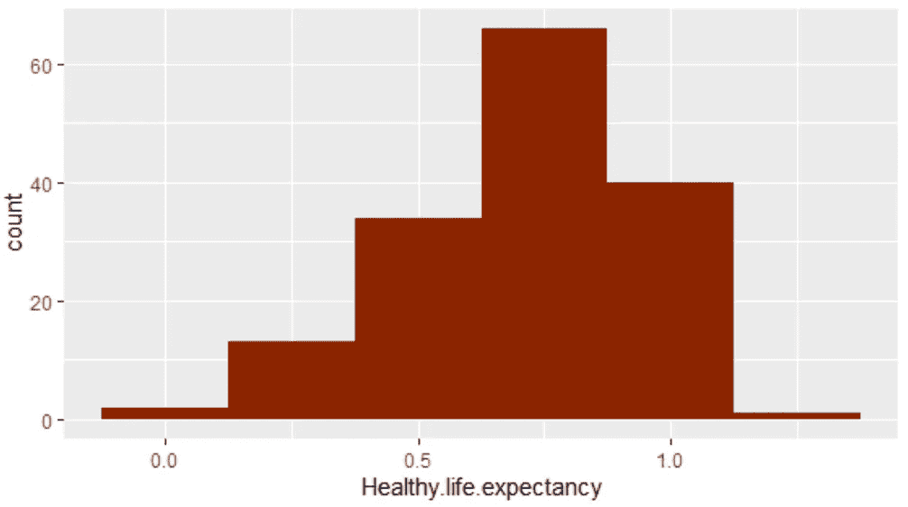

4.**做出人生选择的自由**，这是二元问题的全国平均答案:
“*你对自己选择生活的自由感到满意吗？*

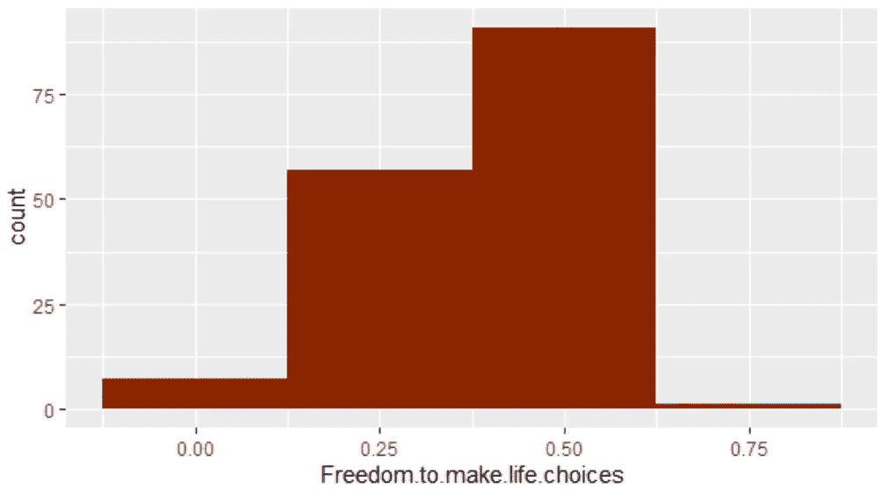

5.**慷慨度**，这是二元问题答案的全国平均值:
" *过去一个月你有没有给慈善机构捐过钱？*

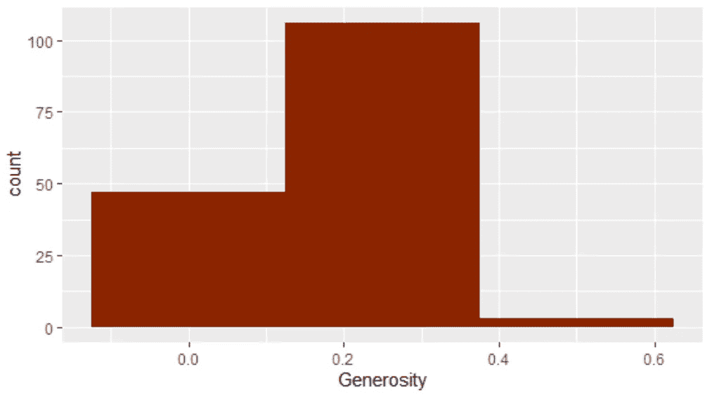

6.**对腐败的看法**，这是两个二元问题的全国平均答案:
“*腐败是否在政府中普遍存在？*&
*企业内部的腐败现象是否普遍？*

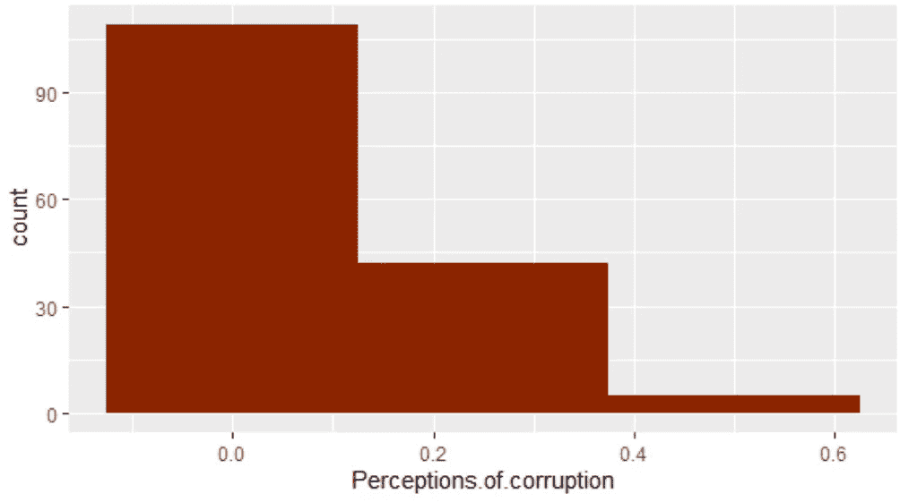

幸福分数(0-10)本身并不是基于这六个被称为“子因素”的数量，而是基于所谓的“T2”和“T3”坎崔尔阶梯。 坎特里尔梯是这样提出的一个理论问题:

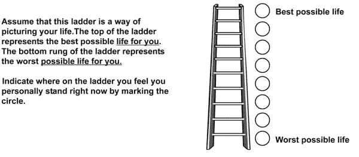

[点击此处获取来源](https://www.researchgate.net/publication/41403889_Self-reported_physical_and_mental_health_status_and_quality_of_life_in_adolescents_A_latent_variable_mediation_model)

## 线性建模得分和子因素

我创建了一个 OLS 回归模型，来看看这些子因素是如何相互作用的，最重要的是，与幸福分数本身的相互作用。我的发现如下:

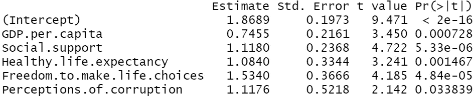

线性回归输出(以 R 表示)

这些数字是什么意思？这个模型有多精确？

让我先从第二个问题开始:这个模型的 R 平方值为 77%，这意味着这个模型能够预测数据中 77%的可变性。简单来说，这个模型的*准确率*是 77%。

尽管这不是最好的*模型，但对于我们的目的来说，也就是理解分数和子因素之间的关系来说，这已经足够好了。*

现在，第一个问题:这意味着什么？让我们一步一步来。

1.  **截距:**截距是被称为“反乌托邦”国家的分值。换句话说，一个 GDP 为零、没有社会支持、预期寿命可怕等等的国家，其幸福指数为 1.86(满分 10 分)。你可能对目前所有国家的平均得分感到好奇。所有国家的平均值为 **5.407** ，方差为 **1.23** 。背景来看，美国(排名第 19)的幸福指数为 **6.89** ，芬兰(排名第 1)的幸福指数为 **7.76** 。南苏丹(排名#156)的得分为 **2.85** 。
2.  **估计值:**每个变量都有一个相关的估计值，如上面第二列所示。理解估计值(也称为系数)的方式是这样的:变量中每增加一个*单位*，比如说人均 GDP，分数就会增加估计值。
    对于人均 GDP，估算值为 **0.74** ，也是所有估算值中*最低的*。这告诉我们两件事:第一，GDP 每上升一个整单位，幸福得分增加 0.74 分；第二，当谈到幸福时，GDP 实际上是六个子因素中最不重要的因素。
    相比之下，做出生活选择的自由系数为 **1.53** ，在预测幸福感时是最重要的*。*

我还建立了一个[人工神经网络](https://en.wikipedia.org/wiki/Artificial_neural_network)模型来预测幸福得分，准确率接近 90%。对于感兴趣的人，[这个模型可以在这里找到](https://www.kaggle.com/theshreyasman/neural-network-and-eda-on-happiness-dataset)。

# #2 为什么巴基斯坦比印度幸福？

印度和巴基斯坦，这个故事开始于 1947 年，当时新独立的印度诞生了一个新的巴基斯坦。这两个国家就像兄弟一样，总是被拿来比较。因此，当谈到幸福时，也有一个比较是恰当的。

事实证明，巴基斯坦(排名第 67 位)，一个因为错误的原因而经常出现在头条的国家，比印度(排名第 140 位)更幸福。出于多种原因，我觉得这很奇怪。

1.  T21:印度的国内生产总值为 2.86 万亿美元。另一方面，巴基斯坦的 GDP 为 2780 亿美元。印度是经济上占优势的国家——遥遥领先。那么是不是金钱*买不到*给你的幸福？我们会看到…
2.  民主:印度也是世界上最大的民主国家，但更重要的是它也是一个稳定的民主国家。巴基斯坦是一个民主国家，但它经常不得不与试图剥夺巴基斯坦民主的军事政变作斗争。至少可以说，一个稳定的民主国家比一个不稳定的民主国家更不幸福是一件奇怪的事情。
3.  **预期寿命&自由:**你可能会认为印度的预期寿命很低——如果你拿它和美国相比的话，确实如此——但是和巴基斯坦相比，印度的预期寿命更长，而且有更大的自由来选择生活，正如我们所知，这是幸福的最重要因素。

让我们仔细看看这两个国家及其各自的子因素:

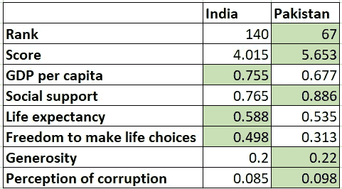

下一个自然的问题是:巴基斯坦一直比印度幸福吗？

要回答这个问题，让我们看看这些国家在过去五年的排名:

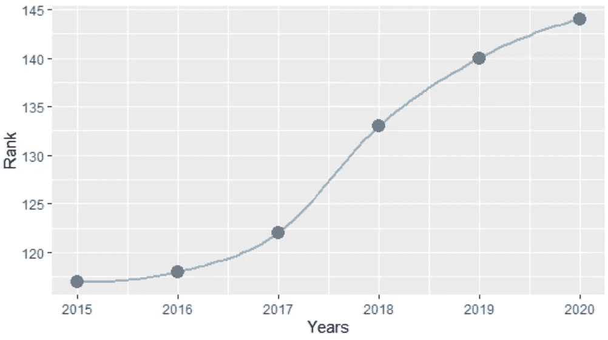

印度、WHR 排名(2015–2020 年)

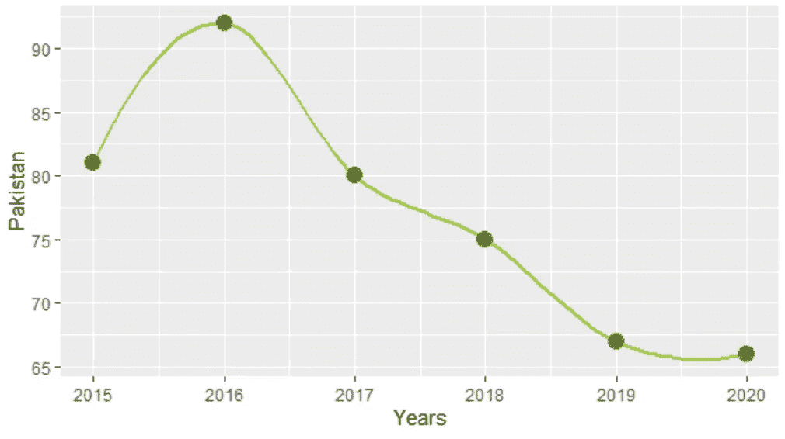

巴基斯坦、WHR 排名(2015–2020 年)

从上面的图表中可以清楚地看到，不仅巴基斯坦比印度幸福，而且印度的总体幸福指数正在稳步下降，而巴基斯坦的总体幸福指数似乎在上升。

如果我把上一节的信息代入我的 OLS 模型，我得到的结果也很有趣。

根据我的模型，基于六个子因素中的五个，印度的幸福指数应该是 4.78。提醒你一下，印度目前的得分是**4.015**——所以，这个预测不会太离谱。

另一方面，根据我的模型，巴基斯坦的得分应该是 **4.53** 。4.53 低于印度预测的 4.78 分，并且*显著*低于巴基斯坦的实际得分 **5.63。**

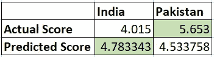

因此，尽管数据对印度有利，巴基斯坦实际上更幸福。

这是怎么回事？

我的直觉告诉我，印度人只是比巴基斯坦人更愤世嫉俗。因此，尽管有更好的社会经济环境，他们并不幸福。我这么说是因为幸福指数是基于坎特里尔阶梯，而不是六个子因素本身。

但这不可能！这太离奇了。

我所掌握的数据显然是不完整的，还有一个因素我遗漏了。什么因素？我不确定，所以我得去别处看看。

[据福布斯](https://www.forbes.com/sites/panosmourdoukoutas/2019/03/23/pakistan-beats-india-in-happiness/?sh=750f3f5d1378)报道，答案是收入不平等:

> 过去四十年来，截至 2014 年，印度 1%的高收入者占全国收入的比重从大约 7%上升到 22%。与此同时，收入最低的 50%人群的收入占比从 20 世纪 80 年代初的约 23%下降到 2014 年的 15%。

第二，“在向大众传播财富方面，巴基斯坦已经走在了印度的前面。”巴基斯坦通过在公共福利项目领域的战略性政府支出做到了这一点。

这是我显然没有专业知识的信息，我也没有真正的数据来解释为什么巴基斯坦更幸福，但经过一些研究后，它似乎真的可以归结为两件事:政府支出和收入不平等。

虽然就我个人而言，我认为印度人是一个更愤世嫉俗的民族的想法是更有趣的论点——但是，我没有数据来支持这个论点。

这就是印度和巴基斯坦的现状。

在本博客的下一部分，我将谈论北欧国家，以及为什么它们一直在世界幸福报告的前十名。我还会谈谈经济繁荣和幸福的关系。

如果你想看我写的更多内容，请点击“鼓掌”按钮并订阅！

感谢阅读，乡亲们。